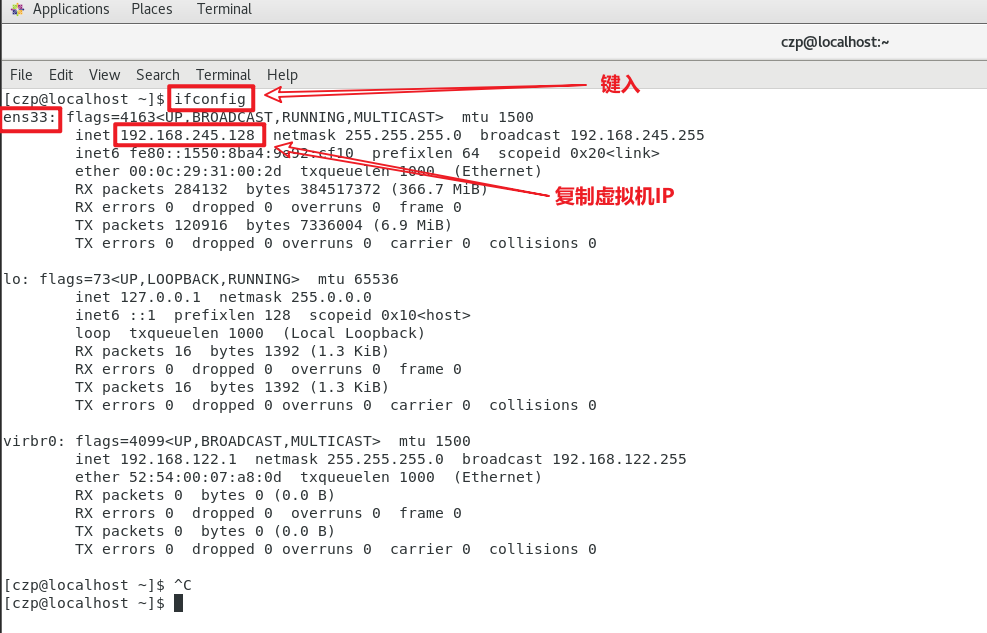
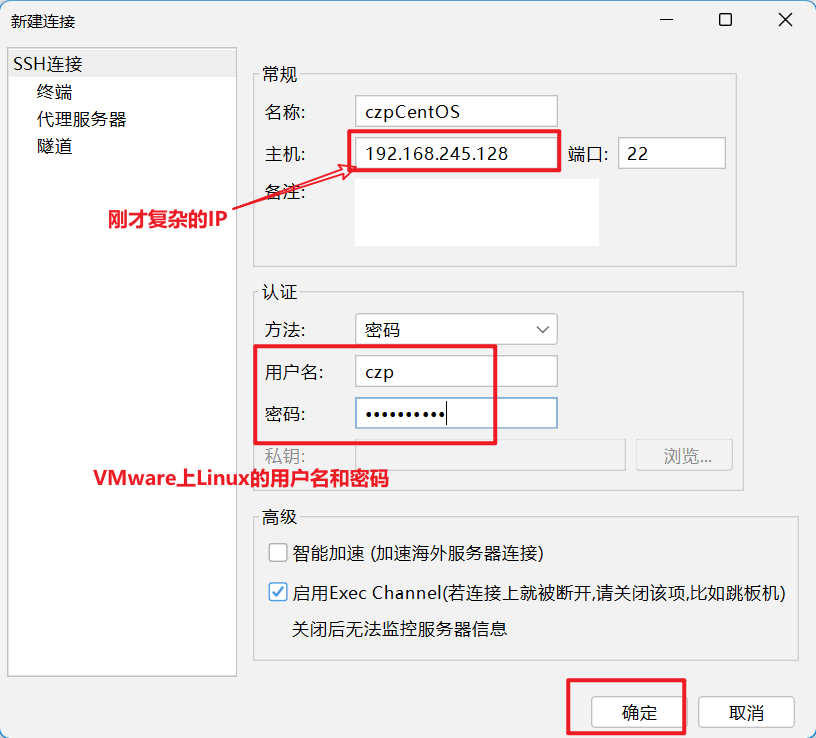
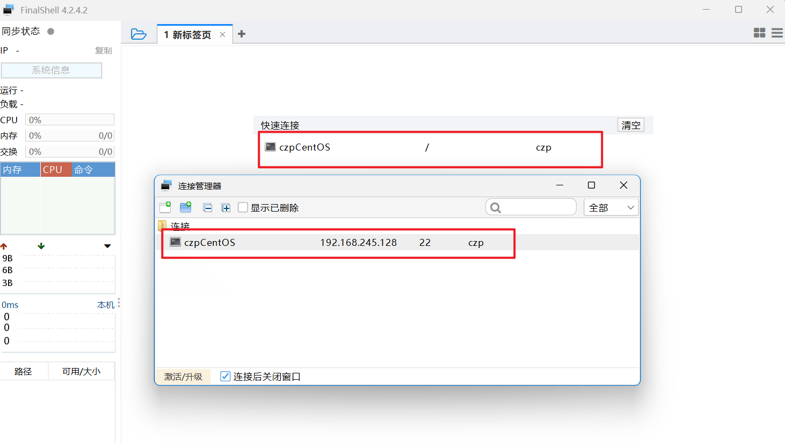
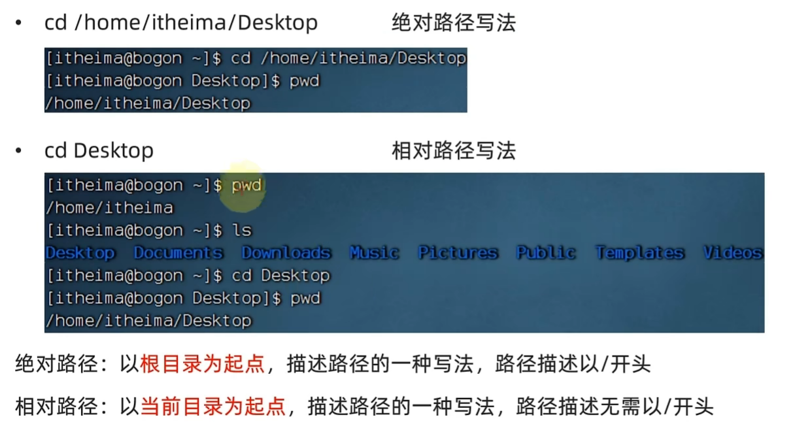
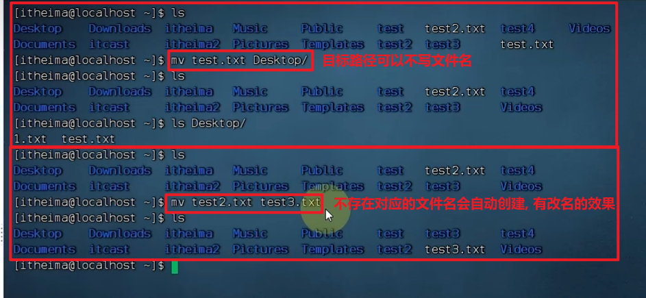
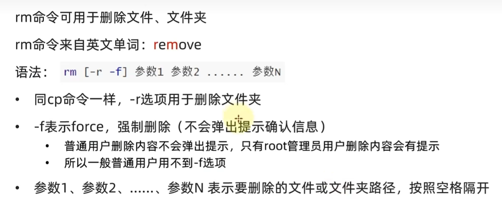
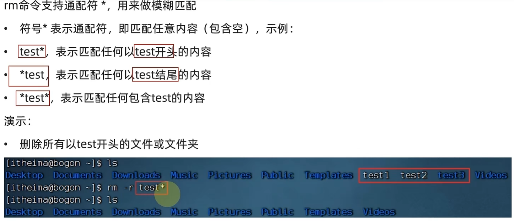
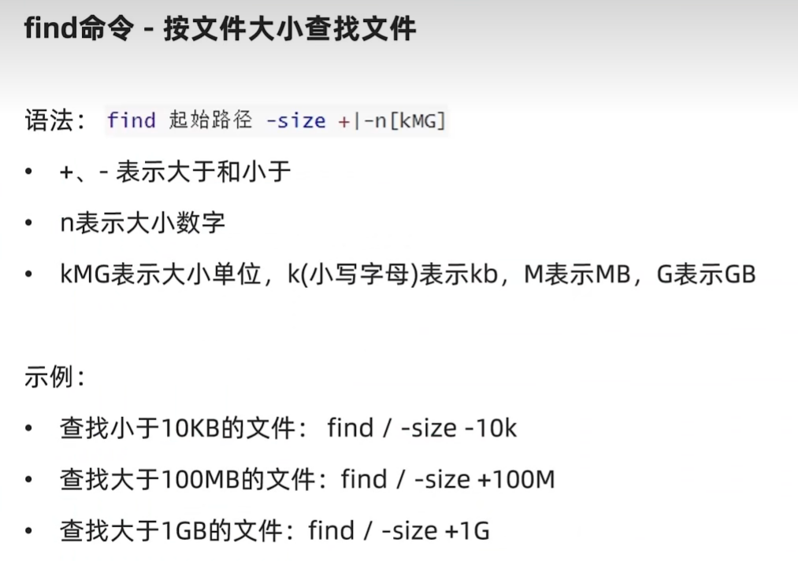

# 环境安装


## VMware安装

> 虚拟机软件, 可以在该软件上安装操作系统

拷贝自微信公众号"**软件管家**":  [VMware17.0.zip_免费高速下载|百度网盘-分享无限制 (baidu.com)](https://pan.baidu.com/s/1PMCdcgQ3iVReVLJxrG6fEw?pwd=7777)


## CentOS安装

> Linux发行版, *即包含linux内核和特定的系统级程序的完整封装*

**打开**:  [Index of /7.6.1810/isos/x86_64 (centos.org)](https://vault.centos.org/7.6.1810/isos/x86_64/)

下载图示iso文件

如下载遇到403错误, 则下载对应的**torrent**文件, 然后去**迅雷**用torrent文件下载对应的iso文件


## 在VMware创建CentOS

**B站**讲解:  [第一章-05-VMware Workstation中安装CentOS7 Linux操作系统_哔哩哔哩_bilibili](https://www.bilibili.com/video/BV1n84y1i7td?p=6)


## 安装FinalShell

> 远程连接Linux的第三方软件
>
> 因为通过VMware在window和linux之间的交互*(复制粘贴上传下载)*不方便, 所以需要远程连接软件

安装**链接**:  http://www.hostbuf.com/downloads/finalshell_install.exe


> > 详情可见hostbuf官网


## 使用FinalShell连接Linux

> 1. 打开**VMware**内的Linux的终端, 键入`ifconfig`按下回车, 在`ens33`附件可以获取**虚拟机的IP**
> 1. 打开**FinalShell**, 如图, 建立SSH连接
> 1. 如图配置IP、用户名和密码
> 1. 如图, 双击任一红框内容进行连接
> 1. 开始使用LInux的命令行


# Linux命令

## 基础须知

> window层级间用`\`, 有盘符, *如下为一个文件路径: `D:\home\eve\index.txt`*
>
> Linux层级间用**`/`**, 唯一顶级目录为`/`, *如下为一个文件路径: `/home/eve/index.txt`*


## ls命令

**ls**可以展示 当前工作目录 *(默认HOME目录: /home/用户名)* 下的文件 *(隐藏 文件和文件夹除外)*

命令格式:

```bash
ls [-a -l -h] [directory]
```

+ **directory** 是指定的linux目录, 不填则默认为`/home/用户名`
+ **-a -l -h** 是可选选项
    + **-a** 表示**列出所有文件**, 包括隐藏 文件和文件夹 *(文件名或者文件夹名以**`.`**开头则自动隐藏)*
    + **-l**  以**竖向排列**的形式展示更多的信息
    + **-h**  搭配**-l**使用, 人性化的方式**显示文件大小的单位**


## cd命令

切换到指定的目录下

```bash
cd [directory]
```

**directory**表示要切换的目录, 不填默认回到用户的HOME目录


## pwd命令

无选项, 无参数, `pwd`*(print work directory)* 可以打印当前工作目录


## 路径相关

> 相对路径无需以`/`开头, 以当前目录为起点

> 特殊路径符  **.    ..    ~**


## mkdir命令

make directory 用于创建新的目录

命令格式:

```bash
mkdir [-p] Linux路径
```

**-p** 表示自动创建不存在的父目录, 适用于连续多层级的目录


## touch-cat-more命令

### touch

**创建**文件, 无选项, 参数必填

```bash
touch Linux路径
```

e.g.` touch ~/myNote.txt`


### cat

**查看**文件, 无选项, 参数必填

```bash
cat Linux路径
```

e.g.` cat ~/myNote.txt`


### more

**翻页查看**文件, 无选项, 参数必填

```bash
more Linux路径
```

e.g.` more ~/myNote.txt`


## cp-mv-rm命令

### cp


```bash
cp -r /from /to
```

**-r** 表示复制对象为**文件夹**

**参数2 /to**  可以是某个目录下 *(`myDirectroy/`) * 也可以是某个目录下的文件名 *(`myDirectory/file.txt`)*


### mv


```bash
mv /from/file.txt /to/  #移动到to目录下
mv file1.txt file2.txt  #file1.txt改为file2.txt
```

**参数2 /to**  可以是某个目录下 *(`myDirectroy/`) * 也可以是某个目录下的文件名 *(`myDirectory/file.txt`)*




### rm



rm支持通配符**`*`**




## watch-find命令

### watch

> 查找**命令**对应的二进制文件的位置


```bash
which 命令
```


### find

按**名称**查找**文件名**


```bash
find 起始地址 -name "文件名(可含通配符*)"

## e.g.
find / -name "test*"
```


按**大小**查找**文件名**



```bash
find 起始地址 -size (+|-)n[kMG]

## e.g.
find / -size +10G
```

