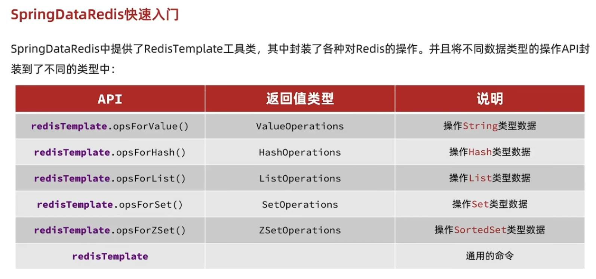
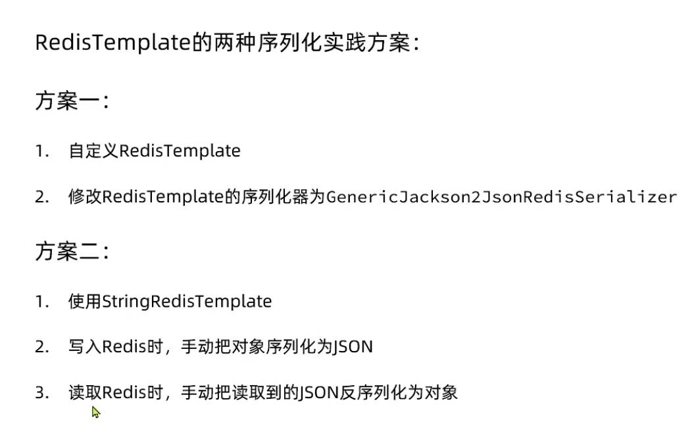

# 安装与配置

1. 安装Redis

    1. 去 菜鸟编程 找到 Redis 的下载链接 (链接指向位于 GitHub ), 

        + [Redis 安装 | 菜鸟教程](https://www.runoob.com/redis/redis-install.html)

        + [Redis安装 | GitHub](https://github.com/tporadowski/redis/releases)

    2. 下载压缩包, 解压至自定义的文件夹内 (文件夹命名为 Redis)

        

2. 启动Redis服务

    1. 打开命令行, 切换目录到 Redis 文件夹
    1. 输入 `redis-server(.exe redis.windows.conf)`  // 括号内内容可省略

    + *注意: 如果关掉该命令行窗口, Redis服务也会关掉*

        

3. 启动Redis客户端 *(连接redis服务)*

    

    + **CLI** *(命令行接口)*

    1. 另打开一个命令行窗口, 同样切换目录到 Redis 文件夹

    1. 输入 `redis-cli(.exe -h 127.0.0.1 -p 6379)` // 括号内内容可省略

        

    + **GUI** *(图形用户接口)*

    1. 去Redis官网下载RedisInsight  =>  [RedisInsight | Redis](https://redis.io/docs/ui/insight/)
    1. 在Redis服务启动的情况下 *(步骤2)* 打开该软件并操作 (操作方法略)


# Jedis

Jedis官网 [Jedis_github.com](https://github.com/redis/jedis)

## 快速入门(Spring)

### 依赖

```xml
<dependency>
      <groupId>redis.clients</groupId>
      <artifactId>jedis</artifactId>
      <version>3.7.0</version>
</dependency>
<dependency>
      <groupId>junit</groupId>
      <artifactId>junit</artifactId>
      <version>4.13.1</version>
      <scope>test</scope>
</dependency>
```


### 实例(测试JUnit)

```java
import org.junit.*;
import redis.clients.jedis.Jedis;

public class JedisTest {

    private static Jedis jedis;

    @BeforeClass
    public static void setup() {    // 连接本地的Redis
        jedis = new Jedis("127.0.0.1", 6379);  // host, port
        jedis.select(0);   // 选择库
    }

    @Test
    public void testString(){
        System.out.println("jedis.get(\"myKey\") = " + jedis.get("myKey"));     // 对jedis直接进行Redis命令
        System.out.println("jedis.set(\"myKey2\", \"czp\") = " + jedis.set("myKey2", "czp"));
        System.out.println("jedis.get(\"myKey2\") = " + jedis.get("myKey2"));
    }

    @AfterClass
    public static void teardown() {
        if (jedis != null) {
            jedis.close();    // 断开Redis连接
        }
    }
}
```


## 连接池

创建连接池

```java
package org.example;

import redis.clients.jedis.Jedis;
import redis.clients.jedis.JedisPool;
import redis.clients.jedis.JedisPoolConfig;

public class JedisConnectionPool {

    private static final JedisPool jedisPool;

    static {
        JedisPoolConfig poolConfig = new JedisPoolConfig();
        poolConfig.setMaxTotal(10);
        poolConfig.setMaxIdle(5);
        poolConfig.setMinIdle(1);
        poolConfig.setMaxWaitMillis(1000);
        jedisPool = new JedisPool(poolConfig, "127.0.0.1", 6379, 3000, null);
    }

    public static Jedis getJedis() {
        return jedisPool.getResource();
    }
}
```

测试用例

```java
package org.example;

import org.junit.BeforeClass;
import org.junit.Test;
import redis.clients.jedis.Jedis;

import static org.junit.Assert.*;

public class JedisConnectionPoolTest {

    private static Jedis jedis;
    
    @BeforeClass
    public static void setUp() {
        jedis = JedisConnectionPool.getJedis();   // 静态方法直接通过类名调用
    }
    
    @Test
    public void testGetJedis() {
        jedis.set("hello", "world");
        System.out.println("jedis.get(\"hello\") = " + jedis.get("hello"));
    }

    @BeforeClass
    public static void tearDown() {
        if (jedis != null) {
            jedis.close();
        }
    }
}
```


# Spring Data Redis



## 快速入门(SpringBoot)

### 依赖

```xml
<dependency>
      <groupId>org.springframework.boot</groupId>
      <artifactId>spring-boot-starter-data-redis</artifactId>
      <version>3.0.2</version>
</dependency>
<dependency>
      <groupId>org.apache.commons</groupId>
      <artifactId>commons-pool2</artifactId>
</dependency>
```

### 配置文件

```yml
spring:
  redis:
    host: 127.0.0.1
    port: 6379
    lettuce:
      pool:
        max-active: 8
        max-idle: 8
        min-idle: 0
        max-wait: 200ms
```

### 测试(JUnit) [A]

```java
package com.example.dataredisdemo;

import org.junit.jupiter.api.Test;
import org.springframework.beans.factory.annotation.Autowired;
import org.springframework.boot.test.context.SpringBootTest;
import org.springframework.data.redis.core.RedisTemplate;

@SpringBootTest
class DataRedisDemoApplicationTests {

    @Autowired
    private RedisTemplate redisTemplate;

    @Test
    void testValue() {
        redisTemplate.opsForValue().set("name", "czp");
        Object name = redisTemplate.opsForValue().get("name");
        System.out.println("name = " + name);
    }
}
```


## 序列化




### RedisTemplate+序列化器

> 内部存储class并自动转化

#### 依赖 [B]

```xml
<dependency>
            <groupId>com.fasterxml.jackson.core</groupId>
            <artifactId>jackson-databind</artifactId>
</dependency>
```


#### 配置类

```java
package com.example.dataredisdemo.config;

import org.springframework.context.annotation.Bean;
import org.springframework.data.redis.connection.RedisConnectionFactory;
import org.springframework.data.redis.core.RedisTemplate;
import org.springframework.data.redis.serializer.RedisSerializer;

public class RedisJsonConfig {

    @Bean
    public RedisTemplate<String, Object> redisTemplate(RedisConnectionFactory redisConnectionFactory) {

        RedisTemplate<String, Object> redisTemplate = new RedisTemplate<>();
        
        // 连接工厂
        redisTemplate.setConnectionFactory(redisConnectionFactory);

        // set序列化 (详见源码)
        redisTemplate.setKeySerializer(RedisSerializer.string());
        redisTemplate.setHashKeySerializer(RedisSerializer.string());
        redisTemplate.setValueSerializer(RedisSerializer.json());
        redisTemplate.setHashValueSerializer(RedisSerializer.json());

        return redisTemplate;
    }
}
```


#### 测试 (同A)

```java
package com.example.dataredisdemo;

import org.junit.jupiter.api.Test;
import org.springframework.beans.factory.annotation.Autowired;
import org.springframework.boot.test.context.SpringBootTest;
import org.springframework.data.redis.core.RedisTemplate;

@SpringBootTest
class DataRedisDemoApplicationTests {

    @Autowired
    private RedisTemplate<String, String> redisTemplate;

    @Test
    void testValue() {
        redisTemplate.opsForValue().set("name", "czp");
        Object name = redisTemplate.opsForValue().get("name");
        System.out.println("name = " + name);
    }
}
```


### SpringRedisTemplate+Json工具

> 手动通过json转化, 减少内存开销(不需要存class)

#### 依赖(同B)

```xml
<dependency>
            <groupId>com.fasterxml.jackson.core</groupId>
            <artifactId>jackson-databind</artifactId>
</dependency>
```


#### 测试

```java
package com.example.dataredisdemo;

import com.example.dataredisdemo.pojo.User;
import com.fasterxml.jackson.core.JsonProcessingException;
import com.fasterxml.jackson.databind.ObjectMapper;
import org.junit.jupiter.api.Test;
import org.springframework.beans.factory.annotation.Autowired;
import org.springframework.boot.test.context.SpringBootTest;
import org.springframework.data.redis.core.StringRedisTemplate;

@SpringBootTest
class DataRedisDemoApplicationTests {

    @Autowired
    private StringRedisTemplate stringRedisTemplate;

    // json工具
    public static final ObjectMapper mapper = new ObjectMapper();

    @Test
    void testValue() throws JsonProcessingException {

        // 创建对象  转成json串  存入Redis
        User iUser = new User("虎哥",18);
        String iJson = mapper.writeValueAsString(iUser);
        stringRedisTemplate.opsForValue().set("user:1", iJson);

        // 从Redis取出json  json转成Java对象  打印输出
        String oJson = stringRedisTemplate.opsForValue().get("user:1");
        User oUser = mapper.readValue(oJson, User.class);
        System.out.println("oUser = " + oUser);
    }
}
```

