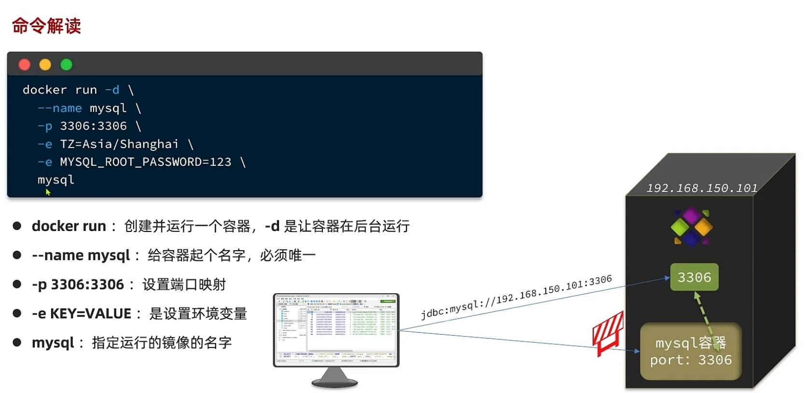
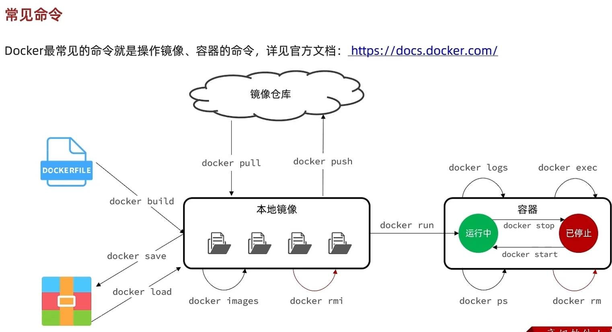
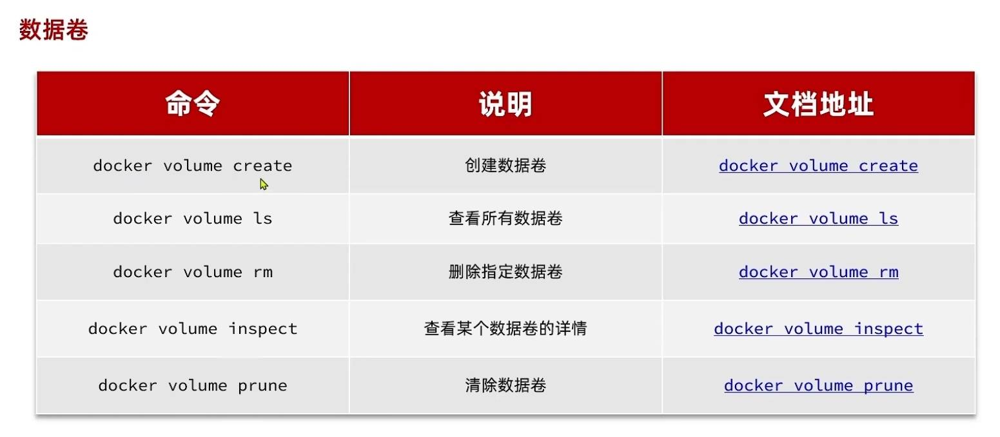
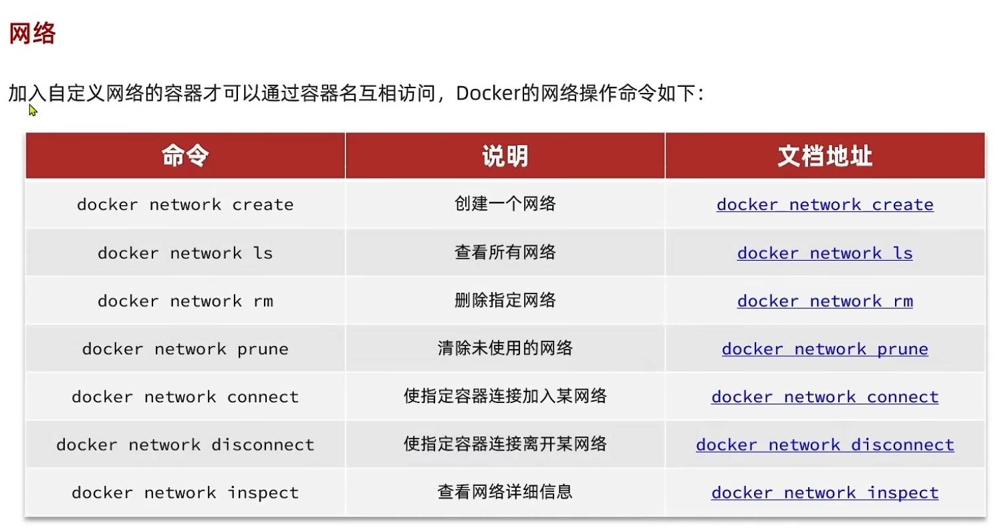
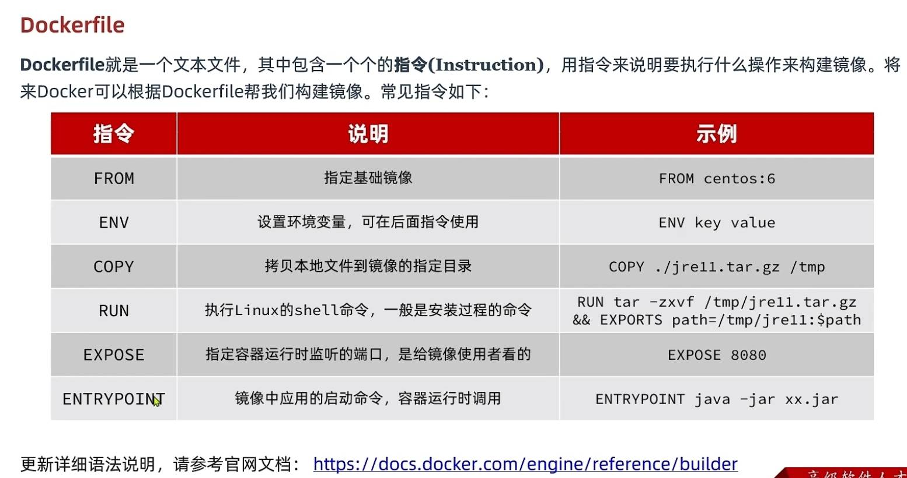
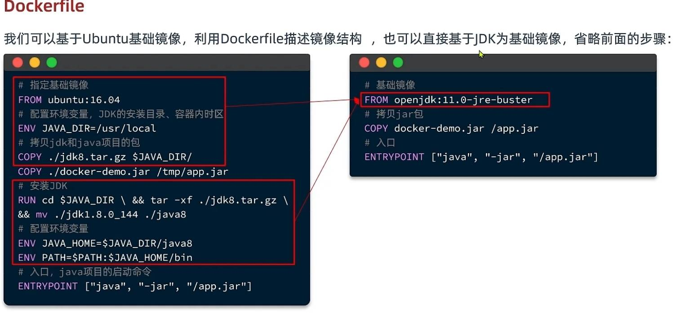

# 安装

> 需要在**Linux**系统中安装, 这里我们用**Windows**的**VMware**创建的**CentOS**系统来进行**docker的安装**与操作

安装教程链接[**docker官网**]  [Install Docker Engine on CentOS | Docker Docs](https://docs.docker.com/engine/install/centos/)

安装教程[**黑马的飞书文档**]  [安装Docker - 飞书云文档 (feishu.cn)](https://b11et3un53m.feishu.cn/wiki/Rfocw7ctXij2RBkShcucLZbrn2d)

# 命令相关

## 命令解读

## 常见命令

# 命令别名

1. 调用`vim ~/bashrc`
1. 进入输入模式, 键入`alias 命令别名=命令原名`
1. 保存并退出
1. 刷新更改 `source ~/bashrc`

# 数据卷

>  每个docker都有一个单独的容器来与外界隔离, 容器内有相关的环境配置, 一般情况下, 容器内部是没有配置vim的, 所以我们无法直接修改容器内文件, 这时候我们就需要用到数据卷了

在`docker run ..`的时候 用`-v 宿主机目录:容器内目录` 来将容器内的目录与宿主机的目录进行**双向绑定**,

具体举例代码如下: `docker run -d --name nginx -p 8082:8082 -e ... -v html:/usr/share/nginx/html nginx:latest`

> 
>
> 

# 网络IP

容器有自己的IP, 与宿主机的IP是不同的, 但是同一个容器的IP并不是固定的, 不过同一个容器IP对应的标识符(如`localhost`)是固定的, 例如用docker构建的MySQL的容器的IP可以直接用`mysql`来表示

>  例如: 我们在导入的JAR包的配置文件中, 如果用到了虚拟机的docker构建的mysql, 
>
> 我们可以把`application.yml`中的mysql的IP用`${xx.xx.host}`来表示, 
>
> 然后在`application-local.yml`中写入`xx.xx.host=本地mysql`, 
>
> 在`application-dev.yml`中写入`xx.xxhost=mysql`, **这里的`mysql`**指的就是docker构建的mysql的容器IP

> 

# Dockerfile

