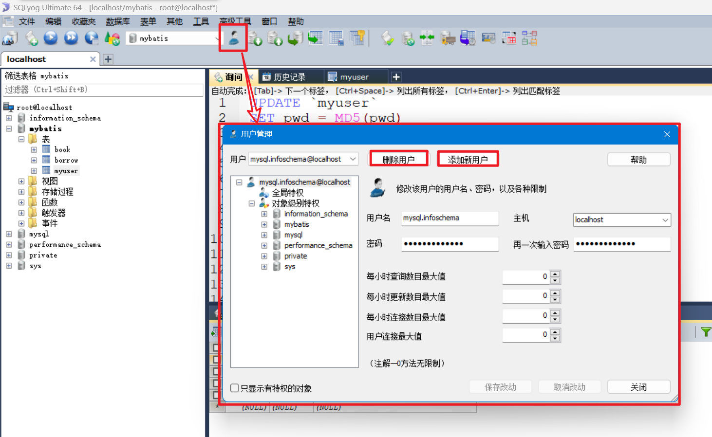
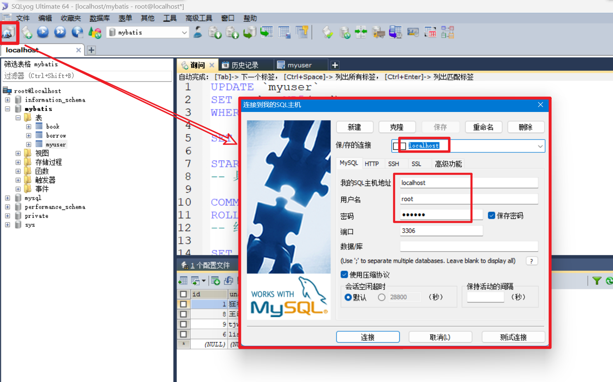
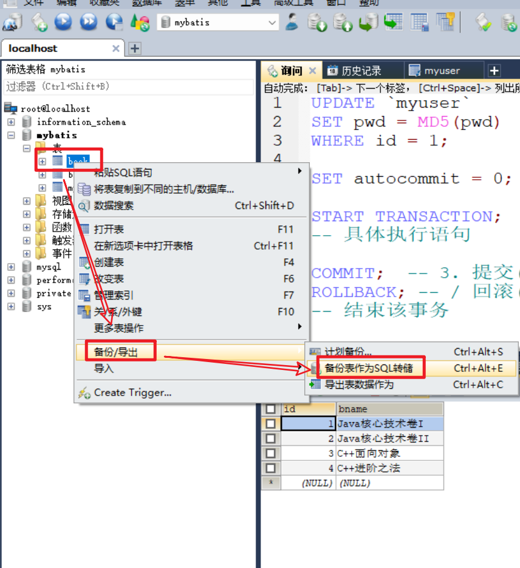
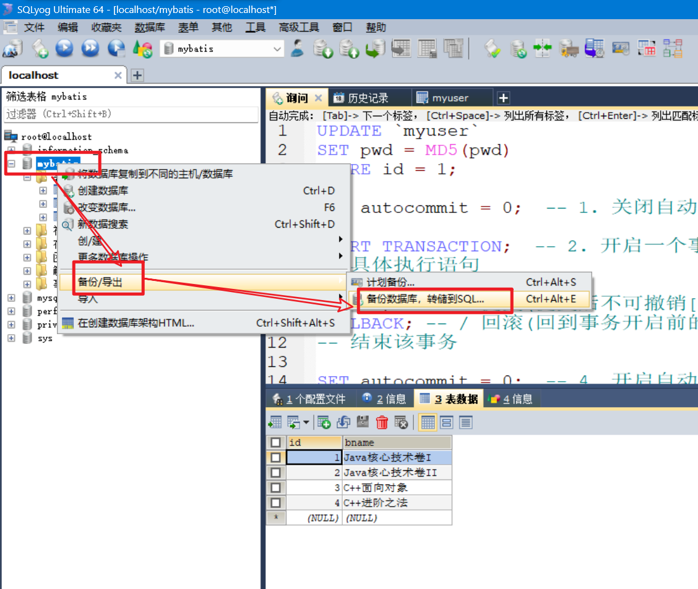
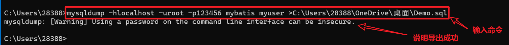
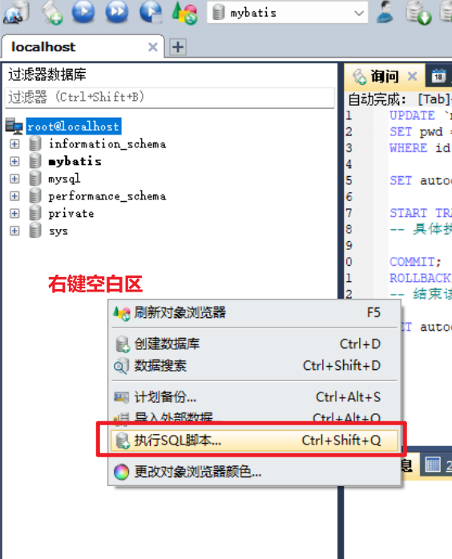
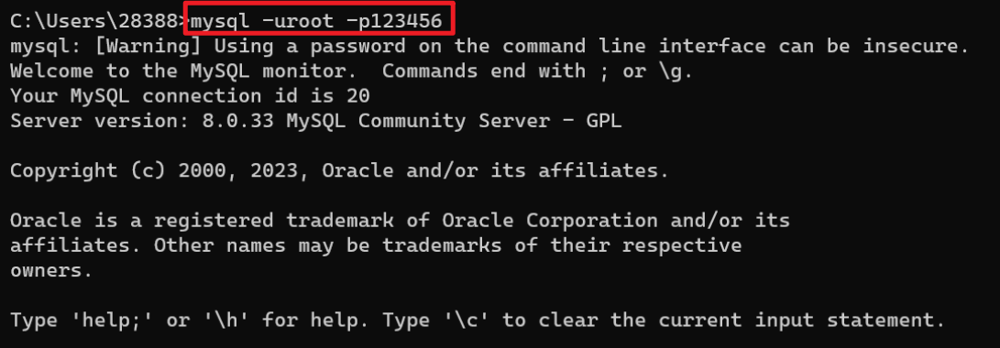
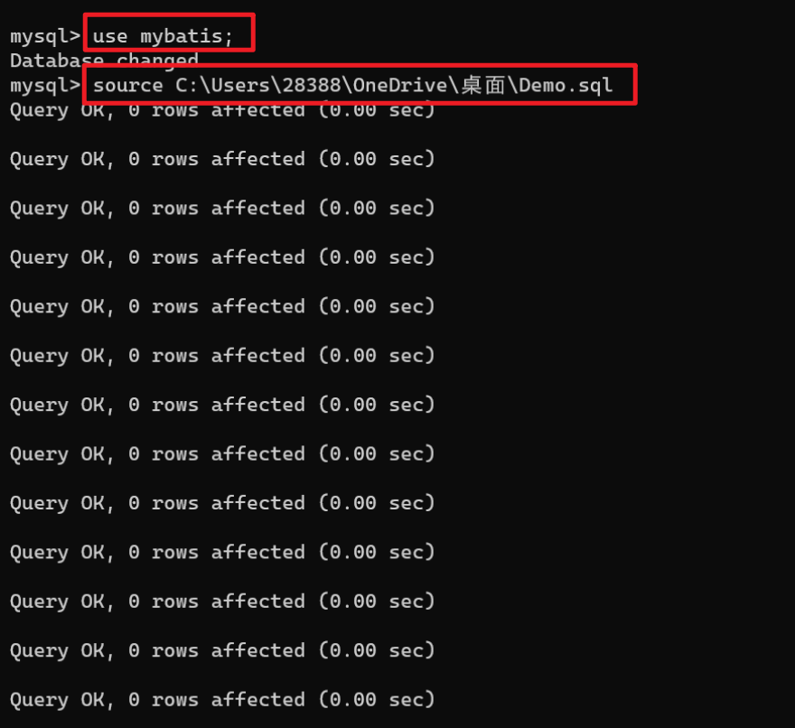

# *MySQL书写


# ==MySQL优化==


# 事务

## 执行流程

1. 关闭自动提交
1. 开启一个事务
1. 提交 / 回滚
1. 开启自动提交

```mysql
SET autocommit = 0;  -- 1. 关闭自动提交

START TRANSACTION;  -- 2. 开启一个事务
-- 具体执行语句

COMMIT;  -- 3. 提交(提交后不可撤销[持久化])
ROLLBACK; -- / 回滚(回到事务开启前的状态)
-- 结束该事务

SET autocommit = 0;  -- 4. 开启自动提交
```


## ==隔离级别==


# *索引


# 用户管理

## 用户操作

> 通过 **SQLyog **的 **用户**按钮 可以实现 用户的**创建**(权限设置)与**删除**



> 创建和删除的用户信息与参数统一存放在 `mysql.user`的表中
>
> 上面的界面化操作本质是在修改这张表, 当然**也可以通过`mysql`语句来管理用户**

## 测试

> 按照创建的**用户参数**来创建一个新的**连接**



> 连接完成后, 新的连接就是一个新的用户


# 备份

## 导出

### SQLyog导出

导出表



导出库

	


### 命令行导出

导出命令的模板:

**mysqldump**  -h*主机名*  -u*用户名*  -p*密码*  *库名*  [*表名*]  >*导出到的绝对路径* \ 文件名.sql 

实例

`mysqldump -hlocalhost -uroot -p123456 mybatis myuser >C:\Users\28388\OneDrive\桌面\Demo.sql`

*忽略表名这导出库*




## 导入

### SQLyog导入




### 命令行导入

```bash
mysql -u用户名 -p密码   # 登录账号
use 库名    # 切换到指定库
source 文件地址\文件名.sql    # 将指定sql文件导入

# 或者 ===================
mysql -u用户名 -p密码 库名 
```






# ==锁==

