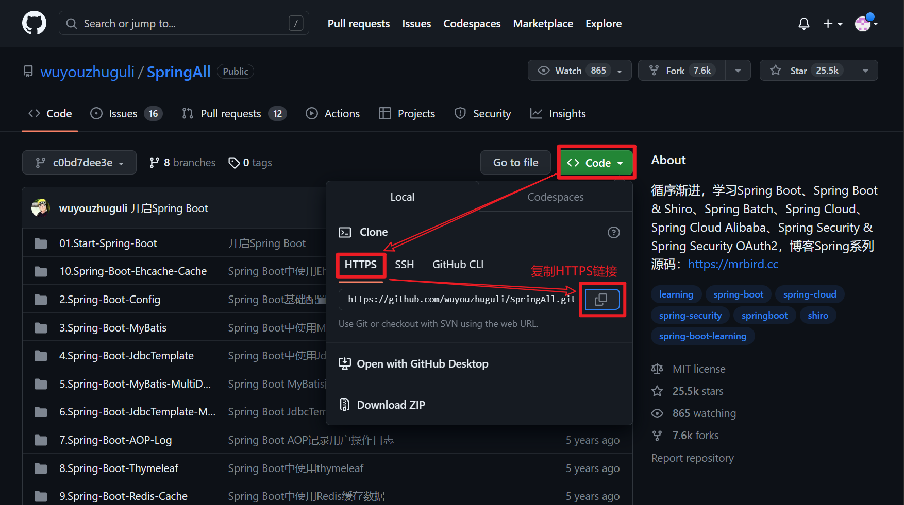

# 克隆GitHub

## 克隆到IDEA

1. 复制HTTPS链接

2. 

3. 

## git bash克隆至文件夹

1. 同`IDEA克隆`的  *复制HTTPS链接*
1. 

3. 语法`git clone HTTPS_Url`

# IDEA 中 Git 的版本控制

+ 

+ 

# (远程&本地)仓库的同步

在本地仓库打开**git bash**

+ 将本地同步至远程
    1. `git add .`
    1. `git commit -m "myCommitMessage"`
    1. `git push`

+ 将远程同步至本地
    + `git pull`