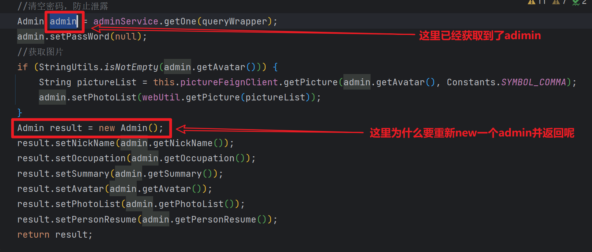
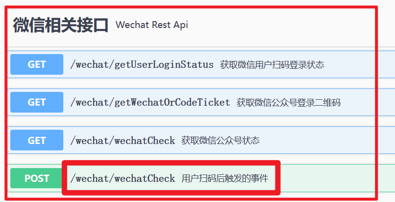
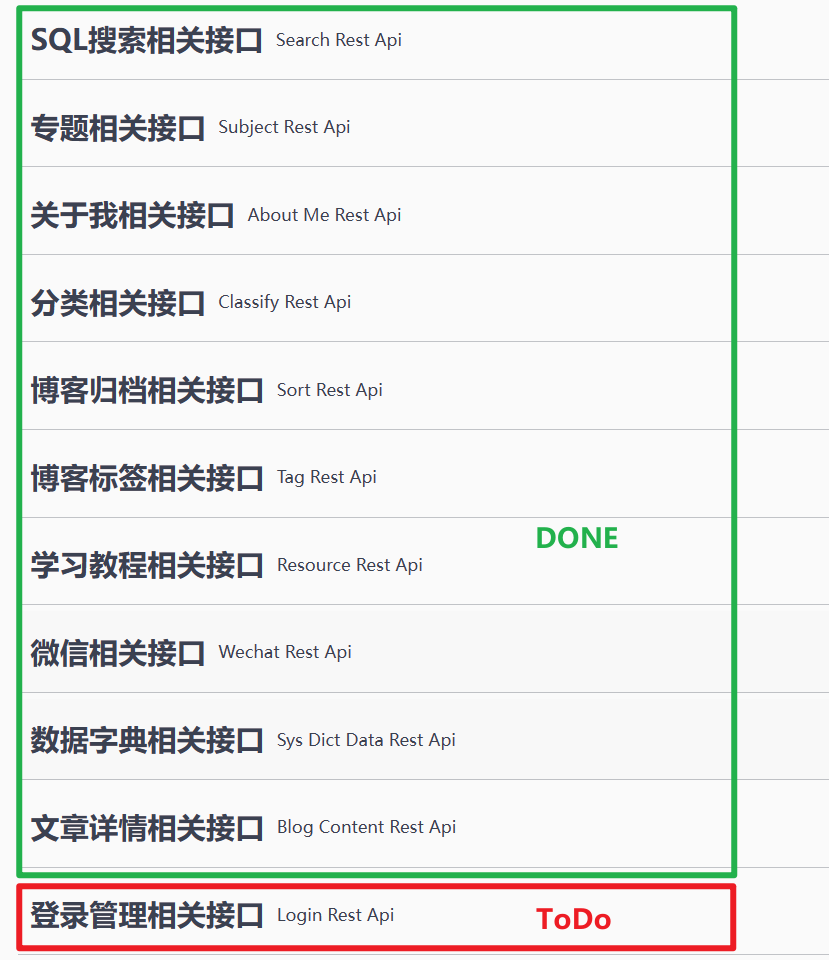

#  结构

## 条件构造器>分页查询

e.g. 1

```java
// 构造QueryWrapper
QueryWrapper<Blog> queryWrapper = new QueryWrapper<>();
queryWrapper.and(wrapper -> wrapper.like(SQLConf.TITLE, keyword).or().like(SQLConf.SUMMARY, keyword));
queryWrapper.eq(SQLConf.STATUS, EStatus.ENABLE);
queryWrapper.eq(SQLConf.IS_PUBLISH, EPublish.PUBLISH);
queryWrapper.select(Blog.class, i -> !i.getProperty().equals(SQLConf.CONTENT));
queryWrapper.orderByDesc(SQLConf.CLICK_COUNT);

// 构造Page
Page<Blog> page = new Page<>();
page.setCurrent(currentPage);
page.setSize(pageSize);

// 分页查询
// blogService实现IService接口, 自带分页查询函数page()
IPage<Blog> iPage = blogService.page(page, queryWrapper); 
List<Blog> blogList = iPage.getRecords();
```

e.g. 2

```java

Page<Blog> page = new Page<>();
page.setCurrent(currentPage);
page.setSize(pageSize);

QueryWrapper<Blog> queryWrapper = new QueryWrapper<>();
queryWrapper.like(SQLConf.TAG_UID, tagUid);
queryWrapper.eq(SQLConf.STATUS, EStatus.ENABLE);
queryWrapper.eq(BaseSQLConf.IS_PUBLISH, EPublish.PUBLISH);
queryWrapper.orderByDesc(SQLConf.CREATE_TIME);
queryWrapper.select(Blog.class, i -> !i.getProperty().equals(SysConf.CONTENT));
IPage<Blog> pageList = blogService.page(page, queryWrapper);
List<Blog> list = pageList.getRecords();
```


## 列表中,通过sortUid设置sortName

```Java
// 参数是list,其每个元素带有属性BlogSortUid, 
// 该函数的目标是为每个元素设置与BlogSortUid相对应的属性BlogSort
public List<Blog> setSortByBlogList(List<Blog> list) {  
    //获取sort_uid_list
	List<String> sortUids = new ArrayList<>();
	list.forEach(item -> {
        if (StringUtils.isNotEmpty(item.getBlogSortUid())) {
            sortUids.add(item.getBlogSortUid());
        }
	});

    // 获取sort_list
	Collection<BlogSort> sortList = new ArrayList<>();
    if (sortUids.size() > 0) {
        sortList = blogSortService.listByIds(sortUids);
    }
    
    // 获取Map<sort_uid, sort>
	Map<String, BlogSort> sortMap = new HashMap<>();
    sortList.forEach(item -> {
        sortMap.put(item.getUid(), item);
    });

    // 设置名字并返回结果   **it.setSort(map.get(it.getSortUid()))
    for (Blog item : list) {
        //设置分类
        if (StringUtils.isNotEmpty(item.getBlogSortUid())) {
            if (sortMap.get(item.getBlogSortUid()) != null) {
                item.setBlogSortName(sortMap.get(item.getBlogSortUid()).getSortName());
            }
        }
	}
	return list;
}
```


## 自定义JsonUtils

> 局部代码

```java
// ...
public class JsonUtils {
    // ...
    public static String objectToJson(Object obj) {
        Gson gson = new GsonBuilder().setDateFormat("yyyy-MM-dd HH:mm:ss").create();
        try {
            return gson.toJson(obj);
        } catch (Exception e) {
            e.printStackTrace();
        }
        return null;
    }
    // ...
    public static Object jsonToObject(String jsonString, Class<?> clazz) {

        Gson gson = new GsonBuilder().setDateFormat("yyyy-MM-dd HH:mm:ss").create();
        Object obj = null;
        try {
            obj = gson.fromJson(jsonString, clazz);
        } catch (JsonSyntaxException e) {
            e.printStackTrace();
        }
        return obj;
    }
    // ...
```


# 局部

## 注解

### @RequestBody

> 用于形参
>
> 表示接受前端传递的json数据

### @FeignClient ==?==

> ?

### @TableId(value = "", type = IdType.*NONE*)

> 枚举类`IdType`源码
>
> ```java
> public enum IdType {
>     AUTO(0),
>     NONE(1),
>     INPUT(2),
>     ID_WORKER(3),
>     UUID(4),
>     ID_WORKER_STR(5);
> 
>     private final int key;
> 
>     private IdType(int key) {
>         this.key = key;
>     }
> 
>     public int getKey() {
>         return this.key;
>     }
> }
> ```


## 工具类

### CollectionUtil

>  用法: CollectionUtil.**isNotEmpty**(*mylist*)

### StringUtils

> 用法: StringUtils.**isEmpty**(*mystr*)


## 接口

### IService

> [IService接口和ServiceImpl实现类（Mybatis-Plus对service层的封装）-CSDN博客](https://blog.csdn.net/yuandfeng/article/details/129660661?ops_request_misc=%7B%22request%5Fid%22%3A%22169588521416800222894495%22%2C%22scm%22%3A%2220140713.130102334..%22%7D&request_id=169588521416800222894495&biz_id=0&utm_medium=distribute.pc_search_result.none-task-blog-2~all~top_positive~default-1-129660661-null-null.142^v94^chatsearchT3_1&utm_term=IService&spm=1018.2226.3001.4187)
>
> 实现IService的类可以使用`save` `remove` `update` `get` `list` `page`等CURD操作, 
>
> 其中page函数很方便 *(在本文: <u>结构->条件构造器>分页查询</u> 可见)*


## 类

### QueryWrapper

> 


# 思想

## 自定义Result

> 用于返回结果, 包含 *状态?成功数据:错误信息*

## 用Uid来获取一系列信息

> 一个表或一个类保存着另一个类的id, 在查询的时候用 *(本文件: <u>结构->列表中...sortName</u>)* 的方法以用uid补充完整指定类的全部信息

## 控制层以Api结尾

> 控制层除了以`Controller`结尾以外, 还会用到`Api`结尾, 通常以`Api`结尾的类会写进`Swagger`


# 疑问

## 代理冗余




## photoList

1

```java
// ...
IPage<StudyVideo> pageList = studyVideoService.page(page, queryWrapper);
List<StudyVideo> list = pageList.getRecords();

StringBuilder fileIds = new StringBuilder();
for (StudyVideo item : list) {
    if (StringUtils.isNotEmpty(item.getFileUid())) {
        fileIds.append(item.getFileUid()).append(",");
    }
}
//PictureList
String result = this.pictureFeignClient.getPicture(fileIds.toString(), ",");
List<Map<String, Object>> picList = webUtil.getPictureMap(result);

for (StudyVideo item : list) {
    List<String> photoList = new ArrayList<>();
    for (Map<String, Object> map : picList) {
        //因为资源可能有多个图片
        String fileUid = item.getFileUid();
        List<String> fileUids = StringUtils.changeStringToString(fileUid, ",");
        for (String uid : fileUids) {
            if (map.get("uid").toString().equals(uid)) {
                photoList.add(map.get("url").toString());
            }
        }
    }
    item.setPhotoList(photoList);
}
```


## getWechatOrCodeTicket




# ==ReadMe==

