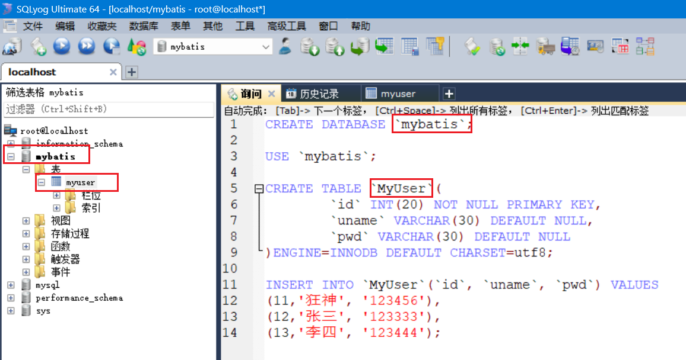
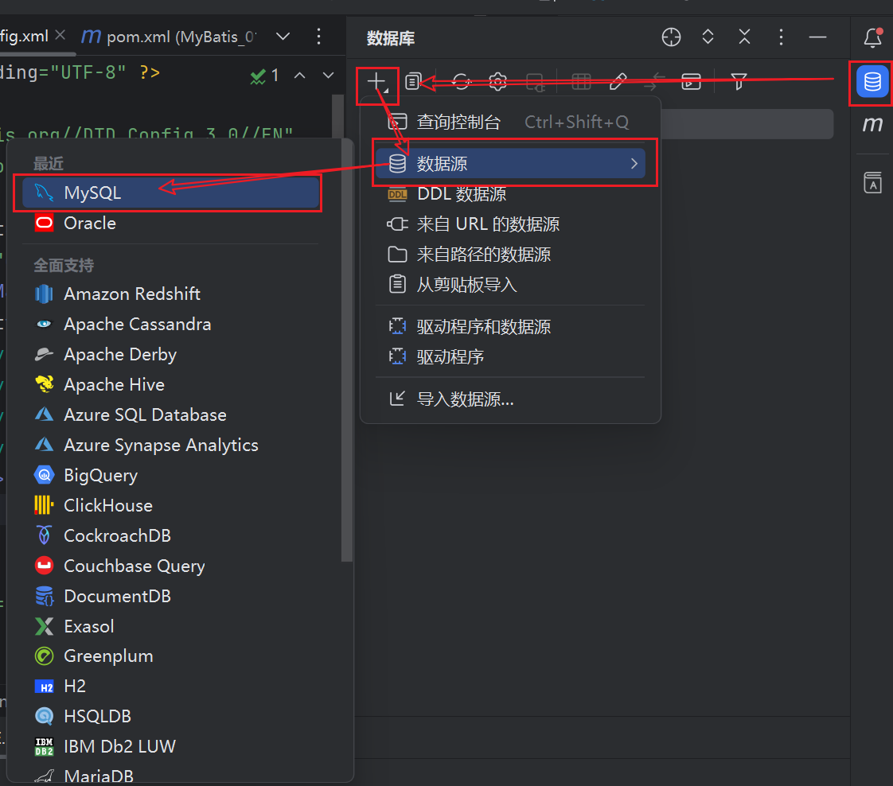
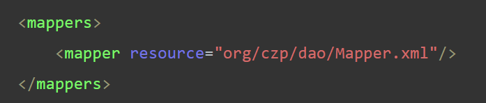
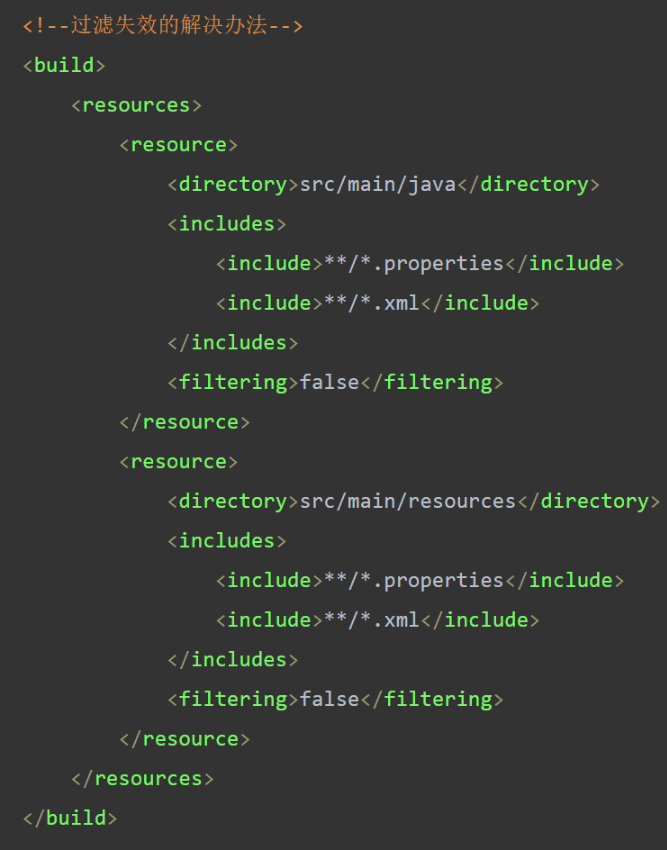
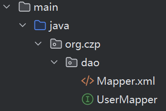
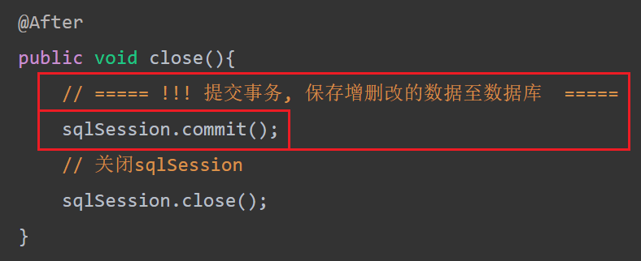
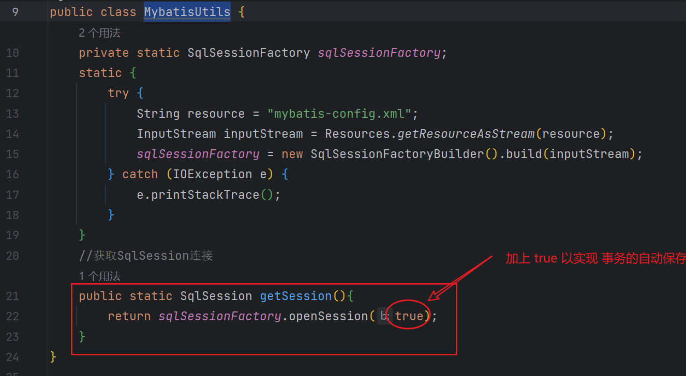

# 	Mysql与SQLyog配置

## MySql

### 初次:

1. 官网下载压缩包并解压至自定义目录下
1. 配置环境变量
1. 新增`my.ini`文件并写入相关配置
1. CMD命令配置

### 使用(CMD):

```java
// 1. 进入mysql下的bin目录
cd /d D:\__acquired_D\_mysql\mysql-8.0.33\bin
// 2. 启动mysql服务器
net start mysql
// 3. 输入用户名和密码, 从而进入MySql命令行
mysql -u root -p123456
```


## SQLyog安装与使用

> 略, 详见: [MySQL8.0安装及SQLyog安装与激活_bilibili](https://www.bilibili.com/video/BV1jq4y1e7FC/?spm_id_from=333.1007.top_right_bar_window_history.content.click)


# 第一个MyBatis程序

## 1. 构建数据库



## 2. maven项目

### 前序

#### ==简述与大纲==

> 先创建maven项目, 
>
> 再创建子(maven)模块, 新建文件夹 ( main-java, main-resources, test ) 
>
> 连接数据库, 并做好相关配置


#### 连接数据库




### ==一些问题==

+ 问题: 运行`test.java.org.czp.UserMapperTest.test()`时报错: 找不到`org/czp/dao/Mapper.xml`



+ 解决方法: 在`pom.xml`中加上过滤器:




### pom.xml

> 注入依赖  line21-38

```xml
<?xml version="1.0" encoding="UTF-8"?>
<project xmlns="http://maven.apache.org/POM/4.0.0"
         xmlns:xsi="http://www.w3.org/2001/XMLSchema-instance"
         xsi:schemaLocation="http://maven.apache.org/POM/4.0.0 http://maven.apache.org/xsd/maven-4.0.0.xsd">
    <modelVersion>4.0.0</modelVersion>

    <groupId>org.example</groupId>
    <artifactId>MyBatis_01</artifactId>
    <version>1.0-SNAPSHOT</version>
    <packaging>pom</packaging>
    <modules>
        <module>MyBatis_01_01</module>
    </modules>

    <properties>
        <maven.compiler.source>17</maven.compiler.source>
        <maven.compiler.target>17</maven.compiler.target>
        <project.build.sourceEncoding>UTF-8</project.build.sourceEncoding>
    </properties>

    <!--导入依赖-->
    <dependencies>
        <dependency>
            <groupId>org.mybatis</groupId>
            <artifactId>mybatis</artifactId>
            <version>3.5.6</version>
        </dependency>
        <dependency>
            <groupId>mysql</groupId>
            <artifactId>mysql-connector-java</artifactId>
            <version>8.0.28</version>
        </dependency>
        <dependency>
            <groupId>junit</groupId>
            <artifactId>junit</artifactId>
            <version>4.13.1</version>
        </dependency>
    </dependencies>
    
    <!--过滤失效的解决办法-->
    <build>
        <resources>
            <resource>
                <directory>src/main/java</directory>
                <includes>
                    <include>**/*.properties</include>
                    <include>**/*.xml</include>
                </includes>
                <filtering>false</filtering>
            </resource>
            <resource>
                <directory>src/main/resources</directory>
                <includes>
                    <include>**/*.properties</include>
                    <include>**/*.xml</include>
                </includes>
                <filtering>false</filtering>
            </resource>
        </resources>
    </build>

</project>
```

### resources

#### 核心配置 mybatis-config.xml

> ==与数据库绑定==
>
> url username password 自定义  line11-13
>
> mapper路径 自定义 line18

```xml
<?xml version="1.0" encoding="UTF-8" ?>
<!DOCTYPE configuration
        PUBLIC "-//mybatis.org//DTD Config 3.0//EN"
        "http://mybatis.org/dtd/mybatis-3-config.dtd">
<configuration>

    <environments default="development">
        <environment id="development">
            <transactionManager type="JDBC"/>
            <dataSource type="POOLED">
                <property name="driver" value="com.mysql.cj.jdbc.Driver"/>
                <property name="url" value="jdbc:mysql://localhost:3306/mybatis?useSSL=true&amp;useUnicode=true&amp;characterEncoding=utf8"/>
                <property name="username" value="root"/>
                <property name="password" value="123456"/>
            </dataSource>
        </environment>
    </environments>

    <mappers>
        <mapper resource="org/czp/dao/Mapper.xml"/>
    </mappers>

</configuration>
```


### main.java (.org.czp)

#### dao

##### 接口类 UserMapping

```java
package org.czp.dao;

import org.czp.pojo.MyUser;
import java.util.List;

public interface UserMapper {
    List<MyUser> selectUser();
}
```

##### 配置文件 Mapper.xml

```xml
<?xml version="1.0" encoding="UTF-8" ?>
<!DOCTYPE mapper
        PUBLIC "-//mybatis.org//DTD Mapper 3.0//EN"
        "http://mybatis.org/dtd/mybatis-3-mapper.dtd">

<!--指定命名空间(接口类Usermapping)-->
<mapper namespace="com.czp.dao.UserMapper">

    <!-- 重写命名空间的方法select(), 返回类型为实体类MyUser -->
    <select id="selectUser" resultType="com.czp.pojo.MyUser">
        select * from Mybatis.MyUser
    </select>
    
</mapper>
```

#### pojo

##### 实体类 MyUser.java

> 类中的属性名应与数据库中对应表中的属性名一致

```java
package org.czp.dao;

public class MyUser {
    private int id;  //id
    private String uname;   //姓名
    private String pwd;   //密码

    // ======= Setter Getter Tostring NoArgsConstructor AllArgsConstructor ==========

    public MyUser() {
    }

    public MyUser(int id, String uname, String pwd) {
        this.id = id;
        this.uname = uname;
        this.pwd = pwd;
    }

    @Override
    public String toString() {
        return "MyUser{" +
                "id=" + id +
                ", uname='" + uname + '\'' +
                ", pwd='" + pwd + '\'' +
                '}';
    }

    public int getId() {
        return id;
    }

    public void setId(int id) {
        this.id = id;
    }

    public String getUname() {
        return uname;
    }

    public void setUname(String uname) {
        this.uname = uname;
    }

    public String getPwd() {
        return pwd;
    }

    public void setPwd(String pwd) {
        this.pwd = pwd;
    }
}
```

#### utils

##### 工具类 MybatisUtils.java

>  核心配置路径 line11

```java
import org.apache.ibatis.io.Resources;
import org.apache.ibatis.session.SqlSession;
import org.apache.ibatis.session.SqlSessionFactory;
import org.apache.ibatis.session.SqlSessionFactoryBuilder;
import java.io.IOException;
import java.io.InputStream;
public class MybatisUtils {
    private static SqlSessionFactory sqlSessionFactory;
    static {
        try {
            String resource = "mybatis-config.xml";
            InputStream inputStream = Resources.getResourceAsStream(resource);
            sqlSessionFactory = new SqlSessionFactoryBuilder().build(inputStream);
        } catch (IOException e) {
            e.printStackTrace();
        }
    }
    //获取SqlSession连接
    public static SqlSession getSession(){
        return sqlSessionFactory.openSession();
    }
}
```


### test.java (.org.czp)

```java
package org.czp;

import org.apache.ibatis.session.SqlSession;
import org.czp.dao.UserMapper;
import org.czp.pojo.MyUser;
import org.czp.utils.MybatisUtils;
import org.junit.Test;

import java.util.List;

public class UserMapperTest {
    @Test
    public void test(){
        
        // 获取工具类对象sqlSession
        SqlSession sqlSession = MybatisUtils.getSession();

        // 获取含有selectUser()方法的接口UserMapper
        UserMapper mapper = sqlSession.getMapper(UserMapper.class);

        // 使用方法selectUser以获取user列表 并循环输出
        List<MyUser> userList = mapper.selectUser();
        userList.forEach(System.out::println);

    }
}
```


# 主体内容

## 增删改查

### 接口 UserMapper.java

```java
package org.czp.dao;

import org.apache.ibatis.annotations.Param;
import org.czp.pojo.MyUser;

public interface UserMapper {
    // 增
    void addUser(@Param("id") int id, @Param("uname") String uname, @Param("pwd") String pwd);
    // 删
    void deleteUserById(@Param("ID") int id);
    // 查
    MyUser selectUserById(@Param("ID") int id);
    // 改
    void updatePassword(@Param("ID") int id, @Param("pwd") String pwd);
}
```


### 映射配置 Mapper.xml

```xml
<?xml version="1.0" encoding="UTF-8" ?>
<!DOCTYPE mapper
        PUBLIC "-//mybatis.org//DTD Mapper 3.0//EN"
        "http://mybatis.org/dtd/mybatis-3-mapper.dtd">

<!--指定命名空间-->
<mapper namespace="org.czp.dao.UserMapper">

    <insert id="addUser">
        insert into MyUser(id,uname,pwd) values (#{id},#{uname},#{pwd})
    </insert>

    <delete id="deleteUserById">
        delete from MyUser where id = #{ID}
    </delete>

    <select id="selectUserById" resultType="org.czp.pojo.MyUser">
        select * from Mybatis.MyUser where id = #{ID}
    </select>

    <update id="updatePassword">
        update MyUser set pwd = #{pwd} where id = #{ID}
    </update>
</mapper>	
```


### 测试类 UserMapperTest.java

```java
package org.czp;

import com.mysql.cj.jdbc.BlobFromLocator;
import org.apache.ibatis.session.SqlSession;
import org.czp.dao.UserMapper;
import org.czp.pojo.MyUser;
import org.czp.utils.MybatisUtils;
import org.junit.*;

import java.util.List;

public class UserMapperTest {

    private SqlSession sqlSession;
    private UserMapper mapper;

    @Before
    public void init(){
        // 获取工具类对象sqlSession
        sqlSession = MybatisUtils.getSession();

        // 获取含有selectUser()方法的接口UserMapper
        mapper = sqlSession.getMapper(UserMapper.class);
    }

    @After
    public void close(){
        // ===== !!! 提交事务, 保存增删改的数据至数据库  =====
        sqlSession.commit();
        // 关闭sqlSession
        sqlSession.close();
    }
    // 增
    @Ignore   // 同一个 id=6 不可多次创建, 故忽略
    @Test
    public void addUserTest(){
        mapper.addUser(6, "兆鹏", "020306");
    }
    // 删
    @Test
    public void deleteUserByIdTest(){
        mapper.deleteUserById(5);
    }
    // 查
    @Test
    public void selectByIdTest(){
        MyUser user = mapper.selectUserById(2);
        System.out.println(user);
    }
    // 改
    @Test
    public void updatePwdTest(){
        mapper.updatePassword(2,"123123");

    }
}
```


### 小结

+ 所有的增删改操作都需要提交事务！
+ 接口所有的普通参数，尽量都写上`@Param`参数，尤其是多个参数时，必须写上！
+ 有时候根据业务的需求，可以考虑使用map传递参数！
+ 为了规范操作，在SQL的配置文件中，我们尽量将Parameter参数和resultType都写上！


## 注解开发

### 更换配置路径

在 核心配置文件 中的 xml映射配置 改成 接口配置

> 注意: 
>
> 前者是`resource`,以`/`分隔,
>
> 后者是`class`, 以`.`分隔

```xml
<mappers>
        <!--<mapper resource="org/czp/dao/Mapper.xml"/>-->
        <mapper class="org.czp.dao.UserMapper"/>
</mappers>
```



### 注解语法

之后我们就不需要 `Mapper.xml`了, 在`UserMapper`接口中用注解配置即可

基本语法:

```java
@操作("对应SQL语句")             // 操作 有四种: Insert Delete Select Update
Java抽象函数
```

例如:

```java
@Select("select * from Mybatis.MyUser where id = #{ID}")
MyUser selectUserById(@Param("ID") int id);
```


### 注解实例

一下是用注解实现增删改查的接口类的代码:

```java
package org.czp.dao;

import org.apache.ibatis.annotations.*;
import org.czp.pojo.MyUser;

public interface UserMapper {
    // 增
    @Insert("insert into MyUser(id,uname,pwd) values (#{id},#{uname},#{pwd})")
    void addUser(@Param("id") int id, @Param("uname") String uname, @Param("pwd") String pwd);
    // 删
    @Delete("delete from MyUser where id = #{ID}")
    void deleteUserById(@Param("ID") int id);
    // 查
    @Select("select * from Mybatis.MyUser where id = #{ID}")
    MyUser selectUserById(@Param("ID") int id);
    // 改
    @Update("update MyUser set pwd = #{pwd} where id = #{ID}")
    void updatePassword(@Param("ID") int id, @Param("pwd") String pwd);
}
```


## 事务保存

一般情况下,需要在测试类中写上`sqlSession.commit()`来保存事务



我们可以在工具类 MybatisUtils 中设置




## ResultMap结果集映射 [略]

*核心配置文件*

```xml
<resultMap id="UserMap" type="User">
    <!-- id为主键 -->
    <id column="id" property="id"/>
    <!-- column是数据库表的列名 , property是对应实体类的属性名 -->
    <result column="name" property="name"/>
    <result column="pwd" property="password"/>
</resultMap>

<select id="selectUserById" resultMap="UserMap">
    select id , name , pwd from user where id = #{id}
</select>
```

### 多对一

[狂神SSM教程_MyBatis多对一的处理](https://www.kuangstudy.com/zl/ssm#1377545383739142145)

[新]Mapper.xml

```xml
<?xml version="1.0" encoding="UTF-8" ?>
<!DOCTYPE mapper
        PUBLIC "-//mybatis.org//DTD Mapper 3.0//EN"
        "http://mybatis.org/dtd/mybatis-3-mapper.dtd">
<mapper namespace="com.kuang.mapper.StudentMapper">
    <!--
    需求：获取所有学生及对应老师的信息
    思路：
        1. 获取所有学生的信息
        2. 根据获取的学生信息的老师ID->获取该老师的信息
        3. 思考问题，这样学生的结果集中应该包含老师，该如何处理呢，数据库中我们一般使用关联查询？
            1. 做一个结果集映射：StudentTeacher
            2. StudentTeacher结果集的类型为 Student
            3. 学生中老师的属性为teacher，对应数据库中为tid。
               多个 [1,...）学生关联一个老师=> 一对一，一对多
            4. 查看官网找到：association – 一个复杂类型的关联；使用它来处理关联查询
    -->
    <select id="getStudents" resultMap="StudentTeacher">
      select * from student
    </select>
    <resultMap id="StudentTeacher" type="Student">
        <!--association关联属性  property属性名 javaType属性类型 column在多的一方的表中的列名-->
        <association property="teacher"  column="tid" javaType="Teacher" select="getTeacher"/>
    </resultMap>
    <!--
    这里传递过来的id，只有一个属性的时候，下面可以写任何值
    association中column多参数配置：
        column="{key=value,key=value}"
        其实就是键值对的形式，key是传给下个sql的取值名称，value是片段一中sql查询的字段名。
    -->
    <select id="getTeacher" resultType="teacher">
        select * from teacher where id = #{id}
    </select>
</mapper>
```


### 一对多

[狂神SSM教程_MyBatis一对多](https://www.kuangstudy.com/zl/ssm#1377545657664929794)

[新]Mapper.xml

```xml
<mapper namespace="com.kuang.mapper.TeacherMapper">
    <!--
    思路:
        1. 从学生表和老师表中查出学生id，学生姓名，老师姓名
        2. 对查询出来的操作做结果集映射
            1. 集合的话，使用collection！
                JavaType和ofType都是用来指定对象类型的
                JavaType是用来指定pojo中属性的类型
                ofType指定的是映射到list集合属性中pojo的类型。
    -->
    <select id="getTeacher" resultMap="TeacherStudent">
        select s.id sid, s.name sname , t.name tname, t.id tid
        from student s,teacher t
        where s.tid = t.id and t.id=#{id}
    </select>
    <resultMap id="TeacherStudent" type="Teacher">
        <result  property="name" column="tname"/>
        <collection property="students" ofType="Student">
            <result property="id" column="sid" />
            <result property="name" column="sname" />
            <result property="tid" column="tid" />
        </collection>
    </resultMap>
</mapper>
```


## 动态SQL [略]

举例:

```xml
<!--需求1：
根据作者名字和博客名字来查询博客！
如果作者名字为空，那么只根据博客名字查询，反之，则根据作者名来查询
select * from blog where title = #{title} and author = #{author}
-->
<select id="queryBlogIf" parameterType="map" resultType="blog">
    select * from blog where
    <if test="title != null">
        title = #{title}
    </if>
    <if test="author != null">
        and author = #{author}
    </if>
</select>
```

详见: [狂神SSM教程_MyBatis动态SQL](https://www.kuangstudy.com/zl/ssm#1377545874476904449)


# 其他

## 配置解析

 [狂神SSM教程_MyBatis配置解析](https://www.kuangstudy.com/zl/ssm#1377538433353785345)

```
configuration（配置）
    properties（属性）
    settings（设置）
    typeAliases（类型别名）
    typeHandlers（类型处理器）
    objectFactory（对象工厂）
    plugins（插件）
    environments（环境配置）
        environment（环境变量）
            transactionManager（事务管理器）
            dataSource（数据源）
    databaseIdProvider（数据库厂商标识）
    mappers（映射器）
<!-- 注意元素节点的顺序！顺序不对会报错 -->
```


## 分页

> 略


## 缓存

> 略


