# 新建maven项目

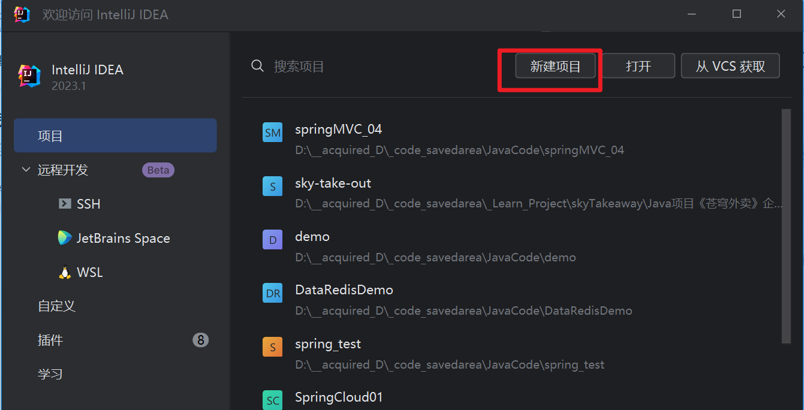

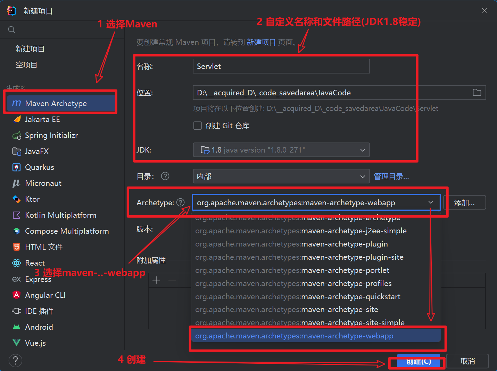

> 可能要等待24~100min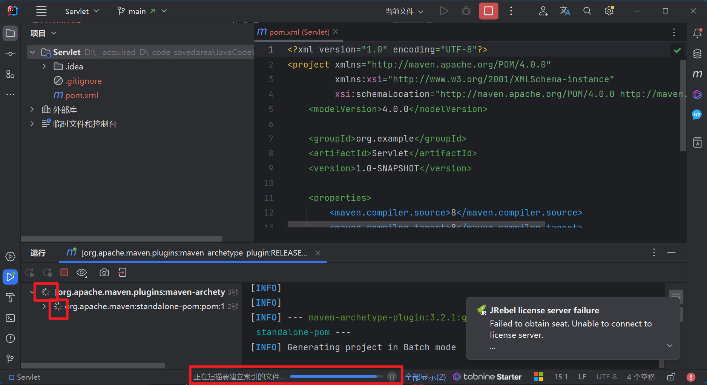
>
> 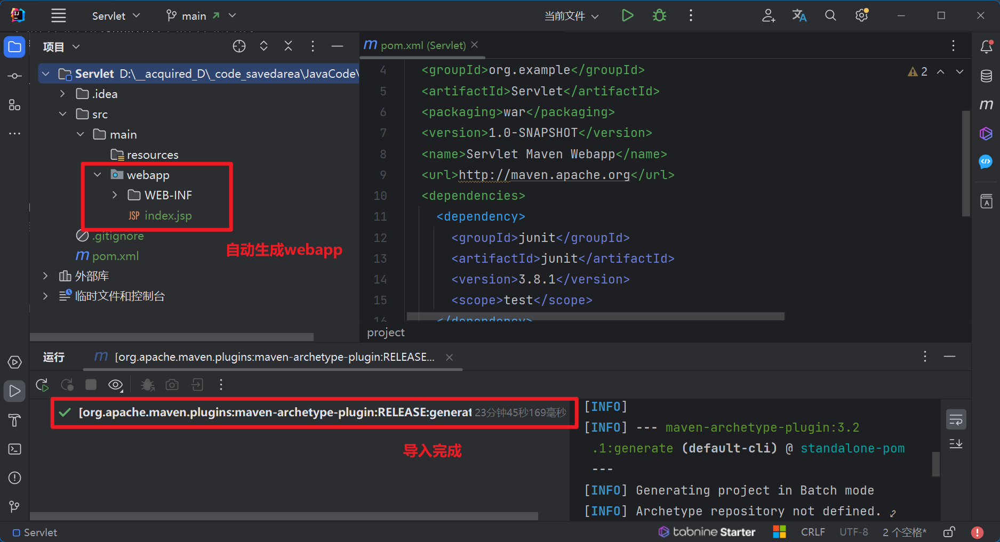

# 配置Tomcat

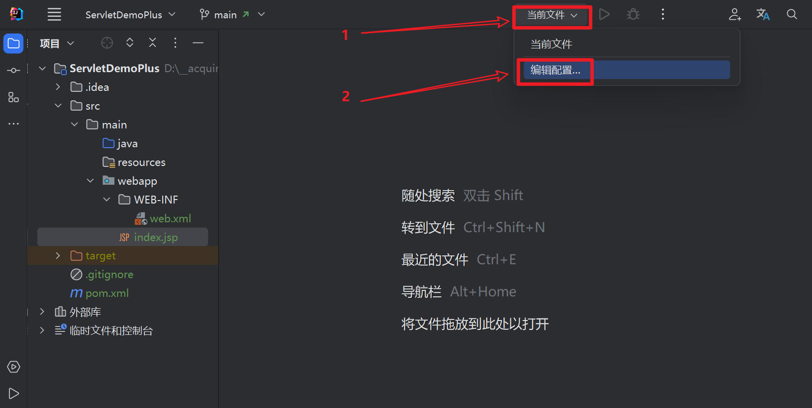

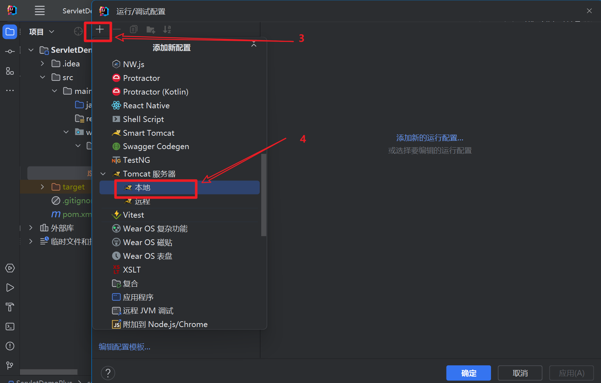

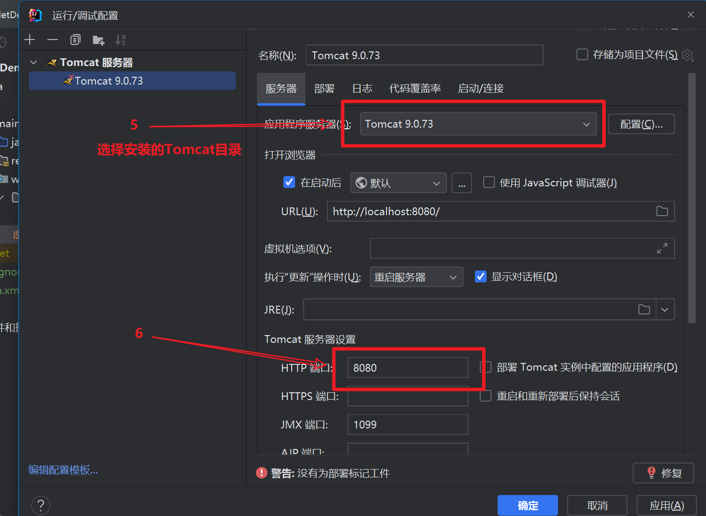

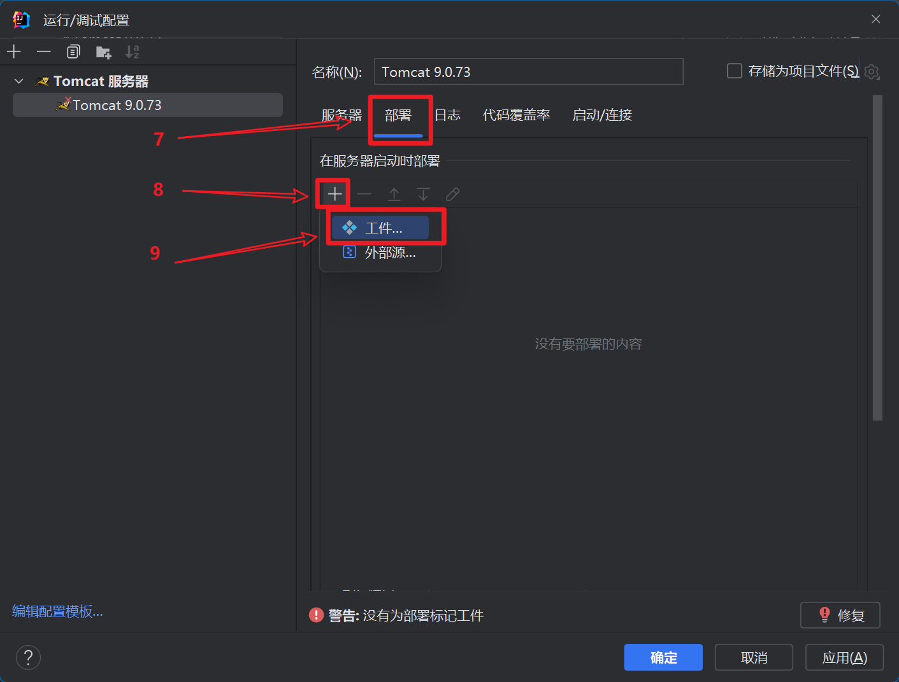

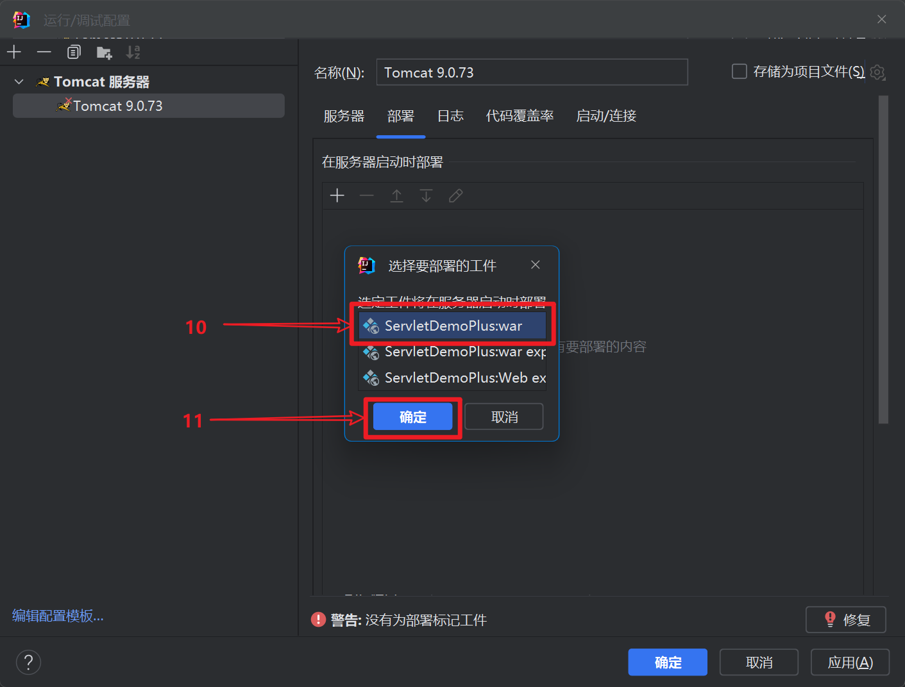

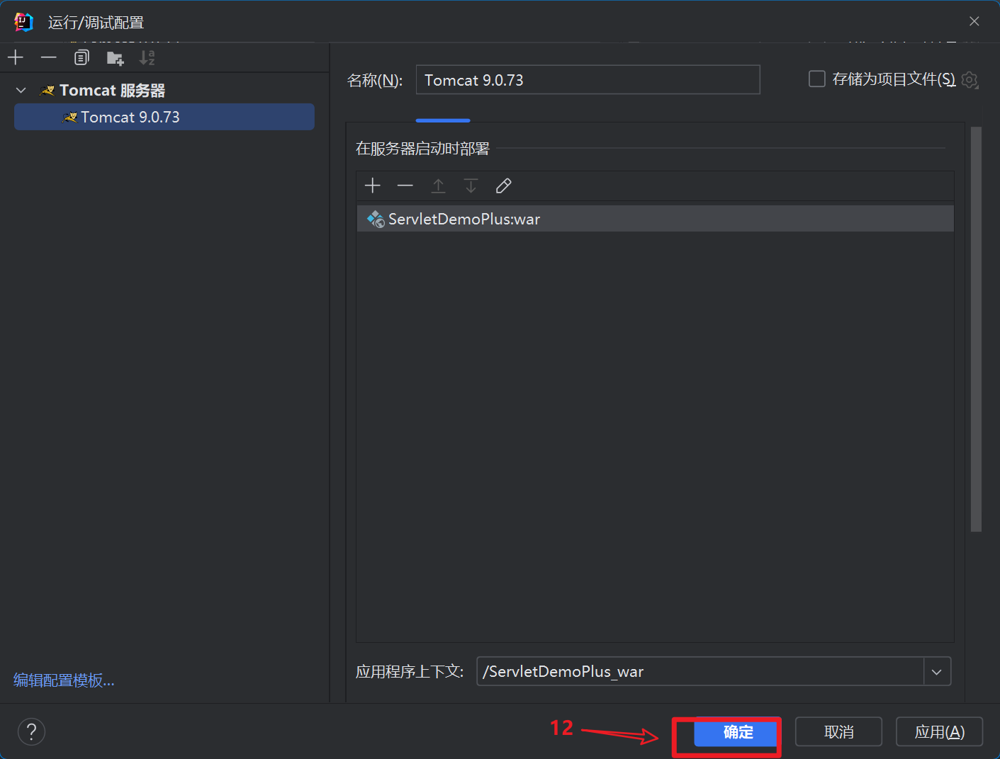

## 测试

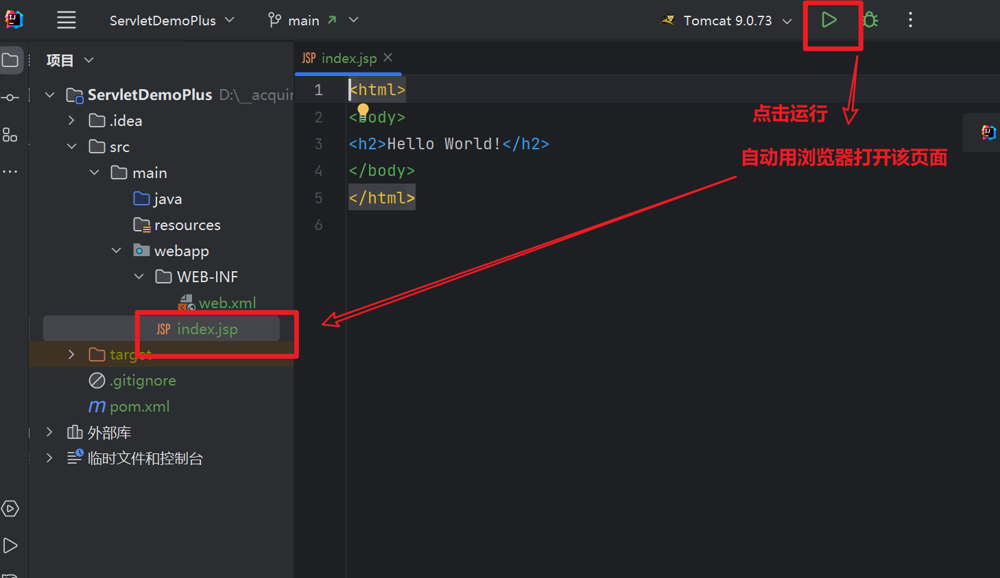

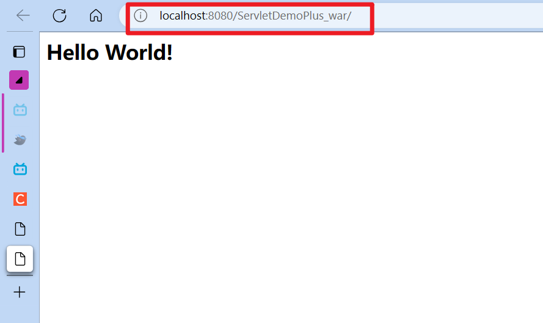

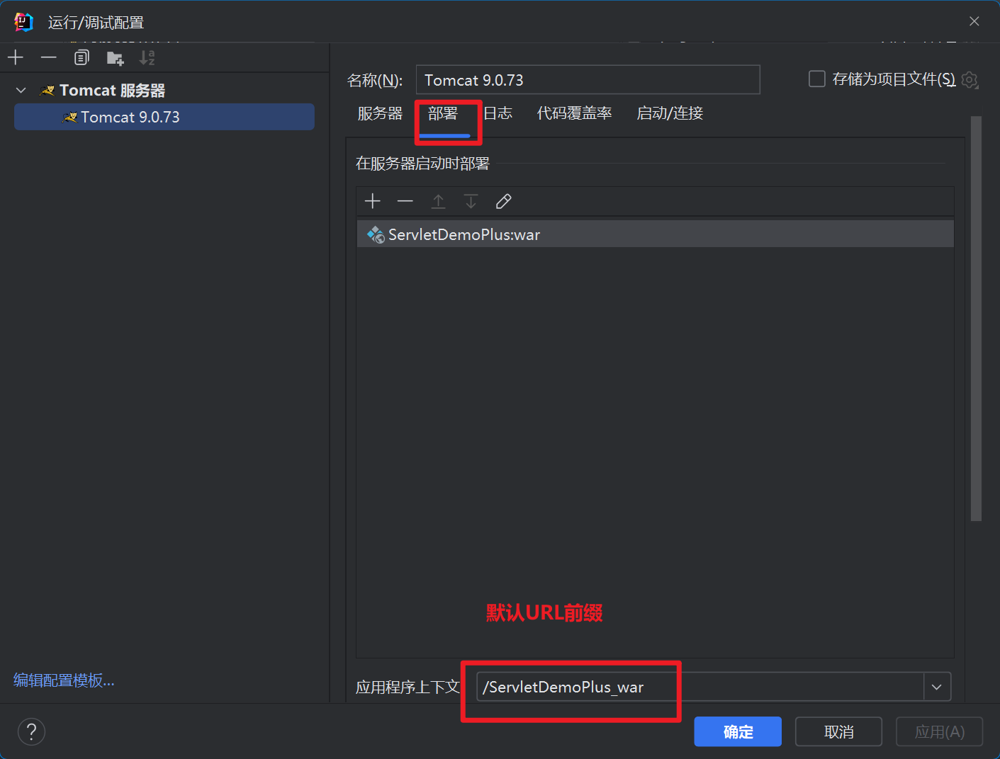

# pom.xml

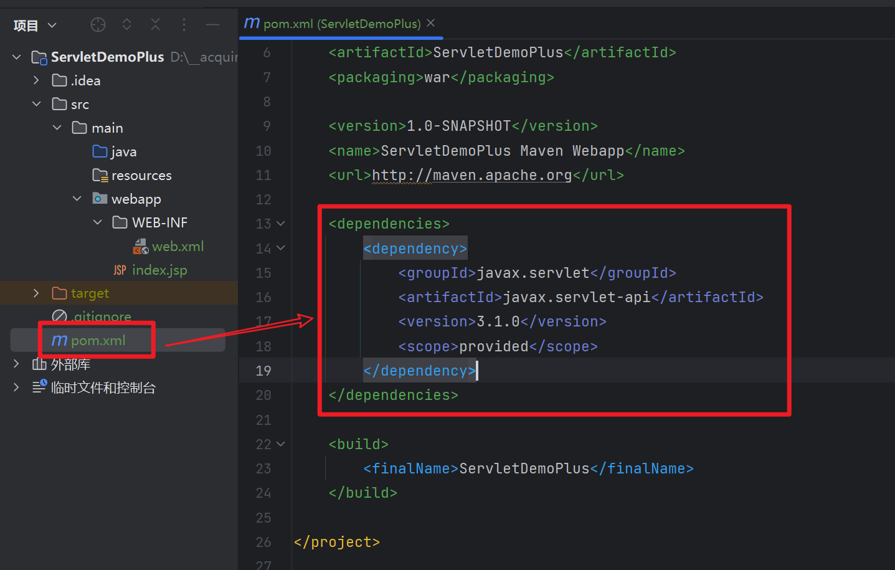

## 代码

```xml
<dependency>
	<groupId>javax.servlet</groupId>
    <artifactId>javax.servlet-api</artifactId>
    <version>3.1.0</version>
    <scope>provided</scope>
</dependency>
```


# 使用Servlet

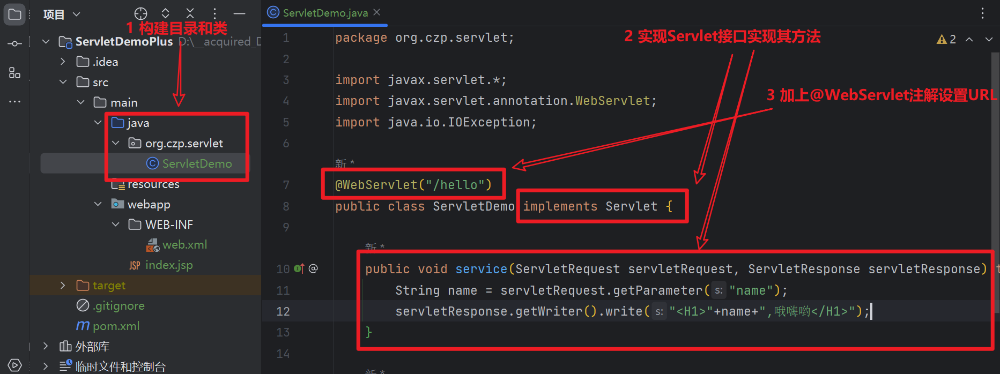

## 测试

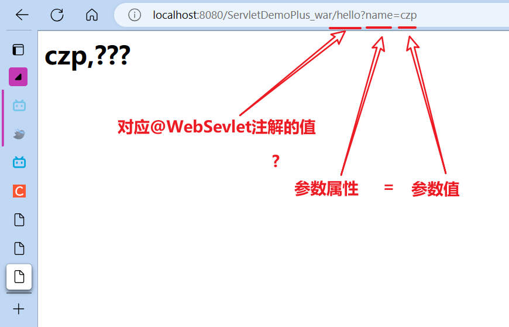