# springboot

## 项目构建

1. 选择Java Maven 

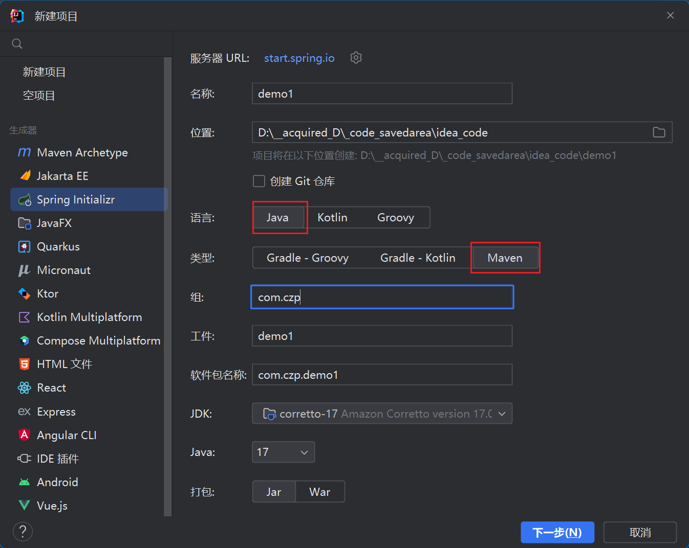

2. 导入Spring Web

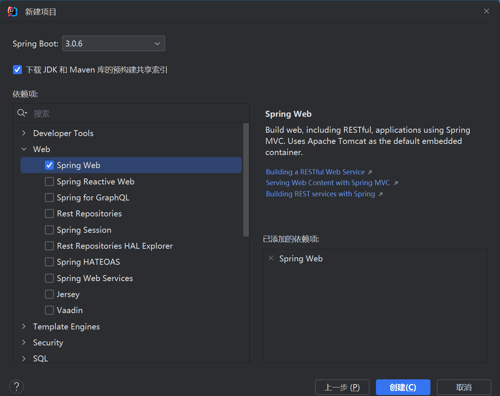

## 项目大纲


# 原理

## 自动装配(pom.xml)

### 父工程

核心依赖在父工程中

```xml
<parent>
		<groupId>org.springframework.boot</groupId>
		<artifactId>spring-boot-starter-parent</artifactId>
		<version>3.0.6</version>
		<relativePath/> <!-- lookup parent from repository -->
</parent>
```


### 启动器

启动器会帮我们自动导入相关的依赖

```xml
<dependency>
			<groupId>org.springframework.boot</groupId>
			<artifactId>spring-boot-starter-web</artifactId>
</dependency>
<dependency>
			<groupId>org.springframework.boot</groupId>
			<artifactId>spring-boot-starter-test</artifactId>
			<scope>test</scope>
</dependency>
```


### 主程序

+ `@SpringBootApplication`
    + `@SpringBootConfiguration`
        + `@Configuration`
            + `@Component`
    + `@EnableAutoConfiguration` // 自动导入包
        + `@AutoConfigurationPackage`
            + `@Import({AutoConfigurationPackages.Registrar.class})`  // 自动注册表
        + `@Import({AutoConfigurationImportSelector.class})`
            + `getAutoConfigurationEntry()` 
                + ......
            + .......
    + `@ComponentScan`   // 扫描当前类的同级包


## yaml相关

### 语法对比

#### xml语法

```xml
<name>zhangsan</name>
<Student>
	<id>106</id>
    <name>lisi</name>
</Student>
```

#### properties语法

// 不方便嵌套(如对象的结构)

```properties
name=zhangsan
```

#### yaml语法

// 空格不能少,否则无法识别

```yaml
name: zhangsan
Student: 
	id: 106
	name: lisi
```


### 属性注入

#### 常规注入方法

User.java

```java
@Component
public class User{                 // 将User注入IOC容器

	@Value("18")
    private String id;             // 属性注入
    
    @Value("zhangsan")
    private String name;
}
```

DemoApplicationTests.java

```java
package com.czp.demo;

import com.czp.demo.pojo.User;
import org.junit.jupiter.api.Test;
import org.springframework.beans.factory.annotation.Autowired;
import org.springframework.boot.test.context.SpringBootTest;

@SpringBootTest
class DemoApplicationTests {

	@Autowired
	private User user;               // 将IOC容器中的User装配到这里

	@Test
	void contextLoads(){
		System.out.println(user);
	}

}
```


#### yaml注入方法

文件目录

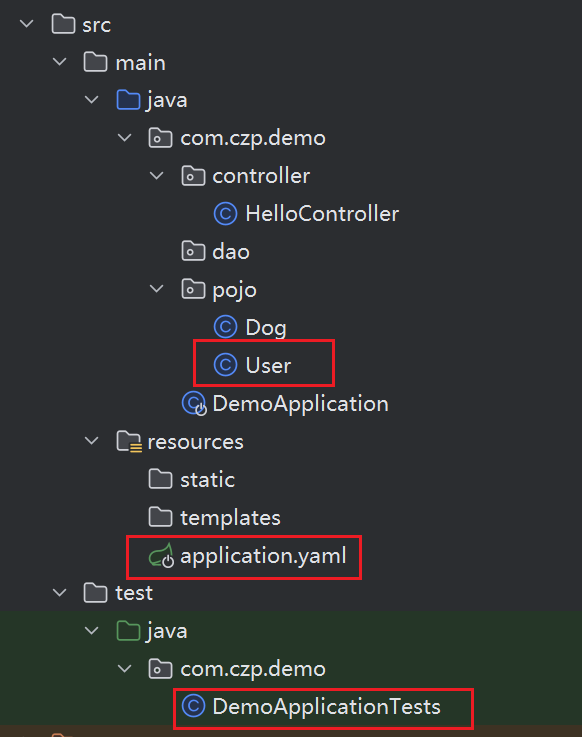

pom.xml 加上配置:

```xml
<dependency>
			<groupId>org.springframework.boot</groupId>
			<artifactId>spring-boot-configuration-processor</artifactId>
			<optional>true</optional>
</dependency>
```

User.java

```java
@Component                                         // 将User注入IOC容器
@ConfigurationProperties(prefix = "user")          // 从yaml配置文件中读取数据以装配属性
public class User{
    private String id;
    private String name;
}
```

application.yaml

```yaml
user:
    id: 18
    name: czp
```

DemoApplicationTests.java **同上(常规注入方法)**


### JSR303校验

#### 示范

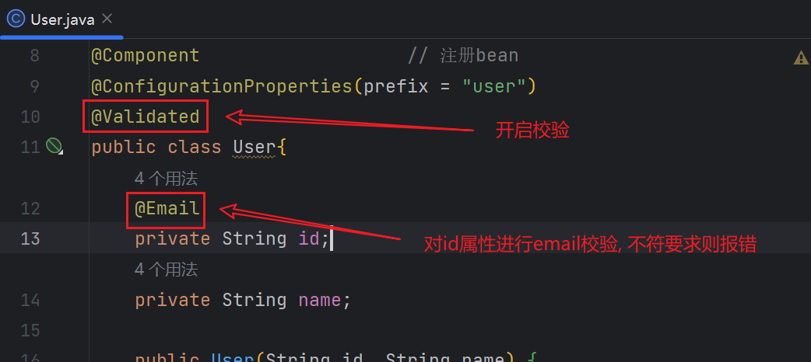

#### 配置

pom.xml

```xml
<!--依赖-->
<dependency>
			<groupId>jakarta.validation</groupId>
			<artifactId>jakarta.validation-api</artifactId>
			<version>3.0.2</version>
</dependency>

<!--插件-->
<plugin>
            <groupId>org.apache .maven.plugins</groupId>
            <artifactId>maven-clean-plugin</artifactId>
            <version>3.2.0</version>
</plugin>
```

#### 其他约束(不完整)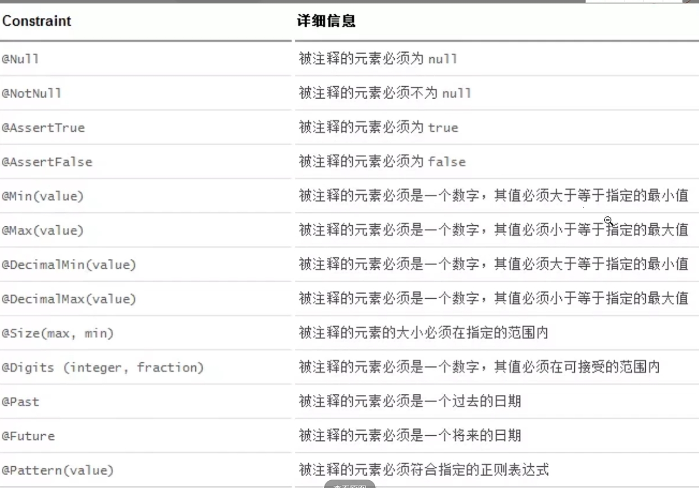


## 多环境

### 多环境配置

可以在以下路径存放配置文件, 若同时存在多个配置文件则按以序号为优先级生效

1. `file:./config/`

    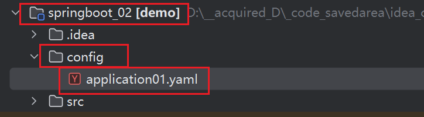

1. `file:./`

    ​	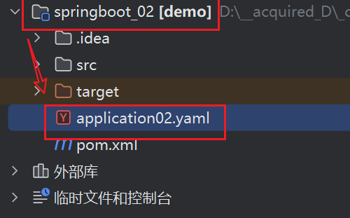

1. `classpath:/config/`

    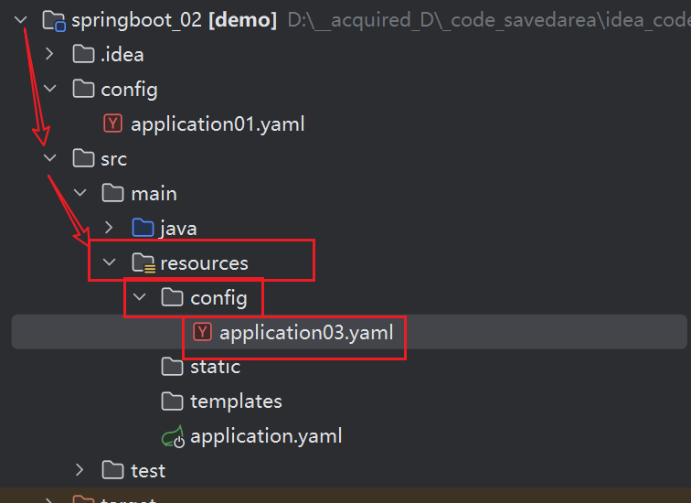

1. `classpath:/`

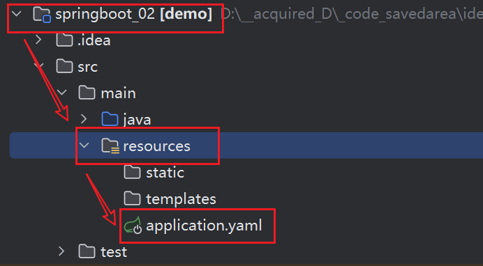

### 多环境切换

目录


dev环境

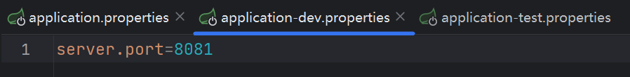

test环境

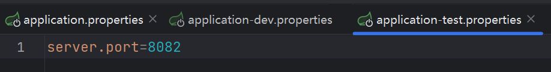

默认环境(切换)

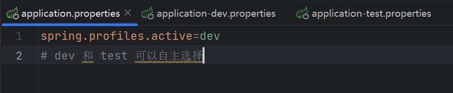


# web开发

## 导入静态资源

### 直接显示

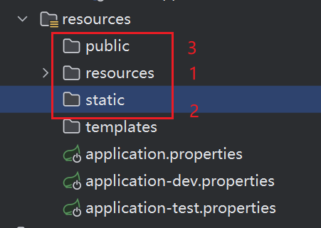

存放于上图红框内的静态文件可直接通过 `localhost:8080/文件名.后缀` 来访问

红色数字对于冲突的文件名, 不同文件夹的优先级

### ==HTML 对 css JavaScript 的整合==

> 在`href`或`src`前加**`th:`**(一个冒号), 
>
> 在本地连接外加`@{}`,
>
> 路径默认从`static`下开始, 以`/`打头

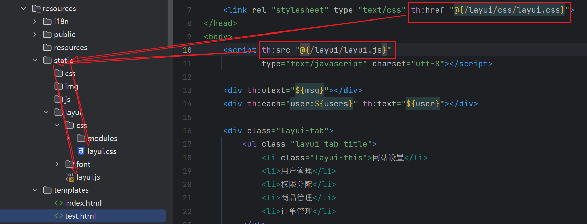


## 首页与图标定制

### 首页

将`index.html`作为静态文件存放于指定的位置  *见:导入静态资源*

### 图标定制 

在`application.properties`文件中加上`spring.mvc.favicon.enable=false`语句以关闭默认图标

然后将图标命名为`favicon.ico`  放在`calsspath:/public/`下


## 模板引擎==thymeleaf==

### 简述

+ jsp替代的替代方案, jsp就是一个模板引擎

+ templates目录下的所有页面, 只能通过controller来跳转 (需要模板引擎的支持)

### 依赖

pom.xml 加上依赖

```xml
<dependency>
			<groupId>org.springframework.boot</groupId>
			<artifactId>spring-boot-starter-thymeleaf</artifactId>
</dependency>
```

### 示范

```java
@Controller                            // 注册bean
@RequestMapping("/c2")                 
public class IndexController {                   

    @RequestMapping("/m1")              // 请求
    public String test(){
        return "test";                   // 返回视图
    }
}
```

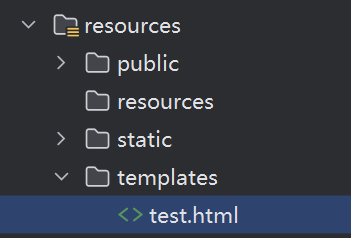

### 约束

+ 视图默认前缀: **`classpath:/templates/`**,  后缀**`.html`**

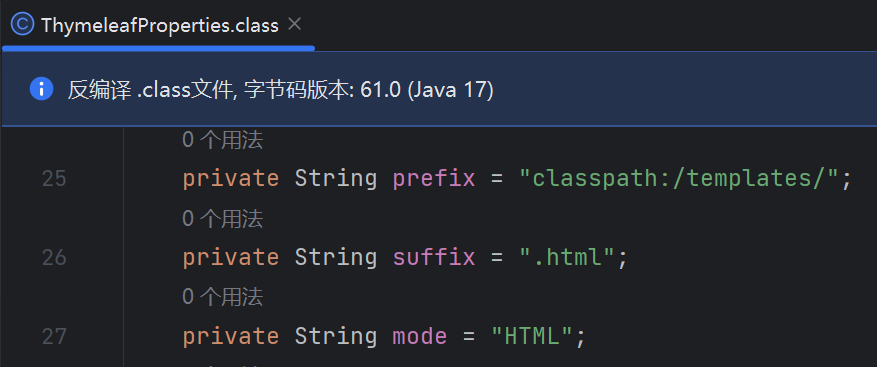

+ HTML头部设为
```html
<html xmlns:th="http://www.thymeleaf.org">
```

接下来便可使用相关语法

### 部分语法

IndexController.java

```java
@Controller
@RequestMapping("/c2")
public class IndexController {

    @RequestMapping("/m1")
    public String test(Model model){
        model.addAttribute("msg","<h1>hello</h1>");     // 字符串 需转义
        return "test";
    }

    @RequestMapping("/m2")
    public String each(Model model){
        model.addAttribute("users", Arrays.asList("zhangsan", "lisi"));  // 字符串数组
        return "test";
    }
}
```

test.html

```html
<!DOCTYPE html>
<html lang="en" xmlns:th="http://www.thymeleaf.org">
<head>
    <meta charset="UTF-8">
    <title>Test</title>
</head>
<body>
    <div th:utext="${msg}"></div>         <!-- utext 可解析 诸如<h1> 的特殊符号-->
    <!--
		从users遍历出user // th:each="user:${users}"
		打印user        // th:text="${user}"
	-->
    <div th:each="user:${users}" th:text="${user}"></div>
</body>
</html>
```

效果

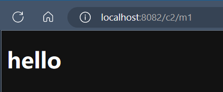

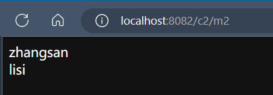


## MVC扩展

com.czp.demo.**config**.MvcConfig

自定义Mvc配置类: 加上注解`@Configuration`, 实现接口`WebMvcConfigurer`,**不要**加注解`@EnableWebMvc`

```java
@Configuration
public class MvcConfig implements WebMvcConfigurer {

    // 自定义视图解析器MyViewResolver并重写方法
    public static class MyViewResolver implements ViewResolver {
        @Override
        public View resolveViewName (String viewName, Locale locale){
            return null;
        }
    }
    // 将自定义的视图解析器注册Bean, 自定义配置完成
    @Bean
    public ViewResolver myViewResolver(){
        return new MyViewResolver();
    }

    // 自定义视图跳转, url:czp -> test.html
    @Override
    public void addViewControllers(ViewControllerRegistry registry) {
        registry.addViewController("/czp").setViewName("test");
    }
    
}
```


## 管理系统: 国际化

### 新建文件

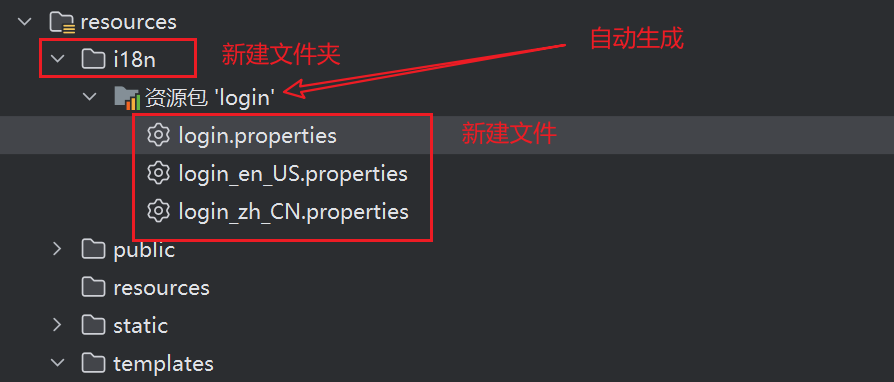

### 编写文件

> 不同文件完成对相同属性的不同语言实现, 如:

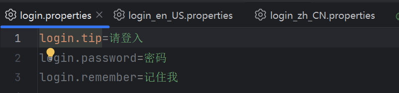

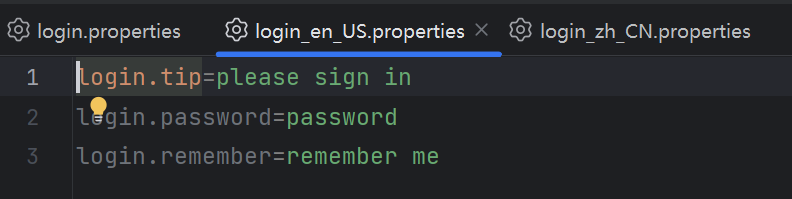

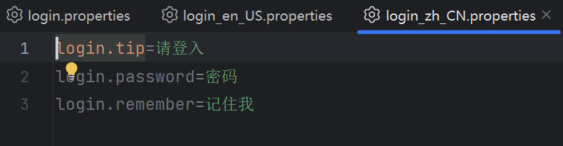

### 设置默认配置

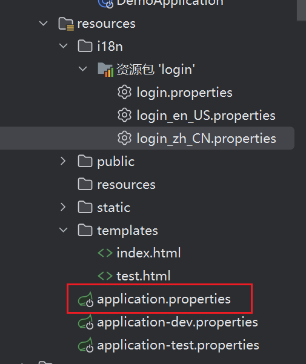

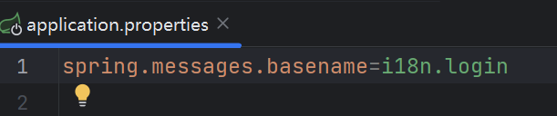

### 编写解析器 MyLocaleResolver

```java
package com.czp.demo.config;

import jakarta.servlet.http.HttpServletRequest;
import jakarta.servlet.http.HttpServletResponse;
import org.springframework.web.servlet.LocaleResolver;
import org.thymeleaf.util.StringUtils;

import java.util.Locale;

public class MyLocaleResolver implements LocaleResolver {
    @Override
    public Locale resolveLocale(HttpServletRequest request) {

        String language = request.getParameter("l");
        Locale locale = Locale.getDefault();
        if (!StringUtils.isEmpty(language)){
            String[] lang = language.split("_");
            locale = new Locale(lang[0], lang[1]);
        }
        return locale;
    }

    @Override
    public void setLocale(HttpServletRequest request, HttpServletResponse response, Locale locale) {
        
    }
}
```

### 注册到Bean

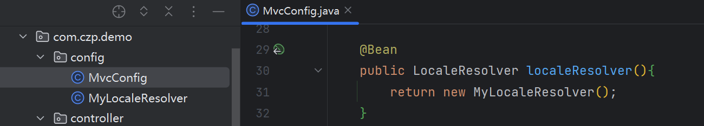


### 自定义视图跳转

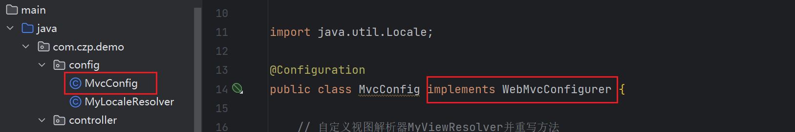

> `templates`下的 HTML文件需要视图解析器来跳转, 这里我们自定义一个

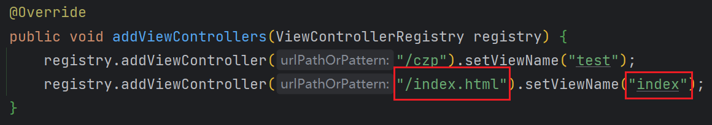

### 测试

index.html

```html
<!DOCTYPE html>
<html lang="en" xmlns:th="http://www.thymeleaf.org">
<head>
    <meta charset="UTF-8">
    <title>首页</title>
</head>
<body>
    hello, 我是首页
    <div th:text="#{login.tip}"></div>
    <div th:text="#{login.password}"></div>
    <div th:text="#{login.remember}"></div>
    <a th:href="@{/index.html(l='en_US')}">English</a>
    <a th:href="@{/index.html(l='zh_CN')}">中文</a>
</body>
</html>
```


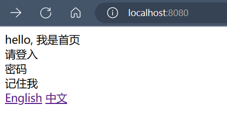

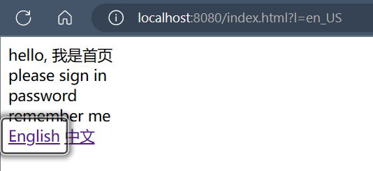

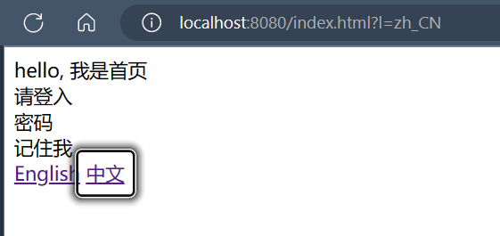


## 管理系统: 拦截器

### 请求页面 IndexController

> 多加了个session 并为其赋值

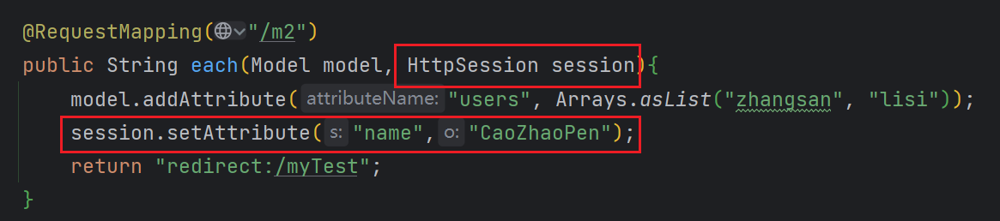


### 拦截器 LoginHandlerInterceptor

```java
package com.czp.demo.config;

import jakarta.servlet.http.HttpServletRequest;
import jakarta.servlet.http.HttpServletResponse;
import org.springframework.web.servlet.HandlerInterceptor;

public class LoginHandlerInterceptor implements HandlerInterceptor {

    @Override
    public boolean preHandle(HttpServletRequest request, HttpServletResponse response, 
                             Object handler) throws Exception {
        Object name = request.getSession().getAttribute("name");    // 获取属性
        if("CaoZhaoPen".equals(name)){
            request.setAttribute("msg","已拦截");
            // 跳转到"index.html"
            request.getRequestDispatcher("index.html").forward(request, response);
            return false;           // 拦截
        }
        return true;        // 不拦截
    }
}
```


### 重写配置 MvcConfig

> // 添加拦截器  并指定哪些被拦截, 哪些不被拦截;
>
> 重写方法:

```Java
@Override
public void addInterceptors(InterceptorRegistry registry) {
    registry.addInterceptor(new LoginHandlerInterceptor())
        .addPathPatterns("/**").excludePathPatterns("/", "/index.html");
}
```


# 数据库相关

## JDBC


### 导入依赖

> 也可以在创建项目时勾选相关依赖

```xml
<!--jdbc-->
<dependency>
            <groupId>org.springframework.boot</groupId>
            <artifactId>spring-boot-starter-jdbc</artifactId>
</dependency>
<!--mysql-->
<dependency>
            <groupId>com.mysql</groupId>
            <artifactId>mysql-connector-j</artifactId>
            <scope>runtime</scope>
</dependency>
```


### 连库&配置yaml

```yaml
spring:
  datasource:
    hikari:
      username: root
      password: 123456
      jdbc-url: jdbc:mysql://localhost:3306/mybatis?userUnicode=true&characterEncode=utf-8&serverTimezone=UTC
      driver-class-name: com.mysql.dbc.Driver
```

### JdbcTemplate 

```java
package com.czp.demo.controller;

import org.springframework.beans.factory.annotation.Autowired;
import org.springframework.jdbc.core.JdbcTemplate;
import org.springframework.web.bind.annotation.GetMapping;
import org.springframework.web.bind.annotation.RestController;

import java.util.List;
import java.util.Map;

@RestController
public class JdbcContronller {

    @Autowired
    JdbcTemplate jdbcTemplate;

    @GetMapping("/userList")
    public List<Map<String, Object>> userList(){
        String sql = "select * from MyUser";
        return jdbcTemplate.queryForList(sql);
    }

}
```


## ==Mybatis==

### 关系&大纲

+ 依赖
+ 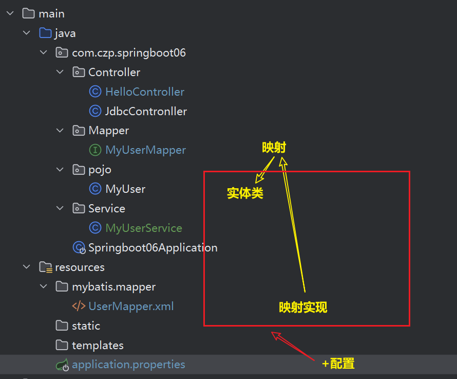


### ==问题&HELP==

+ 报错: 找不到mapper接口的bean, 可能需要 sqlSessionfactory

> 整体版本下降即可解决问题:
>
> + springboot2.x
> + JDK1.8
> + Java8

+ HELP:

    > 导入依赖(+JDBC)
    >
    > 写好核心配置(+JDBC)
    >
    > !! 创建初始HelloController  // 此时项目可以运行"hello world"
    >
    > 编写实体接口
    >
    > 编写mapper接口并实现SQL (用注解或xml)
    >
    > !! 在 (启动类 || 测试类 || Controller) 使用


### 依赖

```xml
<!--mybatis-->
<dependency>
            <groupId>org.mybatis.spring.boot</groupId>
            <artifactId>mybatis-spring-boot-starter</artifactId>
            <version>2.3.0</version>
</dependency>
<!--mysql-->
<dependency>
            <groupId>com.mysql</groupId>
            <artifactId>mysql-connector-j</artifactId>
            <scope>runtime</scope>
</dependency>

<!--不是必须的-->
<dependency>
            <groupId>org.projectlombok</groupId>
            <artifactId>lombok</artifactId>
</dependency>
```


### 实体接口

```java
package com.czp.springboot06.pojo;

import lombok.AllArgsConstructor;
import lombok.Data;
import lombok.NoArgsConstructor;

@Data
@AllArgsConstructor
@NoArgsConstructor
public class MyUser {
    private int id;
    private String uname;
    private String pwd;
}
```


### mapper接口

> 要在该类前加上注解`@Mapper`
>
> , 或者, 
>
> 在入口类前加上扫描注解`@MapperScan("com.czp.springboot06.Mapper.MyUserMapper")`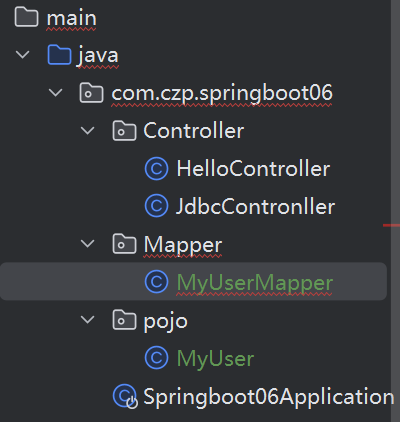

```java
package com.czp.springboot06.Mapper;

import com.czp.springboot06.pojo.MyUser;
import org.apache.ibatis.annotations.Mapper;
import org.springframework.stereotype.Repository;

import java.util.List;

/**
 * @author 28388
 */
@Mapper
@Repository
public interface MyUserMapper {

    List<MyUser> queryUserList();

    MyUser queryById(int id);

    int addUser(MyUser user);

    int updateUser(MyUser user);

    int deleteUser(int id);

}

```


### 映射xml实现

> 百度"MyBatis中文文档"得到**文件头**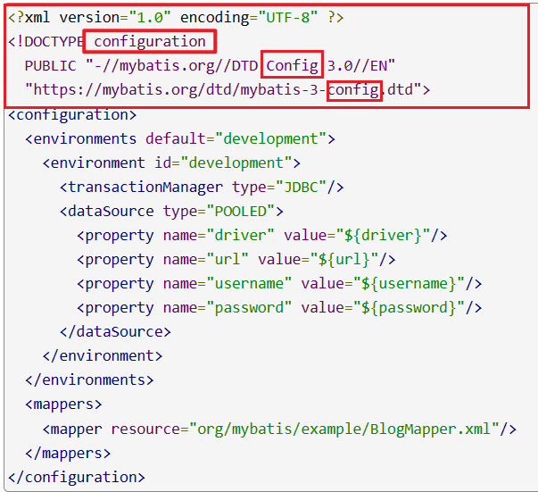
>
> 将`config`和`configuration`改成`mapper`

```xml
<?xml version="1.0" encoding="UTF-8" ?>
<!DOCTYPE mapper
        PUBLIC "-//mybatis.org//DTD Mapper 3.0//EN"
        "https://mybatis.org/dtd/mybatis-3-mapper.dtd">

<mapper namespace="com.czp.springboot06.Mapper.MyUserMapper">

    <select id="queryUserList" resultType="MyUser">
        select * from MyUser
    </select>

    <select id="queryById" resultType="MyUser">
        select * from MyUser where id = #{id}
    </select>

    <insert id="addUser" parameterType="MyUser">
        insert into MyUser(id, uname, pwd) values(#{user.id}, #{user.uname}, #{user.pwd})
    </insert>

    <update id="updateUser" parameterType="MyUser">
        update MyUser set uname = #{user.uname}, pwd = #P{user.pwd} where id = #{id}
    </update>

    <delete id="deleteUser" parameterType="MyUser">
        delete * form MyUser where id = #{id}
    </delete>

</mapper>
```


### +核心配置

> 实体类**包目录**
>
> 映射实现**文件路径**

```properties
mybatis.type-aliases-package=com.czp.springboot.pojo
mybatis.mapper-locations=classpath:mybatis/mapper/*.xml
```


## Druid

### 依赖

```xml
<dependency>
            <groupId>com.alibaba</groupId>
            <artifactId>druid</artifactId>
            <version>1.1.21</version>
</dependency>
```

### spplication.properties

```properties
spring.datasource.username=root
spring.datasource.password=123456
spring.datasource.url=jdbc:mysql://localhost:3306/mybatis?userUnicode=true&characterEncode=utf-8&serverTimezone=UTC
spring.datasource.driver-class-name=com.mysql.cj.jdbc.Driver
spring.datasource.type=com.alibaba.druid.pool.DruidDataSource      # 新增!!!
```

### Config文件

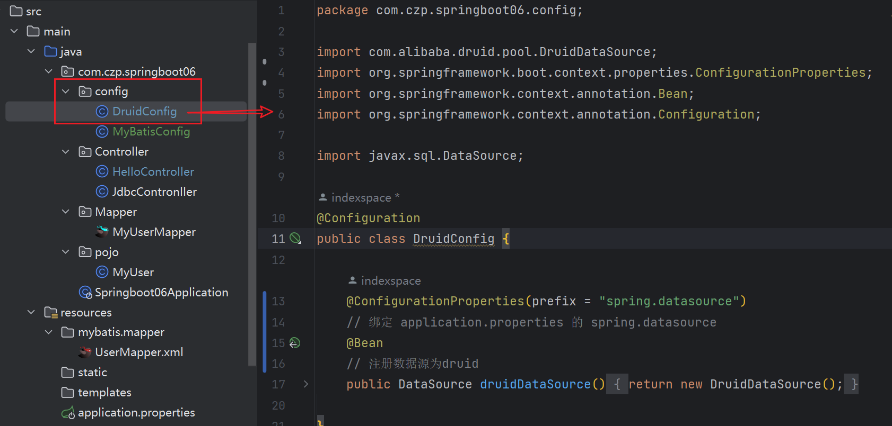

> 具体代码:
>
> ```java
> package com.czp.springboot06.config;
> 
> import com.alibaba.druid.pool.DruidDataSource;
> import org.springframework.boot.context.properties.ConfigurationProperties;
> import org.springframework.context.annotation.Bean;
> import org.springframework.context.annotation.Configuration;
> 
> import javax.sql.DataSource;
> 
> @Configuration
> public class DruidConfig {
> 
>     @ConfigurationProperties(prefix = "spring.datasource")
>     // 绑定 application.properties 的 spring.datasource
>     @Bean
>     // 注册数据源为druid
>     public DataSource druidDataSource(){
>         return new DruidDataSource();
>     }
> }
> ```


## *Shiro


## *Spring Security

### 依赖

```xml
<dependency>
            <groupId>org.springframework.boot</groupId>
            <artifactId>spring-boot-starter-security</artifactId>
</dependency>
```


## *小任务

### 异步任务


### 邮件发送


### 定时任务


