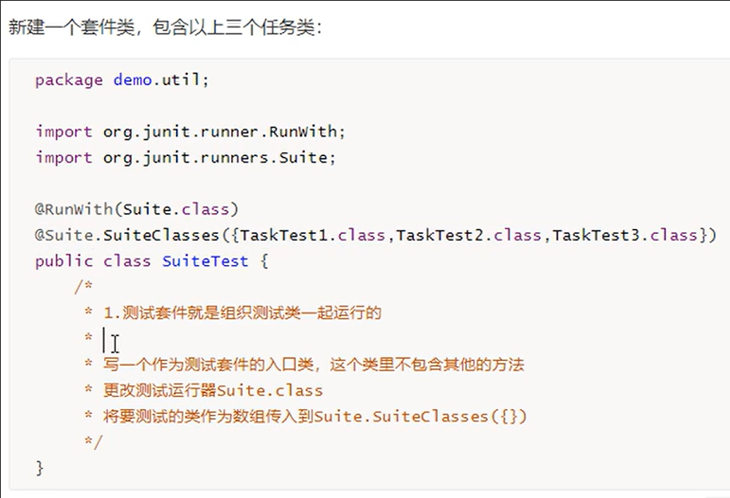

# 操作步骤

1. 创建Maven项目

1. 对被测试类, 右击 -> `转到` -> `测试` -> `新建测试` 

     


3. 等待依赖导入

3. 将方法的注解删掉, 改成我们想要的注解, 同时导入类

    

5. 开始使用对应语句进行测试


# 注解


# 方法


# 进阶


## 参数化


### 实例

```java
import org.junit.Assert;
import org.junit.Test;
import org.junit.runner.RunWith;
import org.junit.runners.Parameterized;

import java.awt.*;
import java.util.Arrays;
import java.util.Collection;

@RunWith(Parameterized.class)   // 必要的注解
public class AddTest {

    @Parameterized.Parameters   // 数据类的注解
    public static Collection<Object []> data() {  // 基本上的固定代码(包括返回值和方法名)
        return Arrays.asList(new Object [][] {   // 返回二维数组
                {2, 1, 1}, {3, 1, 2}, {5, 2, 3}, {6, 3, 3}, {9, 4, 5}  
        });   // 个元素数组表示一测试用例
    }

    private int expected;   // 用以保存测试用例
    private int input1;
    private int input2;

    // 通过构造器将数据类提供的数组依次赋值给上述参数
    public AddTest(int expected, int input1, int input2) {  
        this.expected = expected;
        this.input1 = input1;
        this.input2 = input2;
    }

    @Test
    public void add() {  // 使用通过构造器获取的含有测试用例的私有变量, 
        //!!测试用例的数量与该函数的调用次数一致
        Assert.assertEquals(expected, ALU.add(input1, input2));
    }
}
```

### 执行结果


## 套件



### 实例

```java
import org.junit.runner.RunWith;
import org.junit.runners.Suite;

@RunWith(Suite.class)
@Suite.SuiteClasses({AddTest.class, SubTest.class})
public class ALUTest {
    // 类的内部什么都不用写, 只要写好注解就好
}
```


### 效果

