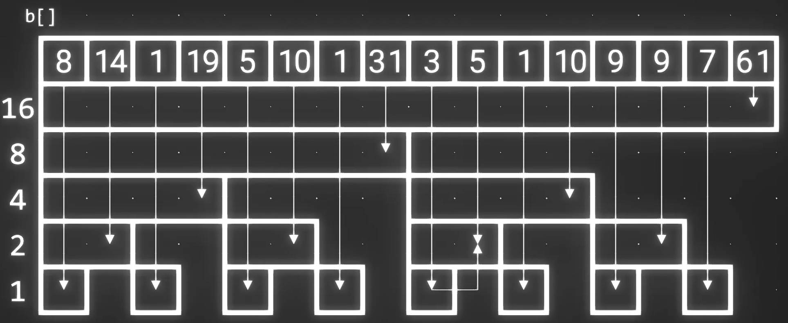

# 算法竞赛

## 入门

#### 	万能头文件
`#include<bits/stdc++.h>`
#### 	typedef
用`typedef long long ll`这样的语句能使`long long`的表达更简单(`ll`)
#### 	~scanf
循坏输入语句 `while(~scanf("%d", &n) && n)`    *// 未输入,则scanf()返回EOF=-1, 取反为0*

#### 	高效IO

在==大量的测试数据==时, 用`scanf("%d", &n)` 和 `printf("str: %d", n)`更好, 因为其效率高

#### for简写

```C++
#include<iostream>
typedef long long ll;
#define _for(i, a, b) for (int (i) = a; (i) < b; i++)
using namespace std;

int main() {

	_for(i, 2, 2020) {
		printf("%d\n", i);
	}
	return 0;
}
```

<hr/>

#### 	数据规模与时间复杂度

| 时间复杂度(省O()) | 数据规模 |
| ----------------- | -------- |
|  n!  |  n<=11  |
| 2^n^  |  n<=25 |
| ==n^2^== | ==n<=5000== |
| nlog~2~n  |  n<=10^6^ |
| ==n== |  ==n<=10^7^==  |
|  log~2~n   |  10^8^  |

## iomanip

+ `setprecision(n) `保留n位数字,  配合 `fixed` 保留n位小数;

```C++
cout << setprecision(2) << 225.12345 <<  endl;     // 保留两位  2.3e2 
cout << setprecision(2) << fixed << 225.12345 <<  endl;     // 保留两位小数  225.12
```

+ `setw()` 设置下次输出的宽, 配合`setfill(' ')` 设置填充的字符;


## STL

### 	sort()

[C++ Sort函数详解CSDN博客](https://blog.csdn.net/VariatioZbw/article/details/125155432)

`#include<algorithm>`

`sort(arr, arr.length, cmp)`  *// 传地址,闭头开尾, cmp表排序规则*

```C++
// 1. 默认升序
vector<int> arr = {9, 6, 3, 8, 5, 2, 7, 4, 1, 0};
sort(arr.begin(), arr.end());

// 2. greater<>()表降序
int a[10] = {9, 6, 3, 8, 5, 2, 7, 4, 1, 0};
sort(a, a + 10, greater<int>());

// 3. 自定义排序
bool cmp(int num1, int num2) {
    return num1 > num2;     // 可以简单理解为 > 降序排列   < 升序排列
}
vector<int> arr = {9, 6, 3, 8, 5, 2, 7, 4, 1, 0};
sort(arr.begin(), arr.end(), cmp); 
```

### 	优先队列

`#include <queue>`

`priority_queue<Type, Container, Functional>`     *// 容器默认为`vector`, 排序方式默认为`less<>`*

```C++
class cmp{
    public:      
        bool operator()(int a, int b{   // 仿函数
            return a < b;
        }
};

priority_queue<int, vector<int>, cmp> Que;
```

## 基础

### 字符串

```C++
scanf("%d:%d:%d", &a, &b, &c);      // 获取指定格式的数据;
printf("%02d-%02d-%02d", a, b, c);      // 输出指定格式(含前导0,最多两位)的数据;
getchar();                   // 获取单个字符;
```


### 排序

#### 快排

```C++
#include<bits/stdc++.h>
#define _for(i, a, b) for(int (i) = a; (i) < b; i++)
typedef long long ll;
using namespace std;

int partition(vector<int>& nums, int l, int r){
	int temp = l;                                     // 确定基准并保存其索引值
	while(l<r){
		while(l<r && nums[temp]<=nums[r]) r--;
		while(l<r && nums[l]<=nums[temp]) l++;
		swap(nums[l], nums[r]);
	}
	swap(nums[temp], nums[l]);  
	return l;  
}

void quick_sort(vector<int>& nums, int l, int r){
	if(l>=r) return;                                       // !! 此处写l==r会出错
	int m = partition(nums, l, r);	
	quick_sort(nums, l, m-1);   // 以nums[m]为基准的排序完成, 所以nums[m]不需要参与接下来的排序
	quick_sort(nums, m+1, r);
}


int main(){

	int nums[] = {28, 15, 23, 4, 25, 9, 12, 16, 19, 29, 25, 3, 4, 7, 13, 13};
	vector<int> arr(nums, nums+sizeof(nums)/sizeof(int));       // 记住该赋值方式
	
	_for(i, 0, arr.size()){
		cout << arr[i] << " ";
	}
	cout << endl;
	
	quick_sort(arr, 0, arr.size()-1);
	
	_for(i, 0, arr.size()){
		cout << arr[i] << " ";
	}

	return 0;
} 
```

####  归并排序

```c++
#include<bits/stdc++.h>
#define _for(i, a, b) for(int (i) = a; (i) < b; i++)  // _for(i,a,b) 得用逗号, 分号会报错
typedef long long ll;
using namespace std;

void Merge(vector<int>& arr, int l, int m, int r){
	
	vector<int> temp;
	int a = l, b = m+1;         // l->m , m+1->r, 闭区间
	while(a<=m && b<=r){                // 给vector赋值得用push_back(val),而非索引
		temp.push_back(arr[a] >= arr[b] ? arr[b++] : arr[a++]);   
	} 
	while(a<=m){  
		temp.push_back(arr[a++]);
	}
	while(b<=r){
		temp.push_back(arr[b++]);
	}
	_for(i, 0, r-l+1){
		arr[l+i] = temp[i];                   // 转移
	}
 	temp.clear();
}

void merge_sort(vector<int>& arr, int l, int r){
	if(l>=r) return;
	int m = (l+r)/2;
	merge_sort(arr, l , m);
	merge_sort(arr, m+1, r);   // l->m , m+1->r
	Merge(arr, l, m, r); 
}


int main(){

	int nums[] = {28, 15, 23, 4, 25, 9, 12, 16, 19, 29, 25, 3, 4, 7, 13, 13};
	vector<int> arr(nums, nums+sizeof(nums)/sizeof(int));
	
	_for(i, 0, arr.size()){
		cout << arr[i] << " ";
	}
	cout << endl;
	
	merge_sort(arr, 0, arr.size()-1);
	
	_for(i, 0, arr.size()){
		cout << arr[i] << " ";
	}

	return 0;
} 
```

### 	素数

#### 		1. 素数判断

```C++
bool isPrime(int n){
	if(n <= 1) return false;
    for(int i = 2; i*i <= n; i++) 
        if(n % i == 0) 
            return false;
    return true;
}
```

#### 		2. 埃式筛

```c++
// to be continued
```
#### 		3. 大区间素数 
若我们要求`[a, b]`之间的素数问题, 我们可以用==埃式筛==来求出`[2, sqrt(b)]`的素数, 再用求出的素数对进行==素数判断==

### 	KMP

```C++
// to be continued
```


## 其他


###  线段树

```C++
int tree_search(vector<int> &a, int pos, int left, int right, int num){   
// 在a数组中的区间[left, right]中的索引值pos的元素开始查找值为num的元素
    if (num == right && num == left){
        //当前的区间就是表示数字num的区间
        return a[pos];
	}
    int mid=(left+right)/2;     //计算区间中点
    int left_child=pos * 2+1;     //左孩子数组下标
    int right_child=pos *2+2;      //右孩子数组下标
    if(num<=mid){          //如果num小于等于区间的中间位置mid
        return tree_search(a, left_child, left, mid, num);
    }
    else{
		return tree_search(a, right_child, mid+1, right, num);
    }
}
```


### 树状数组



单点数组与前缀和数组的结合

```C++
inline int lowbit(int x){ // return 最低位1表示的数
    return x & (-x)       // -x <=> ~x +1
} 

int ask(int x){
    int ans = 0;
    while(x>0){
        ans += b[x];       // b <=> 树状数组
        x -= lowbit(x);
    }
    return ans;
}

void add(int x, intk){
    while(x<=n){    // n <=> b.size();
        b[x] += k;
        x += lowbit(x);
    } 
}
```


