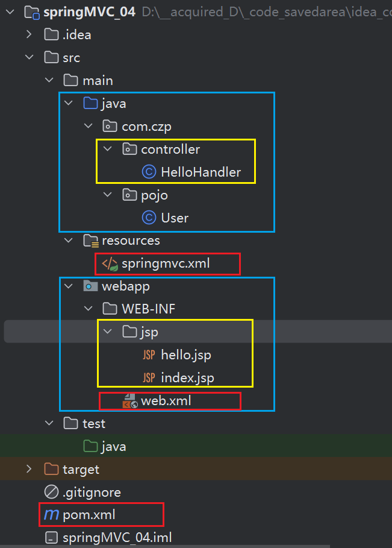
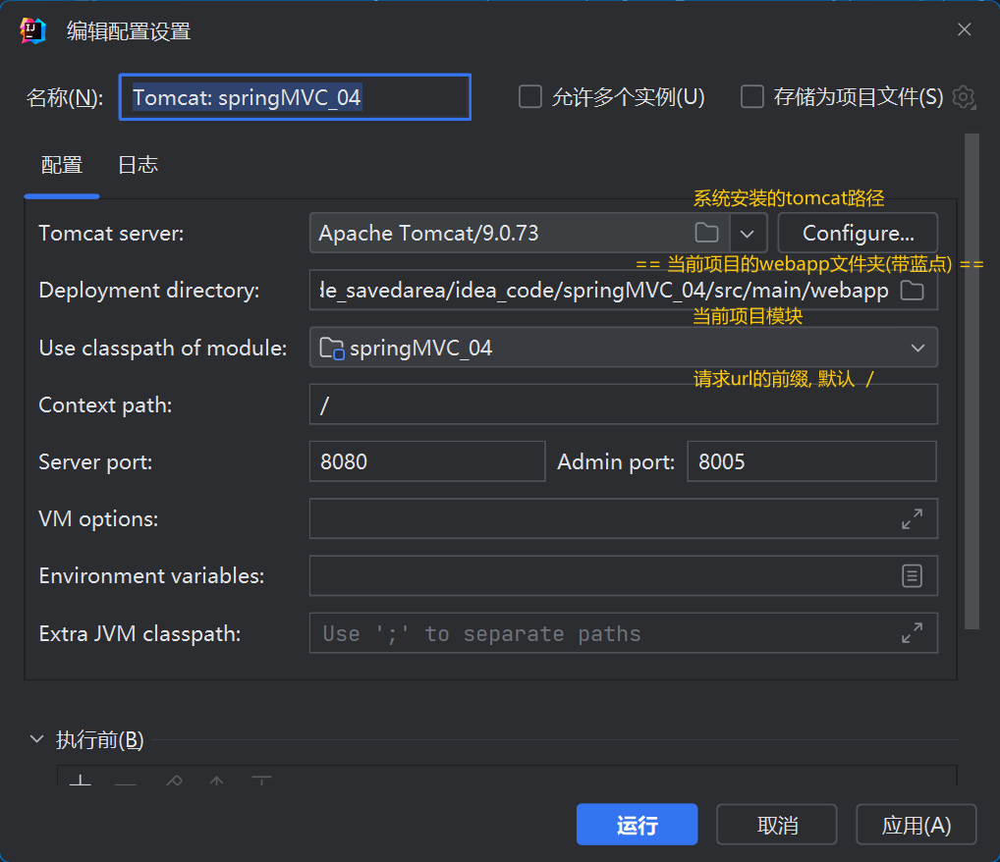
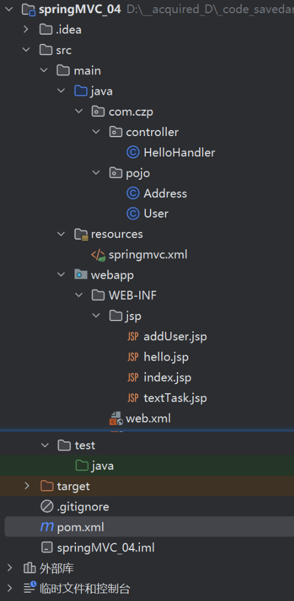

# springMVC项目的构建


## 整体大纲

maven - webapp

**蓝色为主要文件夹, 红色为配置文件, 黄色为可扩展的主要文件 *(业务方法&逻辑视图)* **



## Tomcat配置



## pom.xml

**(加上spring-webmvc依赖) => 31-35行**

**Servlet依赖(MVC视图解析) => 37-42行**

```xml
<?xml version="1.0" encoding="UTF-8"?>
<project xmlns="http://maven.apache.org/POM/4.0.0"
         xmlns:xsi="http://www.w3.org/2001/XMLSchema-instance"
         xsi:schemaLocation="http://maven.apache.org/POM/4.0.0 http://maven.apache.org/xsd/maven-4.0.0.xsd">
    <modelVersion>4.0.0</modelVersion>

    <groupId>org.example</groupId>
    <artifactId>springMVC_04</artifactId>
    <version>1.0-SNAPSHOT</version>
    <packaging>war</packaging>

    <name>SpringMVC Maven Webapp</name>
    <!-- FIXME change it to the project's website -->
    <url>http://www.example.com</url>

    <properties>
        <maven.compiler.source>12</maven.compiler.source>
        <maven.compiler.target>12</maven.compiler.target>
        <project.build.sourceEncoding>UTF-8</project.build.sourceEncoding>
    </properties>

    <dependencies>
        <dependency>
            <groupId>junit</groupId>
            <artifactId>junit</artifactId>
            <version>4.13.1</version>
            <scope>test</scope>
        </dependency>

        <!-- ===== 加上spring-webmvc依赖 ===== -->
        <dependency>
            <groupId>org.springframework</groupId>
            <artifactId>spring-webmvc</artifactId>
            <version>5.3.19</version>
        </dependency>
        
        <!--  =====  导入servlet API ====== -->
        <dependency>
            <groupId>javax.servlet</groupId>
            <artifactId>servlet-api</artifactId>
            <version>2.5</version>
        </dependency>

    </dependencies>

</project>
```


## web.xml

**注意加载类路径 => 17行**

*匹配拦截请求 => 29-33行*

```xml
<!DOCTYPE web-app PUBLIC
        "-//Sun Microsystems, Inc.//DTD Web Application 2.3//EN"
        "http://java.sun.com/dtd/web-app_2_3.dtd" >

<web-app>
    <display-name>Archetype Created Web Application</display-name>
    <!-- 配置核心控制器 -->
    <servlet>
        <servlet-name>dispatcherServlet</servlet-name>
        <servlet-class>org.springframework.web.servlet.DispatcherServlet</servlet-class>
        <!-- springmvc配置文件加载路径
             1）默认情况下，读取WEB-INF下面的文件
             2）可以改为加载类路径下（resources目录），加上classpath:
         -->
        <init-param>
            <param-name>contextConfigLocation</param-name>
            <param-value>classpath:springmvc.xml</param-value>
        </init-param>
        <!--
           DispatcherServlet对象创建时间问题
              1）默认情况下，第一次访问该Servlet的创建对象，意味着在这个时间才去加载springMVC.xml
              2）可以改变为在项目启动时候就创建该Servlet，提高用户访问体验。
                  <load-on-startup>1</load-on-startup>
                        数值越大，对象创建优先级越低！ （数值越低，越先创建）
        -->
        <load-on-startup>1</load-on-startup>
    </servlet>
    <servlet-mapping>
        <servlet-name>dispatcherServlet</servlet-name>
        <!-- /     匹配所有的请求；（不包括.jsp）-->
        <!-- /*    匹配所有的请求；（包括.jsp） [包括 .jsp 在内的所有文件都被拦截] -->
        <!-- *.do  拦截以do结尾的请求-->
        <url-pattern>/</url-pattern>
    </servlet-mapping>
    
    <!--防乱码-->
    <filter>
        <filter-name>encodingFilter</filter-name>
        <filter-class>org.springframework.web.filter.CharacterEncodingFilter</filter-class>
        <init-param>
            <param-name>encoding</param-name>
            <param-value>UTF-8</param-value>
        </init-param>
    </filter>
    <filter-mapping>
        <filter-name>encodingFilter</filter-name>
        <url-pattern>/*</url-pattern>
    </filter-mapping>
    
</web-app>
```

## springmvc.xml

配置自动扫包 => 8行

**视图解析器: 逻辑视图的前后缀 => 11-17行**

```xml
<?xml version="1.0" encoding="UTF-8"?>
<beans xmlns="http://www.springframework.org/schema/beans"
       xmlns:xsi="http://www.w3.org/2001/XMLSchema-instance"
       xmlns:context="http://www.springframework.org/schema/context"
       xsi:schemaLocation="http://www.springframework.org/schema/beans
       http://www.springframework.org/schema/beans/spring-beans.xsd http://www.springframework.org/schema/context https://www.springframework.org/schema/context/spring-context.xsd">
    <!-- 配置自动扫包 -->
    <context:component-scan base-package="com.czp.controller"/>

    <!-- 视图解析器 -->
    <bean class="org.springframework.web.servlet.view.InternalResourceViewResolver">
        <!--给逻辑视图加上前缀和后缀 -->
        <!--前缀-->
        <property name="prefix" value="/WEB-INF/jsp/"/>
        <!--后缀-->
        <property name="suffix" value=".jsp"/>
    </bean>

</beans>
```

## HelloHandler.java [初始] 

**返回的视图的路径 默认是webapp(带蓝点)文件下的, (可以在web.xml文件设置的加载类路径下的springmvc.xml文件中, 指定逻辑视图的前后缀)  => 19行**

```java
package com.czp.controller;

import org.springframework.stereotype.Controller;
import org.springframework.web.bind.annotation.RequestMapping;

@Controller
public class HelloHandler {
    /**
     * 当客户端访问index请求时
     * 直接自动关联到这个方法
     * 执行这个方法后，会返回结果
     * @return
     */
    @RequestMapping("/hello")
    public String index(){
        System.out.println("接收到了hello请求");
        //返回逻辑视图 逻辑视图相当于视图的别名 通过这个找到物理视图，也就是真正的视图
        //这里返回的只是页面的名称，不是完整的页面访问路径
        return "hello";
    }
}
```

## hello.jsp [初始] 

```jsp
<%@ page contentType="text/html;charset=UTF-8" language="java" %>
<html>
    <head>
        <title>Title</title>
    </head>
    <body>
        === hello ===
    </body>
</html>
```

​    

# 参数绑定 /strJsp

## RequesrParam引入参数

+ `@RequestParam("args")` 放在形参前面   **[ line 3-4 ]**

+ ```java
    // RequesrParam引入参数
        @RequestMapping(value = "/hello")
        public String index(@RequestParam("name") String userName,
                            @RequestParam("gender") String userGender){
            System.out.println(userGender + userName + "接收到了hello请求");
            //返回逻辑视图 逻辑视图相当于视图的别名 通过这个找到物理视图，也就是真正的视图
            //这里返回的只是页面的名称，不是完整的页面访问路径
            return "hello";
        }
    ```

+ `@RequestParam(value="args", required=false, defaultValue="0")`  *// required=true 表必须填写*

## cookie            
`@CookieValue("JSESSIONID")`

## POJO           
// 业务方法调用指定对象的**无参构造**方法, 视图表单将指定的参数以**setter()**的方式写入对象 

## 转发与重定向            
+ 默认转发,  
+ 欲重定向,则返回值为 `"redirect:/WEN-INF/jsp/hello.jsp"`, 
+ // WEN-INF/jsp/hello.jsp 表示完整路径

# 数据绑定 /str

## 常规数据

### 输入数据的方式

// 详见**参数绑定**

+ url参数
+ 表单对象

### 输出数据的方式

+ 在方法前加上注解`@ResponseBody`,该方法返回的字符串会出现在页面上, 而不是跳转到指定的逻辑视图

+ ```java
    @RequestMapping("data")
    @ResponseBody
    public String data(Integer id){
        return "id="+id;
    }
    ```

+ 

##　JSON数据　？

=　=　=　 ???　=　=　=


# MVC视图层 /mv+jsp

## 业务数据绑定到request域对象

### ModelAndView

#### HelloHandler.java

```java
@Controller
@RequestMapping("/HelloHandler")
public class HelloHandler {
    // MVC视图解析
    @RequestMapping("mv")
    public ModelAndView mvUser(User user){      // user由表单获取
        ModelAndView mv = new ModelAndView("index");
        mv.addObject("myUser",user);            // "myUser"对应下面文件的${myUser}   
        return mv;
    } 
}
```

#### index.jsp

```jsp
<%@ page contentType="text/html;charset=UTF-8" language="java" %>
<%@ page isELIgnored="false"%>
<html>
    <head>
        <title>indexTitle</title>
    </head>
    <body>
        === index.jsp ===
        ${myUser}                    <!--对应上面文件的addObject()的参数"myUser"-->
    </body>
</html>
```

### ModelAttribute

#### 注解介绍

> `@ModelAttribute`的作用是当Handler接收到一个**客户端请求**以后，

> 不管调用哪一个业务方法，都会**优先调用**被`@ModelAttribute`注解修饰的方法,并且把其返回值作为**业务数据**，

> 再到业务方法，此时**业务方法**只需要返回**视图信息**就可以了，不需要返回业务数据，

> *即使返回业务数据，也会被@ModelAttribute注解修饰的方法返回的数据所覆盖*

#### ModelAttribute和业务方法

```java
// 优先调用并返回user对象
@ModelAttribute
public User user02(){
    User user = new User();
    user.setName("张三");
    user.setID(106);
    Address address = new Address(1234, "桂林");
    user.setAddress(address);
    return user;
}

// 接收user对象, 结合业务方法自身提供的视图信息, 返回modelAndView
@RequestMapping("add02")
public ModelAndView add02(User user){        // 接收user对象
    ModelAndView mv = new ModelAndView("index");
    mv.addObject("myUser",user);
    return mv;
}
```

### Servlet

#### HelloHandler.java  >  add03

```java
// Servlet   addUser-03   获取数据user,返回视图index
    @RequestMapping("add03")
    public String add03(HttpServletRequest request,
                        User user){            // request自动获取, user由表单获取
        request.setAttribute("myUser", user);
        return "index";
    }
```

#### index.jsp 同上 (同ModelAndView)


## 业务数据绑定到Session域对象

### Session

#### HelloHandler.java  >  add03

```java
// Session   addUser-04   获取数据user,返回视图index
@RequestMapping("add04")
public String add04(HttpSession session, User user){
    session.setAttribute("myUser", user);
    return "index";
}
```

#### index.jsp

**line 10: 与上面的绑定方法有些区别**

```jsp
<%@ page contentType="text/html;charset=UTF-8" language="java" %>
<%@ page isELIgnored="false"%>
<html>
    <head>
        <title>indexTitle</title>
    </head>
    <body>
        === index.jsp ===
        <br/>
        ${sessionScope.myUser}                
    </body>
</html>
```


# 其他

详见: [Spring MVC详解_CSDN博客](https://blog.csdn.net/qq_52797170/article/details/125591705)

+ SeesionAttribute

+ 自定义数据类型转换器

+ RESTful的集成

+ 文件的上传下载

+ 拦截器


# 一些问题

## 无法显示直接显示jsp页面

> 尚未解决

## 返回字符串至页面出现乱码

> 未出现相关问题

## 业务数据无法绑定至jsp视图页面

在对应的jsp文件开头写上`<%@ page isELIgnored="false"%>`即可


# 部分代码 (除配置文件)

## 总体




## HelloHandler.java

```java
package com.czp.controller;

import com.czp.pojo.Address;
import com.czp.pojo.User;
import org.springframework.stereotype.Controller;
import org.springframework.web.bind.annotation.*;
import org.springframework.web.servlet.ModelAndView;

import javax.servlet.http.HttpServletRequest;
import javax.servlet.http.HttpSession;

@Controller
@RequestMapping("/HelloHandler")
public class HelloHandler {

    /**
     * 当客户端访问index请求时
     * 直接自动关联到这个方法
     * 执行这个方法后，会返回结果
     * @ return
     */

    // RequestParam引入参数
    @RequestMapping(value = "/hello")
    public String index(@RequestParam("name") String userName,
                        @RequestParam("gender") String userGender){
        System.out.println(userGender + userName + "接收到了hello请求");
        //返回逻辑视图 逻辑视图相当于视图的别名 通过这个找到物理视图，也就是真正的视图
        //这里返回的只是页面的名称，不是完整的页面访问路径
        return "hello";
    }

    // cookie
    @RequestMapping("/textTask")
    public String textTask(@CookieValue("JSESSIONID") String cookie){
        System.out.println("textTask打开成功了, 下面是cookie信息:");
        System.out.println(cookie);
        return "textTask";
    }

    // POJO_01  User01
    @RequestMapping("user")
    public String user01(){
        return "addUser";
    }

    // POJO_02 addUser-01
    @RequestMapping("add01")
    public String add01(User user){
        System.out.println(user);
        return "index";
    }
    
    // 数据绑定
    @RequestMapping("data")
    @ResponseBody
    public String data(String str){
        return "str="+str;
    }

    // MVC视图解析  addUser-02  将视图index和数据user绑定
    @RequestMapping("add02")
    public ModelAndView add02(User user){
        ModelAndView mv = new ModelAndView("index");
        mv.addObject("myUser",user);
        return mv;
    }

    // Servlet   addUser-03   获取数据user,返回视图index
    @RequestMapping("add03")
    public String add03(HttpServletRequest request, User user){
        request.setAttribute("myUser", user);
        return "index";
    }

    // ModelAttribute user02
    @ModelAttribute
    public User user02(){
        User user = new User();
        user.setName("张三");
        user.setID(106);
        Address address = new Address(1234, "桂林");
        user.setAddress(address);
        return user;
    }

    // Session   addUser-04   获取数据user,返回视图index
    @RequestMapping("add04")
    public String add04(HttpSession session, User user){
        session.setAttribute("myUser", user);
        return "index";
    }
}
```


## User.java

```java
package com.czp.pojo;

public class User {
    private Integer ID;
    private String name;
    private Address address;

    @Override
    public String toString() {
        return "User{" +
                "ID=" + ID +
                ", name='" + name + '\'' +
                ", address=" + address +
                '}';
    }

    public Integer getID() {
        return ID;
    }

    public void setID(Integer ID) {
        this.ID = ID;
    }

    public String getName() {
        return name;
    }

    public void setName(String name) {
        this.name = name;
    }

    public Address getAddress() {
        return address;
    }

    public void setAddress(Address address) {
        this.address = address;
    }

}
```


## Address.java

```java
package com.czp.pojo;

public class Address {
    private int code;
    private String value;

    public int getCode() {
        return code;
    }

    public void setCode(int code) {
        this.code = code;
    }

    public String getValue() {
        return value;
    }

    public void setValue(String value) {
        this.value = value;
    }

    @Override
    public String toString() {
        return "Address{" +
                "code=" + code +
                ", value='" + value + '\'' +
                '}';
    }

    public Address() {
    }

    public Address(int code, String value) {
        this.code = code;
        this.value = value;
    }
}
```


## index.jsp

```xml
<%@ page contentType="text/html;charset=UTF-8" language="java" %>
<%@ page isELIgnored="false"%>
<html>
    <head>
        <title>indexTitle</title>
    </head>
    <body>
        === index.jsp ===
        <br/>
        <!--
			非Session域对象可用:
			${myUser}
		-->
        <!--下面是Session域对象-->
        ${sessionScope.myUser}
    </body>
</html>
```


## hello.jsp

```jsp
<%@ page contentType="text/html;charset=UTF-8" language="java" %>
<html>
<head>
    <title>Title</title>
</head>
<body>
    === hello ===
</body>
</html>
```


## textTask.jsp

```jsp
<%--
  Created by IntelliJ IDEA.
  User: 28388
  Date: 2023/4/24
  Time: 16:11
  To change this template use File | Settings | File Templates.
--%>
<%@ page contentType="text/html;charset=UTF-8" language="java" %>
<html>
<head>
    <title>106曹兆鹏</title>
</head>
<body>
<h1><b>少年中国说</b></h1>
<h6><i>梁启超</i></h6>
<hr/>
<table>
    <tr>
        <td width="800px">
            <p>
                故今日之责任，不在他人，而全在我少年。
                少年智则国智，少年富则国富；
                <b>少年强则国强，</b> 少年独立则国独立；
                少年自由则国自由；少年进步则国进步；
                少年胜于欧洲，则国胜于欧洲；
                少年雄于地球，则国雄于地球。
            </p>
            <p>
                红日初升，其道大光；河出伏流，
                一泻汪洋；潜龙腾渊，鳞爪飞扬；
                乳虎啸谷，百兽震惶；鹰隼试翼，
                风尘翕张；奇花初胎，矞矞皇皇；
                干将发硎，有作其芒；天戴其苍，
                地履其黄；纵有千古，横有八荒，
                前途似海，来日方长。
                美哉我少年中国，与天不老；
                壮哉我中国少年，与国无疆！
            </p>
        </td>
    </tr>
</table>
</body>
</html>
```


## addUser.jsp

```jsp
<%--
  Created by IntelliJ IDEA.
  User: 28388
  Date: 2023/4/24
  Time: 16:37
  To change this template use File | Settings | File Templates.
--%>
<%@ page contentType="text/html;charset=UTF-8" language="java" %>
<html>
<head>
  <title>Title</title>
</head>
<body>
<form action="/HelloHandler/add04" method="post">
  <table>
    <tr>
      <td>编号:</td>
      <td>
          <input type="text" name="ID">
      </td>
    </tr>
    <tr>
      <td>姓名:</td>
      <td>
          <input type="text" name="name">
      </td>
    </tr>
    <tr>
      <td>地址编码:</td>
      <td>
        <input type="text" name="address.code">
      </td>
    </tr>
    <tr>
      <td>详细地址:</td>
      <td>
        <input type="text" name="address.value">
      </td>
    </tr>
    <tr>
      <td>
        <input type="submit" value="提交">
      </td>
    </tr>
  </table>
</form>
</body>
</html>
```


## 
