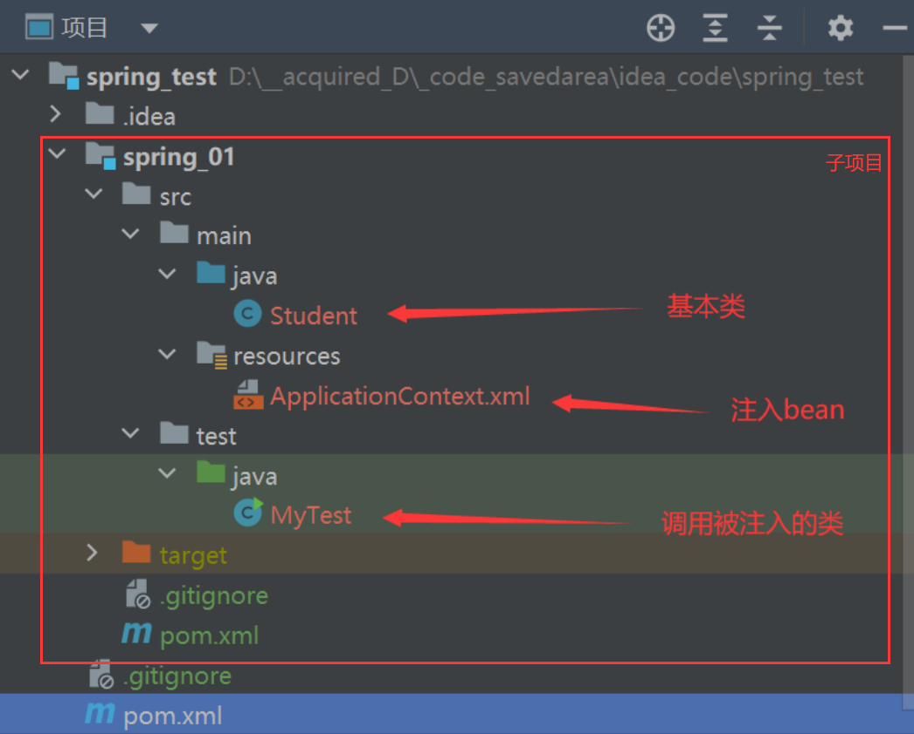
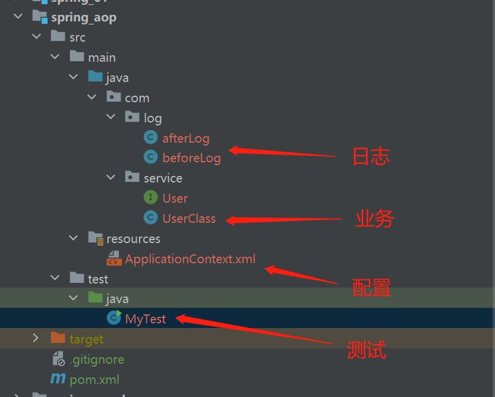
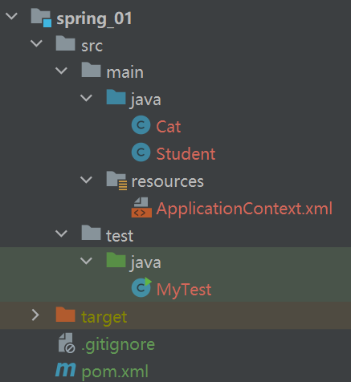
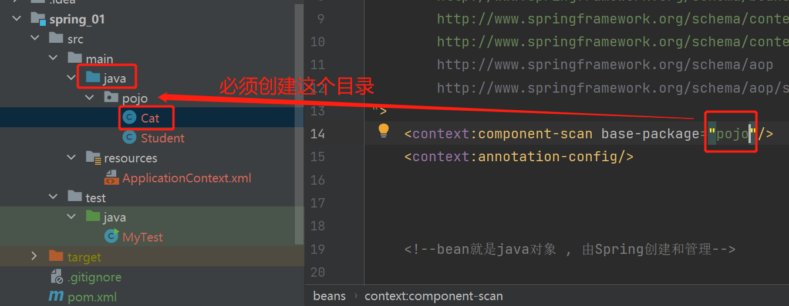

# 创建spring工程的流程


## 创建父工程的过程与配置

1. 创建maven父项目并删除src文件夹, 在该父项目下创建多个maven模块(子项目)

2. 在父项目的pom.xml下加上以下的依赖

```
<!--IOC-->
<!-- https://mvnrepository.com/artifact/org.springframework/spring-webmvc -->
<dependency>
  <groupId>org.springframework</groupId>
  <artifactId>spring-webmvc</artifactId>
  <version>5.2.0.RELEASE</version>
</dependency>
<!-- https://mvnrepository.com/artifact/org.springframework/spring-jdbc -->
<dependency>
  <groupId>org.springframework</groupId>
  <artifactId>spring-jdbc</artifactId>
  <version>6.0.7</version>
</dependency>

<!--AOP-->
<!-- https://mvnrepository.com/artifact/org.aspectj/aspectjweaver -->
    <dependency>
      <groupId>org.aspectj</groupId>
      <artifactId>aspectjweaver</artifactId>
      <version>1.9.4</version>
    </dependency>
```


## 创建子工程的大纲与配置

### 大纲

#### IOC



#### AOP




### 配置

其中`ApplicationContext.xml`的需要导入一些基本的代码, 如下:

```xml
<?xml version="1.0" encoding="UTF-8"?>
<beans xmlns="http://www.springframework.org/schema/beans"
       xmlns:xsi="http://www.w3.org/2001/XMLSchema-instance"
       
       xsi:schemaLocation="http://www.springframework.org/schema/beans
       http://www.springframework.org/schema/beans/spring-beans.xsd">

    <!--bean就是java对象 , 由Spring创建和管理-->
    <!--这片区域注入各种Java对象-->

</beans>
```

进阶配置(ioc的注解注入和 aop):

```xml
<?xml version="1.0" encoding="UTF-8"?>
<beans xmlns="http://www.springframework.org/schema/beans"
       xmlns:xsi="http://www.w3.org/2001/XMLSchema-instance"
       xmlns:context="http://www.springframework.org/schema/context"
       xmlns:aop="http://www.springframework.org/schema/aop"
xsi:schemaLocation="
        http://www.springframework.org/schema/beans
        http://www.springframework.org/schema/beans/spring-beans.xsd
        http://www.springframework.org/schema/context
        http://www.springframework.org/schema/context/spring-context.xsd
        http://www.springframework.org/schema/aop
        http://www.springframework.org/schema/aop/spring-aop.xsd
">
    <!--IOC注解支持-->
	<context:annotation-config/>
    <!--注解开发的扫描包-->
    <context:component-scan base-package="Student"/>
    
    <!--aop注解支持-->
    <aop:aspectj-autoproxy/>
    
    
    <!--bean就是java对象 , 由Spring创建和管理-->
    <!--这片区域注入各种Java对象-->
    
</beans>
```


# 代码记录

## 001 IOC_hello

### 大纲



###  Cat.java

```java 
public class Cat {
    private String name;

    public String getName() {
        return name;
    }

    public void setName(String name) {
        this.name = name;
    }

    @Override
    public String toString() {
        return "Cat{" +
                "name='" + name + '\'' +
                '}';
    }

    public Cat(String name) {
        this.name = name;
    }
}

```

### Student.java

```java
import java.util.*;

public class Student {
    private String name;
    private String sno;
    private int age;
    private Map<String, Integer> scale;
    private Set<String> card;
    private Cat cat;

    public Student() {
    }

    public Student(String name, int age) {
        this.name = name;
        this.age = age;
    }

    @Override
    public String toString() {
        return "Student{" +
                "name='" + name + '\'' +
                ", sno='" + sno + '\'' +
                ", age=" + age +
                ", scale=" + scale +
                ", card=" + card +
                ", cat=" + cat.toString() +
                '}';
    }

    public String getName() {
        return name;
    }

    public String getSno() {
        return sno;
    }

    public int getAge() {
        return age;
    }

    public void setName(String name) {
        this.name = name;
    }

    public void setSno(String sno) {
        this.sno = sno;
    }

    public void setAge(int age) {
        this.age = age;
    }

    public Map<String, Integer> getScale() {
        return scale;
    }

    public void setScale(Map<String, Integer> scale) {
        this.scale = scale;
    }

    public Set<String> getCard() {
        return card;
    }

    public void setCard(Set<String> card) {
        this.card = card;
    }

    public Cat getCat() {
        return cat;
    }

    public void setCat(Cat cat) {
        this.cat = cat;
    }
}

```

### ApplicationContext.xml

```xml
<?xml version="1.0" encoding="UTF-8"?>
<beans xmlns="http://www.springframework.org/schema/beans"
       xmlns:xsi="http://www.w3.org/2001/XMLSchema-instance"
       xmlns:context="http://www.springframework.org/schema/context"
       xmlns:aop="http://www.springframework.org/schema/aop"
xsi:schemaLocation="
        http://www.springframework.org/schema/beans
        http://www.springframework.org/schema/beans/spring-beans.xsd
        http://www.springframework.org/schema/context
        http://www.springframework.org/schema/context/spring-context.xsd
        http://www.springframework.org/schema/aop
        http://www.springframework.org/schema/aop/spring-aop.xsd
">
    <context:component-scan base-package="Student"/>
    <context:annotation-config/>


    <!--bean就是java对象 , 由Spring创建和管理-->
    <bean id="cat" class="Cat">
        <constructor-arg name="name" value="小咪"/>
    </bean>

    <bean id="student" class="Student" autowire="byName">
        <constructor-arg name="name" value="张三"/>
        <constructor-arg name="age" value="21"/>
        <property name="sno" value="0330106"/>
        <property name="scale">
            <map>
                <entry key="C++" value="93"/>
                <entry key="Java" value="73"/>
            </map>
        </property>
        <property name="card">
            <set>
                <value>041892</value>
                <value>063814</value>
            </set>
        </property>
    </bean>

</beans>

```

### MyTest.java

```java
import org.springframework.context.support.ClassPathXmlApplicationContext;

public class MyTest {
    public static void main(String[] args) {
        ClassPathXmlApplicationContext context = new ClassPathXmlApplicationContext("ApplicationContext.xml");
        Student student = (Student) context.getBean("student");
        System.out.println(student.toString());
    }
}

```


## 002_注解开发

### Cat.java

```java
package pojo;

import org.springframework.beans.factory.annotation.Value;
import org.springframework.stereotype.Component;

@Component
public class Cat {
    public String name;

    public String getName() {
        return name;
    }
    @Value("sansan")
    public void setName(String name) {
        this.name = name;
    }

    @Override
    public String toString() {
        return "pojo.Cat{" +
                "name='" + name + '\'' +
                '}';
    }

    public Cat() {
    }

    public Cat(String name) {
        this.name = name;
    }
}

```

### Student.java

```java
package pojo;

import org.springframework.beans.factory.annotation.Autowired;
import org.springframework.beans.factory.annotation.Value;
import org.springframework.stereotype.Component;
import pojo.Cat;

import java.util.*;


@Component
public class Student {
    private String name;
    private String sno;
    private int age;
    private Cat cat;

    public Student() {
    }

    public Student(String name, int age) {
        this.name = name;
        this.age = age;
    }

    @Override
    public String toString() {
        return "pojo.Student{" +
                "name='" + name + '\'' +
                ", sno='" + sno + '\'' +
                ", age=" + age +
                ", cat=" + cat.toString() +
                '}';
    }

    public String getName() {
        return name;
    }

    public String getSno() {
        return sno;
    }

    public int getAge() {
        return age;
    }
    @Value("lisi")
    public void setName(String name) {
        this.name = name;
    }
    @Value("047116")
    public void setSno(String sno) {
        this.sno = sno;
    }
    @Value("21")
    public void setAge(int age) {
        this.age = age;
    }

    public Cat getCat() {
        return cat;
    }
    @Autowired
    public void setCat(Cat cat) {
        this.cat = cat;
    }
}

```

### ApplicationContext.xml

```xml
<?xml version="1.0" encoding="UTF-8"?>
<beans xmlns="http://www.springframework.org/schema/beans"
       xmlns:xsi="http://www.w3.org/2001/XMLSchema-instance"
       xmlns:context="http://www.springframework.org/schema/context"
       xmlns:aop="http://www.springframework.org/schema/aop"
xsi:schemaLocation="
        http://www.springframework.org/schema/beans
        http://www.springframework.org/schema/beans/spring-beans.xsd
        http://www.springframework.org/schema/context
        http://www.springframework.org/schema/context/spring-context.xsd
        http://www.springframework.org/schema/aop
        http://www.springframework.org/schema/aop/spring-aop.xsd
">
    <context:component-scan base-package="pojo"/>
    <context:annotation-config/>


    <!--bean就是java对象 , 由Spring创建和管理-->


</beans>

```

### MyTest.java

```java
import org.springframework.context.support.ClassPathXmlApplicationContext;
import pojo.Cat;
import pojo.Student;

public class MyTest {
    public static void main(String[] args) {
        ClassPathXmlApplicationContext context = new ClassPathXmlApplicationContext("ApplicationContext.xml");

        Cat cat = (Cat) context.getBean("cat");
        System.out.println(cat.toString());

        Student student = (Student) context.getBean("student");
        System.out.println(student.toString());
    }
}

```


## 003 AOP

### 大纲


### afterLog.java

```java
package com.log;

import org.springframework.aop.AfterReturningAdvice;

import java.lang.reflect.Method;

public class afterLog implements AfterReturningAdvice {
    @Override
    public void afterReturning(Object returnValue, Method method, Object[] args, Object target) throws Throwable {
        System.out.println("=====对象:" + target.getClass().getName()
                +",方法:"+method.getName()
                +",返回值："+returnValue+"====="
        );
    }
}

```


### beforeLog.java

```java
package com.log;

import org.springframework.aop.MethodBeforeAdvice;

import java.lang.reflect.Method;

public class beforeLog implements MethodBeforeAdvice {
    @Override
    public void before(Method method, Object[] objects, Object o) throws Throwable {
        System.out.println("=====对象:" + o.getClass().getName()
                +",方法:"+method.getName()+"====="
        );
    }
}

```


### User.java

```java
package com.service;

public interface User {
    public void addUser();
    public void deleteUser();
}
```


### UserClass.java

```java
package com.service;

public class UserClass implements User {

    @Override
    public void addUser() {
        System.out.println("增加了一个用户");
    }

    @Override
    public void deleteUser() {
        System.out.println("删除了一个用户");
    }
}

```


### !! ApplicationContext.xml

```xml
<?xml version="1.0" encoding="UTF-8"?>
<beans xmlns="http://www.springframework.org/schema/beans"
       xmlns:xsi="http://www.w3.org/2001/XMLSchema-instance"
       xmlns:aop="http://www.springframework.org/schema/aop"
       xsi:schemaLocation="http://www.springframework.org/schema/beans
        http://www.springframework.org/schema/beans/spring-beans.xsd
        http://www.springframework.org/schema/aop
        http://www.springframework.org/schema/aop/spring-aop.xsd">

    <bean id="user" class="com.service.UserClass"/>

    <bean id="before" class="com.log.beforeLog"/>
    <bean id="after" class="com.log.afterLog"/>

    <aop:config>
        <aop:pointcut id="pointCut" expression="execution(* com.service.User.*(..))"/>
        
        <aop:advisor advice-ref="before" pointcut-ref="pointCut"/>
        <aop:advisor advice-ref="after" pointcut-ref="pointCut"/>
    </aop:config>


</beans>

```


### MyTest.java

```java
import com.service.User;
import org.springframework.context.ApplicationContext;
import org.springframework.context.support.ClassPathXmlApplicationContext;

public class MyTest {
    public static void main(String[] args) {
        ApplicationContext context = new ClassPathXmlApplicationContext("ApplicationContext.xml");
        User user = (User) context.getBean("user");
        user.addUser();
        user.deleteUser();
    }
}

```


## aop注解开发

其他同上

### annotion.java

```java
package com.log;

import org.aspectj.lang.annotation.After;
import org.aspectj.lang.annotation.Around;
import org.aspectj.lang.annotation.Aspect;
import org.aspectj.lang.annotation.Before;

@Aspect
public class annotion {
    // =============== A =============
    @Before("execution(* com.service.User.*(..))")
    public void before(){
        System.out.println("==aop注解before==");
    }
    @After("execution(* com.service.User.*(..))")
    public void after(){
        System.out.println("==aop注解after==");
    }
	// =============== A =============
}
```

上述A区代码 与 下述代码等价:

```java
@Pointcut("execution(* com.service.User.*(..))")
public void log(){
}

@Before("log()")
public void before(){
    System.out.println("==aop注解before==");
}

@After("log()")
public void after(){
    System.out.println("==aop注解after==");
}
```


### ApplicationContext.xml

```xml
<?xml version="1.0" encoding="UTF-8"?>
<beans xmlns="http://www.springframework.org/schema/beans"
       xmlns:xsi="http://www.w3.org/2001/XMLSchema-instance"
       xmlns:aop="http://www.springframework.org/schema/aop"
       xsi:schemaLocation="http://www.springframework.org/schema/beans
        http://www.springframework.org/schema/beans/spring-beans.xsd
        http://www.springframework.org/schema/aop
        http://www.springframework.org/schema/aop/spring-aop.xsd">

    <!--aop注解支持-->
    <bean id="annotion" class="com.log.annotion"/>
    <aop:aspectj-autoproxy/>


</beans>

```

# 疑问


## 注解注入IOC


### "找不到指定类"

> 在xml配置类, 用注解注入其属性, 无异常;
>
> 用注解注入类和属性, 报错, "找不到指定类" 

解决: 扫描包时,指定Java文件下的指定类的目录




### 构造器

必须显式定义一个无参构造器, 否则报错


### 引用属性的注入

被引用类注入IOC容器, 


然后在其他类的引用属性上写注解`@Autowired`


### ? 其他属性的注解

> 在string boot 中学习
>
> [Spring boot @Value注解详解CSDN博客](https://blog.csdn.net/wangooo/article/details/114018690?ops_request_misc=&request_id=&biz_id=102&utm_term=spring Vaule注解 注入非字符串数据&utm_medium=distribute.pc_search_result.none-task-blog-2~all~sobaiduweb~default-0-114018690.142^v83^insert_down1,201^v4^add_ask,239^v2^insert_chatgpt&spm=1018.2226.3001.4187)


## aop插入失败

在`ApplicationContext.xml`中, 注意以下代码不要出错:

```xml
<aop:config>
        <aop:pointcut id="pointCut" expression="execution(* com.service.User.*(..))"/>
        
        <aop:advisor advice-ref="before" pointcut-ref="pointCut"/>
        <aop:advisor advice-ref="after" pointcut-ref="pointCut"/>
</aop:config>
```

其中, `expression`的 值 是**`execution()`**表达式, 不要写成*`expression()`*表达式;

插入点的引用 键 是**`pointcut-ref`**,而不是编辑器弹出的*`pointcut`*;

