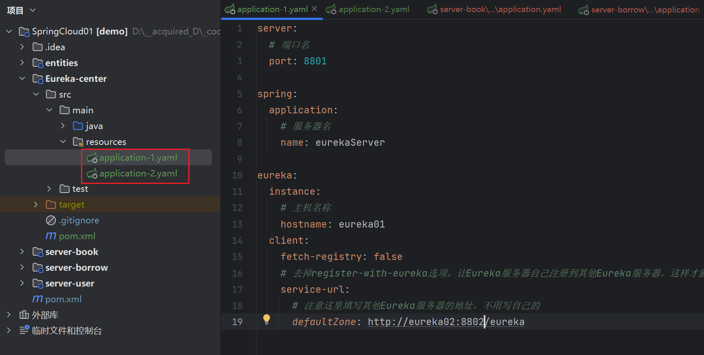
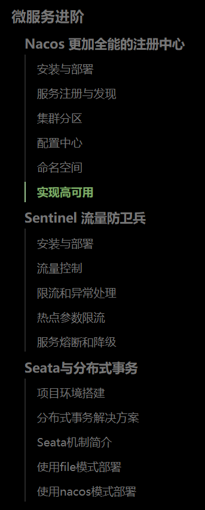

# ==官方文档==

[Spring Cloud](https://spring.io/projects/spring-cloud)

+ Eureka
+ Gateway
+ Config

[Spring Cloud Alibaba 参考文档 (spring-cloud-alibaba-group.github.io)](https://spring-cloud-alibaba-group.github.io/github-pages/2021/zh-cn/index.html)

+ Nacos


# 项目构建

## 父项目

+ 创建spring项目, 无需选择依赖

+ 手动导入依赖

    ```xml
    <dependencies>
            <dependency>
                    <groupId>org.projectlombok</groupId>
                    <artifactId>lombok</artifactId>
                    <version>1.18.22</version>
            </dependency>
            <dependency>
                    <groupId>com.mysql</groupId>
                    <artifactId>mysql-connector-j</artifactId>
                    <scope>runtime</scope>
            </dependency>
    </dependencies>
        
    <dependencyManagement>
    		<dependencies>
             		<dependency>
                            <groupId>org.mybatis.spring.boot</groupId>
                            <artifactId>mybatis-spring-boot-starter</artifactId>
                            <version>2.2.2</version>
                    </dependency>
    		</dependencies>
    </dependencyManagement>           
    
    ```


## 子模块

### 创建启动类

> 例:
>
> ```Java
> package org.example;
> 
> import org.springframework.boot.SpringApplication;
> import org.springframework.boot.autoconfigure.SpringBootApplication;
> 
> @SpringBootApplication
> public class BookApplication {
>     public static void main(String[] args) {
>         SpringApplication.run(BookApplication.class, args);
>     }
> }
> ```


### 导入依赖

```xml
<dependencies>
        <dependency>
                <groupId>org.springframework.boot</groupId>
                <artifactId>spring-boot-starter-web</artifactId>
        </dependency>
            <dependency>
                <groupId>org.mybatis.spring.boot</groupId>
                <artifactId>mybatis-spring-boot-starter</artifactId>
        </dependency>
</dependencies>
```


### application.yaml

```yaml
server:
  port: 8002

spring:
  datasource:
    username: root
    password: 123456
    url: jdbc:mysql://localhost:3306/mybatis?userUnicode=true&characterEncode=utf-8&serverTimezone=UTC
    driver-class-name: com.mysql.cj.jdbc.Driver
```


### SpringBoot-Mybatis

+ 创建表

> 每个子模块各一个表

+ 实体类
+ mapper接口 (注解实现 || xml映射实现)
+ [ service & serviceImpl ]
+ Controller


### RESTTemplate

+ 将各类的普通实体移至新建的普通模块*(称为实体模块)*中

    

+ 在原有的各模块中引入实体模块的依赖

    

+ 现在, 各模块之间可以相互使用实体类了

+ 在复合表中 (此为borrow*(myuser, book)*) :

    > 模块`borrow`下的 
    >
    > 包`org.example.service.impl`下的 
    >
    > 类`BorrowServiceImpl`下的
    >
    > 两个方法:
    
    


> `new RESTTemplate.getForObject("myObjectUrl", myObject.class)` 将返回远程服务所查询到的对象
>
> ==使用时, 需要打开指定URL的服务==, 即, 同时运行多个服务
>
> 这样, 我们可以实现borrow来访问user和book


# Eureka

> **集中管理**微服务的平台, 
>
> Eureka能够自动注册并发现微服务，然后对服务的状态、信息进行集中管理，这样当我们需要获取其他服务的信息时，我们只需要向Eureka进行查询即可

## 搭建Eureka

### 父项目依赖

> 在 [Spring Cloud](https://spring.io/projects/spring-cloud#learn) 查看最新版本

```xml
<dependency>
            <groupId>org.springframework.cloud</groupId>
            <artifactId>spring-cloud-dependencies</artifactId>
            <version>2022.0.2</version>
            <type>pom</type>
            <scope>import</scope>
</dependency>
```


### 子项目

**新建普通模块**

#### 依赖

```xml
<dependencies>
        <dependency>
            <groupId>org.springframework.cloud</groupId>
            <artifactId>spring-cloud-starter-netflix-eureka-server</artifactId>
            <version>3.1.2</version>
        </dependency>
</dependencies>
```


#### 启动类

```java
package org.example;

import org.springframework.boot.SpringApplication;
import org.springframework.boot.autoconfigure.SpringBootApplication;
import org.springframework.cloud.netflix.eureka.server.EnableEurekaServer;

@EnableEurekaServer
@SpringBootApplication
public class EurekaServerApplication {

    public static void main(String[] args) {
        SpringApplication.run(EurekaServerApplication.class, args);
    }
}
```


#### 配置

```yaml
server:
  port: 8888
  
eureka:
  # 开启之前需要修改一下客户端设置（虽然是服务端
  client:
    # 由于我们是作为服务端角色，所以不需要获取服务端，改为false，默认为true
    fetch-registry: false
    # 暂时不需要将自己也注册到Eureka
    register-with-eureka: false
    # 将eureka服务端指向自己
    service-url:
      defaultZone: http://localhost:8888/eureka
```


**运行, 键入`http://localhost:8888/` 测试一下**


## 注册Eureka

> 原模块连接Eureka

### 依赖

> 同Eureka依赖

```xml
<dependency>
            <groupId>org.springframework.cloud</groupId>
            <artifactId>spring-cloud-starter-netflix-eureka-server</artifactId>
            <version>3.1.2</version>
</dependency>	
```


### 配置

```xml
eureka:
  client:
    # 跟上面一样，需要指向Eureka服务端地址，这样才能进行注册
    service-url:
	  # 指向Eureka, 即, 连接Eureka
      defaultZone: http://localhost:8888/eureka

spring:
  application:
    name: bookService
	# 改一下名字, 方便管理
```


## 实现服务发现

>  RESTTemplate的改写

### 注册Bean


```java
package org.example.config;

import org.springframework.cloud.client.loadbalancer.LoadBalanced;
import org.springframework.context.annotation.Bean;
import org.springframework.context.annotation.Configuration;
import org.springframework.web.client.RestTemplate;

@Configuration
public class BeanConfig {
    @Bean
    @LoadBalanced
    RestTemplate template(){
        return new RestTemplate();
    }
}
```


### 服务名称替换


## ==*多端口==

>对同一个服务器创建多个端口


## 搭建Eureka集群

### 配置文件

> 创建两个配置文件, 注意后缀`-1` `-02`
>
> 1号连2号, 2号连1号



> application-1.yaml

```yaml
server:
# 端口名
  port: 8801

spring:
  application:
    # 服务器名
    name: eurekaServer

eureka:
  instance:
    # 主机名称
    hostname: eureka01
  client:
    fetch-registry: false
    # 去掉register-with-eureka选项，让Eureka服务器自己注册到其他Eureka服务器，这样才能相互启用
    service-url:
      # 连接2号Eureka服务器
      defaultZone: http://eureka02:8802/eureka
```

> application-2.yaml

```yaml
server:
# 端口名
  port: 8802

spring:
  application:
    # 服务器名
    name: eurekaServer

eureka:
  instance:
    # 主机名称
    hostname: eureka02
  client:
    fetch-registry: false
    # 去掉register-with-eureka选项，让Eureka服务器自己注册到其他Eureka服务器，这样才能相互启用
    service-url:
      # 连接2号Eureka服务器
      defaultZone: http://eureka01:8801/eureka
```


### 更改hosts文件

> win的路径`C:\Windows\System32\drivers\etc\hosts`的文件中, 
>
> 加入
>
> ```
> 127.0.0.1 eureka01
> 127.0.0.1 eureka02
> ```


### 启动配置

**参考==*多端口==**, 创建另一个Eureka配置并设置环境变量:


### *其他微服务

> 原本的server模块的配置中可以同时加入两个Eureka服务器的URL:
>
> > *经本人实践, 只加一个Eureka服务器的URL也没有影响*

```yaml
eureka:
  client:
    service-url:
        # 将两个Eureka的地址都加入，这样就算有一个Eureka挂掉，也能完成注册
      defaultZone: http://localhost:8801/eureka, http://localhost:8802/eureka
```


# Gateway

> 路由网关

## 基本搭建

**新建普通模块**

### 依赖

> 具体版本看文档: *(版本过高会报错)*
>
>  [Spring Cloud Gateway](https://spring.io/projects/spring-cloud-gateway#learn)
>
> [Spring Cloud](https://spring.io/projects/spring-cloud#learn)

```xml
<dependencies>
        <dependency>
            <groupId>org.springframework.cloud</groupId>
            <artifactId>spring-cloud-starter-gateway</artifactId>
            <version>3.1.6</version>
        </dependency>
        <dependency>
            <groupId>org.springframework.cloud</groupId>
            <artifactId>spring-cloud-starter-netflix-eureka-client</artifactId>
            <version>3.1.2</version>
        </dependency>
    </dependencies>
```

### 启动类

```java
package org.example;

import org.springframework.boot.SpringApplication;
import org.springframework.boot.autoconfigure.SpringBootApplication;

@SpringBootApplication
public class GatewayApplication {
    public static void main(String[] args) {
        SpringApplication.run(GatewayApplication.class, args);
    }
}
```


### 配置文件

> ==注意==: 关于`uri`
>
> 如果服务器含多个端口, 可以使用 `lb://服务器名`
>
> 如果服务器只有一个端口, 必须使用 `http://localhost:端口号`, 否则 报503错误

```yaml
server:
  port: 8500

eureka:
  client:
    service-url:
      defaultZone: http://localhost:8801/eureka

spring:
  application:
    name: gateway
  cloud:
    gateway:
      discovery:
        locator:
          enabled: true
          lower-case-service-id: true
      # 配置路由，注意这里是个列表，每一项都包含了很多信息
      routes:
        - id: service-user   # 路由名称, 唯一即可
          uri: lb://userService    # 路由的地址，lb表示使用负载均衡到微服务，也可以使用http正常转发
          predicates:      # 路由规则，断言什么请求会被路由
            - Path=/user/**    # 只要是访问的这个路径，一律都被路由到上面指定的服务
        - id: service-book
          uri: http://localhost:8020
          predicates:
            - Path=/book/**
        - id: borrowService
          uri: http://localhost:8030
          predicates:
            - Path=/borrow/**
```


## *过滤器

> 失败


## *全局过滤器


# Config

> 集中化地配置文件管理工具

## 服务端配置

**新建项目**

### 依赖

> 文档: [Spring Cloud Config](https://spring.io/projects/spring-cloud-config#learn)

```xml
<dependencies>
        <dependency>
            <groupId>org.springframework.cloud</groupId>
            <artifactId>spring-cloud-config-server</artifactId>
            <version>3.1.6</version>
        </dependency>
        <dependency>
            <groupId>org.springframework.cloud</groupId>
            <artifactId>spring-cloud-starter-netflix-eureka-client</artifactId>
            <version>3.1.2</version>
        </dependency>
</dependencies>
```


### 启动器

```java
package org.example;

import org.springframework.boot.SpringApplication;
import org.springframework.boot.autoconfigure.SpringBootApplication;
import org.springframework.cloud.config.server.EnableConfigServer;

@SpringBootApplication
@EnableConfigServer
public class ConfigApplication {
    public static void main(String[] args) {
        SpringApplication.run(ConfigApplication.class, args);
    }
}
```


### 配置文件

```yaml
server:
  port: 8700
spring:
  application:
    name: configServer
eureka:
  client:
    service-url:
      defaultZone: http://eureka01:8801/eureka
```


### ! 配置仓库

#### 创建仓库

在`gitee`上创建一个仓库

+ 输入简单信息
+ 如下设置
+ 创建完成后, 管理仓库为公开


#### 引入仓库

+ 复制HTTPS引用连接


+ 在配置文件`application.yaml`中, 如下设置

```yaml
spring:
  application:
    name: configServer
  cloud:
    config:
      server:
        git:
          # 这里填写的是本地仓库地址，远程仓库直接填写远程仓库地址 http://git...
          uri: https://gitee.com/indexspace/spring-cloud_-config.git
```

​        

#### 编写仓库文件


具体文件`application.yml`中的代码如下:

> ==注意`---`==

```yml
spring:
  profiles:
    active: dev
    
---
spring:
  profiles: dev
  application:
    name: springcloud-config-dev

---
spring:
  profiles: test
  application:
    name: springcloud-config-test
```


#### 测试

+ 运行
+ 输入`http:/localhost:8700/application-dev.yml`

#### 注意 (文件名&url)

+ 可以在**同一个文件内放置多个环境**, 然后在url后以`-dev`这样的格式引用dev环境的文件配置 **(见上)**

> 仓库中的文件叫`application.yml` , 其中用`---`分隔了不同的版本, 如`dev`, `test`
>
> 在测试的时候用到的url后缀是`application-dev.yml`或 `application-test.yml`

+ 可以一个文件放置一个环境, **但文件名需含有环境**

    > 仓库中的文件叫`application-dev.yml` 或``application-test.yml`
    >
    > 在测试的时候用到的url后缀直接是文件名


## 客户端配置

### 依赖

> 具体版本参考官方文档, 版本不宜过高

```xml
<dependency>
            <groupId>org.springframework.cloud</groupId>
            <artifactId>spring-cloud-starter-config</artifactId>
            <version>3.1.6</version>
</dependency>

<dependency>
            <groupId>org.springframework.cloud</groupId>
            <artifactId>spring-cloud-starter-bootstrap</artifactId>
            <version>3.1.6</version>
</dependency>
```

### 配置文件

**bootstrap.yml**

```yml
spring:
  cloud:
    config:
      # 名称，其实就是文件名称
      name: bookService
      # 配置服务器的地址
      uri: http://localhost:8700
      # 环境
      profile: dev
      # 分支
      label: master
```

> `bootstrap.yml` 在 `application.yml` 之前运行 , 会获取指定路径的文件配置以供自身配置
>
> 可以删掉 `application.yml`, 完全由远程仓库配置
>
> 可以留着 `application.yml`, 也可以一半仓库配置,一半 `application.yml` 配置
>
> 


# *进阶内容




## *Nacos

>  更加全能的注册中心
>
> Nacos（**N**aming **Co**nfiguration **S**ervice）是一款阿里巴巴开源的服务注册与发现、配置管理的组件，相当于是 **Eureka+Config** 的组合形态。


