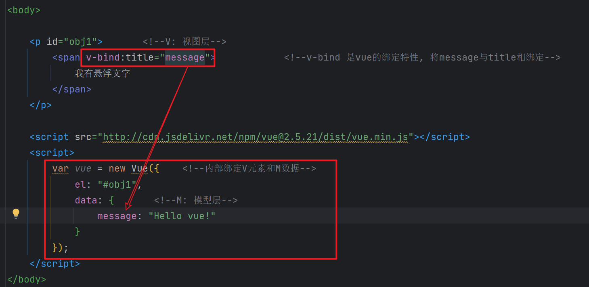
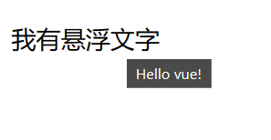
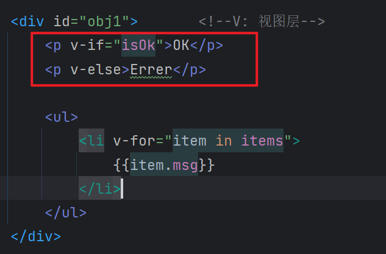
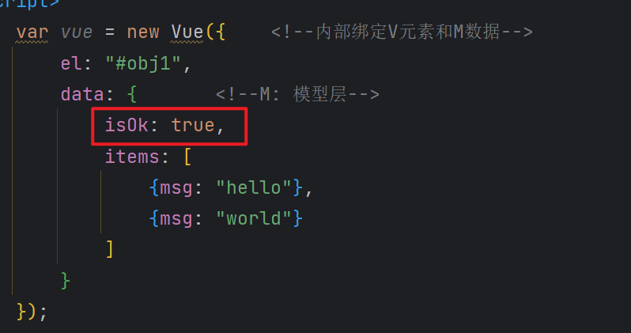
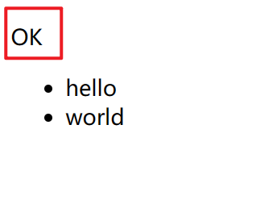
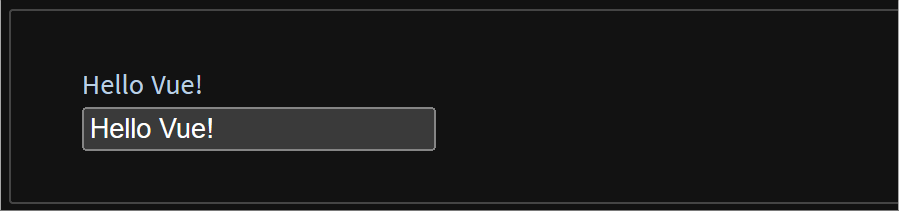
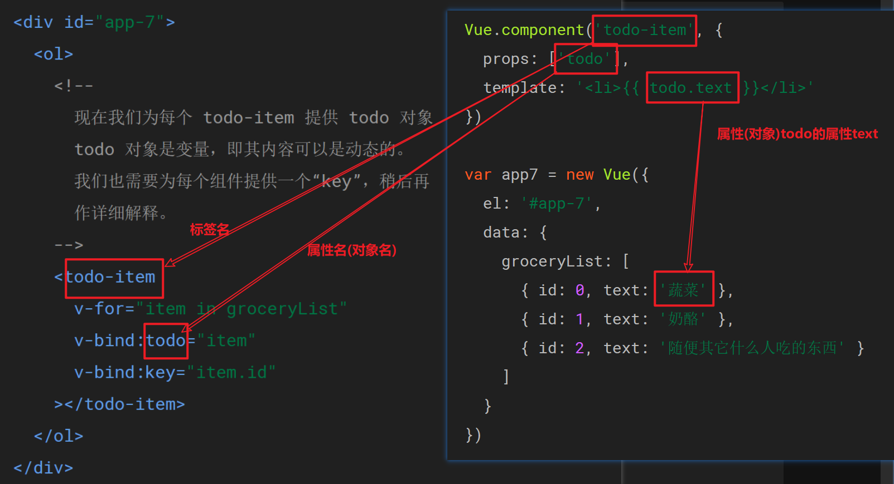
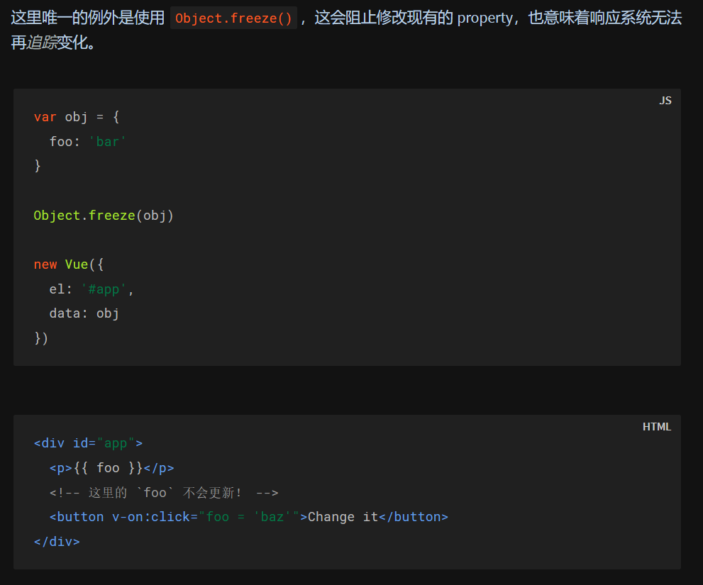
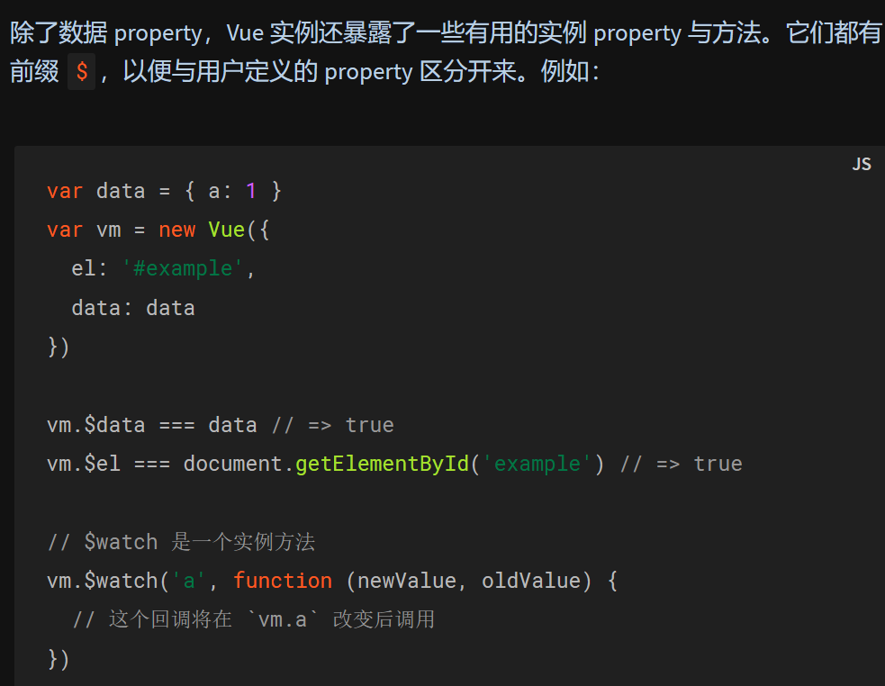
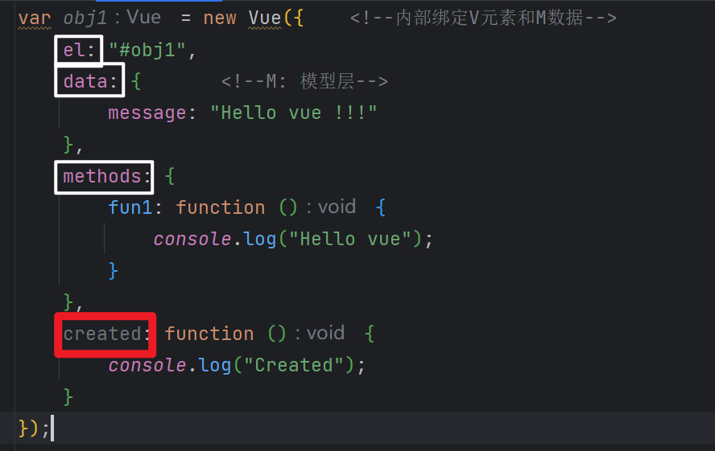

# ==官方文档==

> 百度 `vue.js`即可

[介绍 — Vue2.x.js (vuejs.org)](https://v2.cn.vuejs.org/v2/guide/)


# 首个Vue2.x

1. 创建一个空文件夹

1. 用 IDEA 打开该文件夹

1. 安装插件 vue.js

 ## 引入vue的CDN

+ ```html
        <!-- 开发环境版本，包含了有帮助的命令行警告 -->
        <script src="https://cdn.jsdelivr.net/npm/vue@2/dist/vue.js"></script>
    ```
    
+ ```html
        <!-- 生产环境版本，优化了尺寸和速度 -->
        <script src="https://cdn.jsdelivr.net/npm/vue@2"></script>
    ```

## 使用vue (绑定数据)

> MVVM模式 *(model view viewModel)* 
>
> 其中, viewModel的实现者是 vue

```html
<!DOCTYPE html>
<html lang="en">
<head>
    <meta charset="UTF-8">
    <title>Title</title>
</head>
<body>

    <p id="obj1">                   <!--V: 视图层-->
        {{message}}
    </p>

    <script src="http://cdn.jsdelivr.net/npm/vue@2.5.21/dist/vue.min.js"></script>
    <script>
        var vue = new Vue({         <!--内部绑定V元素和M数据-->
            el: "#obj1",
            data: {                 <!--M: 模型层-->
                message: "Hello vue!"
            }
        });
    </script>
</body>
</html>
```


# vue基础

## 简单介绍

### v-bind

+ 文件头`<html lang="en" xmlns:v-bind="http://www.w3.org/1999/xhtml">`
+ 用法demo
+ 效果


### v-if  & v-for

+ 用法demo
    + 
    + 
+ 效果
    + 


### 绑定方法  *(v-on:click)*

> 语法demo

```js
var app5 = new Vue({
  el: '#app-5',                           // 指定视图
  data: {                                 // 指定model(数据)
    message: 'Hello Vue.js!'                
  },
  methods: {                              // 指定model(方法)  
    reverseMessage: function () {  
      this.message = this.message.split('').reverse().join('')   
    }
  }
})
```

> 使用demo

```html
<div id="app-5">
  	<p>{{ message }}</p>
  	<button v-on:click="reverseMessage">反转消息</button>
</div>
```


### v-model

> 表单输入与应用状态的双向绑定

```html
<div id="app-6">
  	<p>{{ message }}</p>
  	<input v-model="message"> <!--输入框的默认值为message的值, 输入框内容和message同步更改-->
</div>
```




### 组件注册




## Vue实例

### 数据与方法

+ 
+ 


### 生命周期钩子

> 某个周期阶段执行某个函数

**示例**



**具体周期阶段**


## 模板语法

#### 插值

##### v-span

> 一次性的插值, 不会更新

```HTML
<span v-once>这个将不会改变: {{ msg }}</span>
```


##### v-html

> 插入html代码

```html
<span v-html="rawHtml"></span>
```


#### 缩写

##### v-bind

> `v-bind:attribute`
>
> 简写成
>
> `:attribute`

```html
<!-- 完整语法 -->
<a v-bind:href="url">...</a>

<!-- 缩写 -->
<a :href="url">...</a>

<!-- 动态参数的缩写 (2.6.0+) -->
<a :[key]="url"> ... </a>
```

##### v-on

> `v-on:click`
>
> 简写成
>
> `@click`

```html
<!-- 完整语法 -->
<a v-on:click="doSomething">...</a>

<!-- 缩写 -->
<a @click="doSomething">...</a>

<!-- 动态参数的缩写 (2.6.0+) -->
<a @[event]="doSomething"> ... </a>
```


## 计算属性和监听器

### 计算属性

> **计算属性**和**方法**的区别:
>
> **计算属性**是基于它们的响应式依赖进行**缓存**的, 只在相关响应式依赖 *发生改变时* 它们才会 *重新求值* ,
>
> 而**方法** *每次调用* 时 *都会求值*

> **`computed`**

```js
var vm = new Vue({
  el: '#example',
  data: {
    message: 'Hello'
  },
  computed: {
    // 计算属性的 getter
    reversedMessage: function () {
      // `this` 指向 vm 实例
      return this.message.split('').reverse().join('')
    }
  }
})
```


### *监听器

> 看不懂

```html
<div id="watch-example">
  <p>
    Ask a yes/no question:
    <input v-model="question">
  </p>
  <p>{{ answer }}</p>
</div>

<!-- 因为 AJAX 库和通用工具的生态已经相当丰富，Vue 核心代码没有重复 -->
<!-- 提供这些功能以保持精简。这也可以让你自由选择自己更熟悉的工具。 -->
<script src="https://cdn.jsdelivr.net/npm/axios@0.12.0/dist/axios.min.js"></script>
<script src="https://cdn.jsdelivr.net/npm/lodash@4.13.1/lodash.min.js"></script>
<script>
var watchExampleVM = new Vue({
  el: '#watch-example',
  data: {
    question: '',
    answer: 'I cannot give you an answer until you ask a question!'
  },
  watch: {
    // 如果 `question` 发生改变，这个函数就会运行
    question: function (newQuestion, oldQuestion) {
      this.answer = 'Waiting for you to stop typing...'
      this.debouncedGetAnswer()
    }
  },
  created: function () {
    // `_.debounce` 是一个通过 Lodash 限制操作频率的函数。
    // 在这个例子中，我们希望限制访问 yesno.wtf/api 的频率
    // AJAX 请求直到用户输入完毕才会发出。想要了解更多关于
    // `_.debounce` 函数 (及其近亲 `_.throttle`) 的知识，
    // 请参考：https://lodash.com/docs#debounce
    this.debouncedGetAnswer = _.debounce(this.getAnswer, 500)
  },
  methods: {
    getAnswer: function () {
      if (this.question.indexOf('?') === -1) {
        this.answer = 'Questions usually contain a question mark. ;-)'
        return
      }
      this.answer = 'Thinking...'
      var vm = this
      axios.get('https://yesno.wtf/api')
        .then(function (response) {
          vm.answer = _.capitalize(response.data.answer)
        })
        .catch(function (error) {
          vm.answer = 'Error! Could not reach the API. ' + error
        })
    }
  }
})
</script>
```


## class与style绑定

### 绑定class

```html
<div v-bind:class="{ class: bool }"></div>
```


### 绑定style

```html
<div v-bind:style="{ color: myColor, fontSize: mySize + 'px' }"></div>
```

```js
data: {
  myColor: 'red',
  mySize: 30
}
```


## 条件渲染

### v-if

**key**

> Vue 会尽可能高效地渲染元素，通常会复用已有元素而不是从头开始渲染，
>
> 切换相同标签元素时，元素内容不变，要想不同元素相互独立(不被复用)，可以用**key**


### v-show

```html
<h1 v-show="ok">Hello!</h1>
```

> `v-if`和`v-show`功能上一致，
>
> 不同的是带有 `v-show` 的元素始终会被渲染并保留在 DOM 中，
>
> `v-show` 只是简单地**切换元素的 CSS property `display`**


## 列表渲染

### v-for里的对象

```html
<div v-for="(value, key, index) in object">  {{ index }}. {{ key }}: {{ value }}</div>
```

> 上述代码,
>
> `object` 是字典, 
>
> `key` 和 `value` 分别是键和值,
>
> `index` 是从0开始的索引

### 数值更新检查

> 控制台对数值进行操作, 页面也会自动同步


## *事件处理


## *表单输入绑定


## *组件基础


# *深入了解组件


