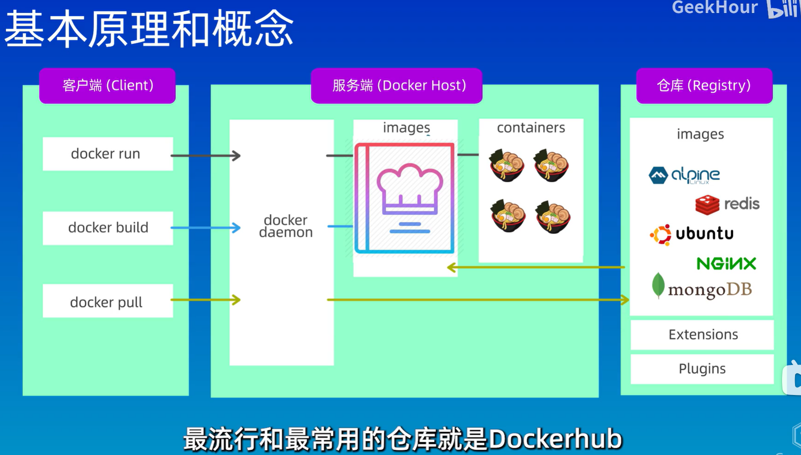

# 简介

+ **Docker **是一个用于 **构建(bulid) 运行(run) 传送(share)** <u>应用程序</u> 的平台,
+ 传送时会打包一系列环境 *(诸如 操作系统 运行时环境 第三方软件库和依赖包 应用程序 环境变量 配置文件 启动命令)*
+ 名词解释:
    + **镜像**: 一个只读的**模板** (类似于 `类`), 用于构建容器
    + **容器**: 一个运行**实例 **(类似于 `对象`) , 提供了独立的可移植的环境
+ 相关图片:
    + 
    + 
    + 

# Docker的安装

