# 一 概述

# 二 HTML

## 表单标签I

+ 控件
    + input
        + radio *(以name定组)*
        + checkbox  *(checked表选中)*
        + file
        + hidden
    + select *-option  (selected表选中)*
    + textarea
+ 按钮
    + *input* submit
    + *input* reset
    + *input* button
    + *input* image
    + button
+ 表单分组
    + fieldset
    + legend

+ 属性 
    + placeholder
    + readonly
    + disabled

## 表单标签II iframe框架

+ 属性
    + required
+ 标签 
    + a

 

## 表格标签II

+ 属性
    + cellpadding    
    + align
    + colspan
    + rowspan
+ 标签
    + colgroup   *按组配置颜色*
    + col

## 列表标签 表格标签I

+ ol
+ ul
+ dl
+ table

## 头部标签 图像标签

+ `<title> </title>`
+ `<meta />`
+ `<link />`
+ ``
+ ``

 

+ img

# 三 CSS基础

## 基本语法

+ 选择器
+ 引用方式

## 常用属性I

+ font-family  *字体*

+ font-size

+ font-style *斜体与否?*

+ font-weight  *多粗?*

    

    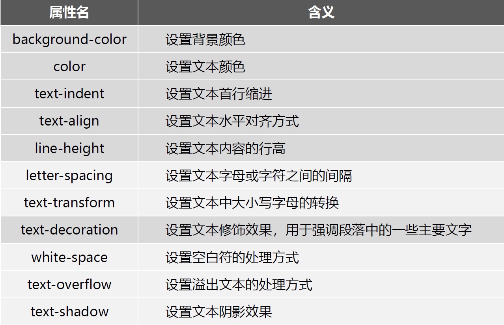

+ color
+ text-indent
+ text-align
+ line-height
+ letter-spacing
+ text-decoration

## 常用属性II

+ white-space   *文本空白符的处理方式*

+ text-overflow  *溢出文本的处理方式*

+ text-shadow

+ background-repeat

+ background-image

+ background-attachment  *背景固定方式*

+ background-position

+ background-size

    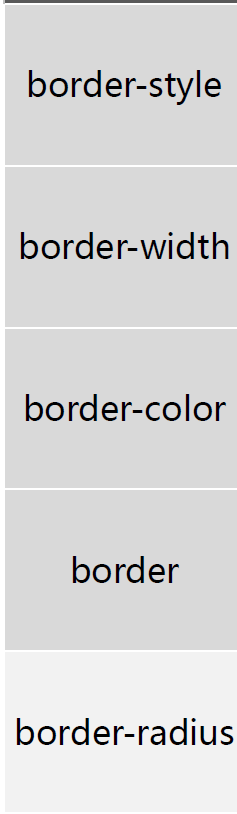

## 常用属性III

+ border-color

+ border-radius

    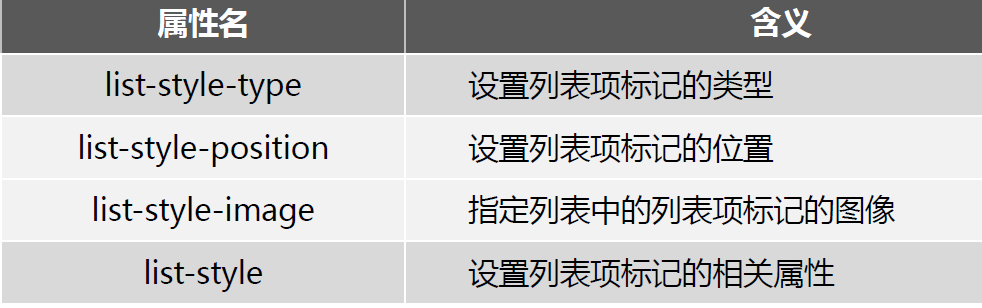

# 四 ==CSS布局==

## 盒子模型概述 & 元素类型及转化I

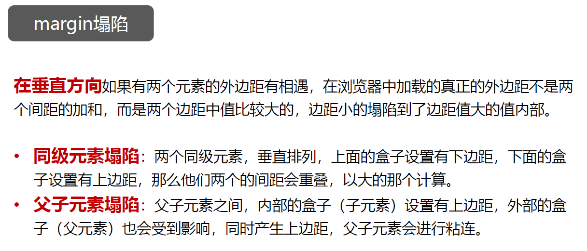

## 元素类型及转化II & 浮动与定位I

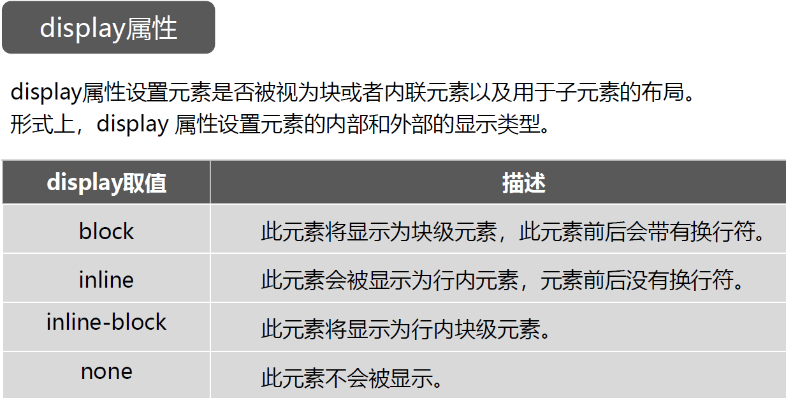

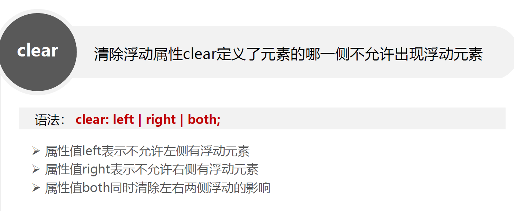

## 浮动与定位II

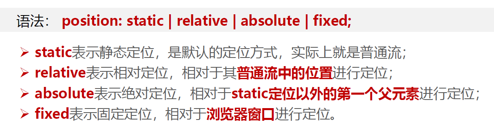

# 五 JavaScript基础

## 概述 & 基本语法I

+ 简单数据类型
+ 算术运算符 逻辑运算符
+ window.prompt()
+ window.alert()
+ console.log()
+ document.write()

## 基本语法II & 对象I

+ 分支语句
+ 函数声明
+ 对象的创建方法
+ 其他数据类型
    + 数组 

## 对象II

+ 字符串
+ 日期 **new Date()**

+ setTimeout
+ setInterval
+ 数学方法

## BOM & DOM I

> BOM *( Browser Object Model )*
> 即浏览器对象模型，
> 它提供了独立于内容而与浏览器窗口进行交互的对象，其核心对象是 window 对象

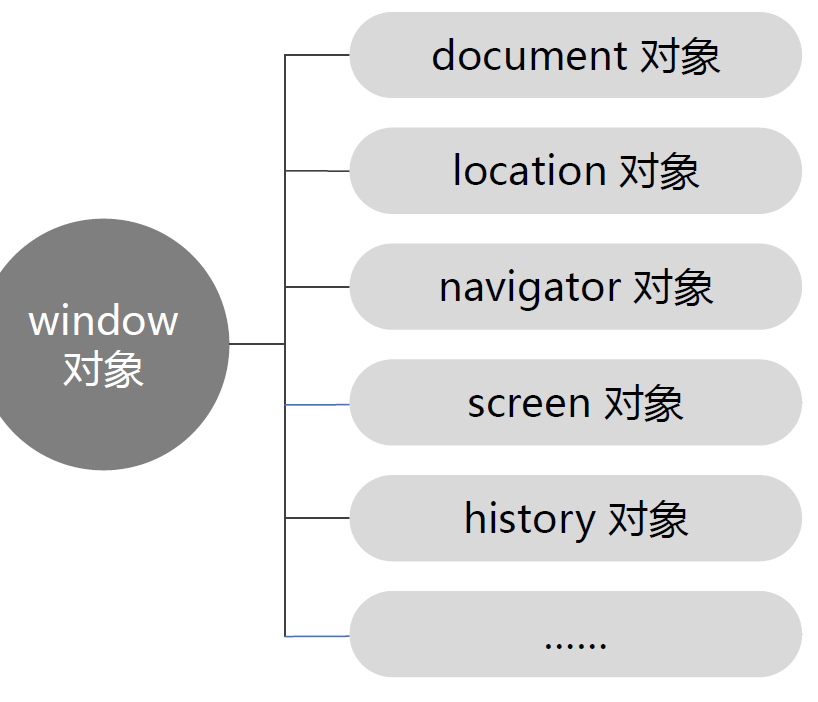

+ innerWidth
+ innerHeight
+ alert()
+ confirm()
+ prompt("提示语", "默认值")    *// 提示输入*
+ open()      *// 打开一个新的浏览器窗口或查找一个已命名的窗口*
+ close    *// 关闭浏览器窗口*
+ scrollBy  *// 把内容滚动指定的像素数*
+ scrollTo  *// 把内容滚动到指定的坐标*

> DOM  *(Document Object Model)* 
> 即文档对象模型
> 提供了用程序动态控制 html 接口
> DOM 描绘了一个层次化的节点树，运行开发人员添加、移除和修改页面的某一部分。

+ `document.getElementById()`
+ `document.getElementsByTagName()`
+ `document.getElementsByClassName()`
+ `document.getElementsByName()`

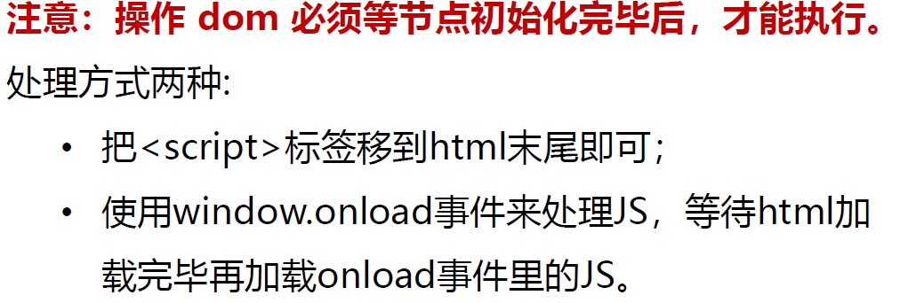

+ `document.querySelector()`      *// 查找页面中第一个符合选择器的元素*
+ `document.querySelectorAll()`
+ `元素.innerHTML`
+ `元素.innerText`
+ `表单元素.value`

## DOM II

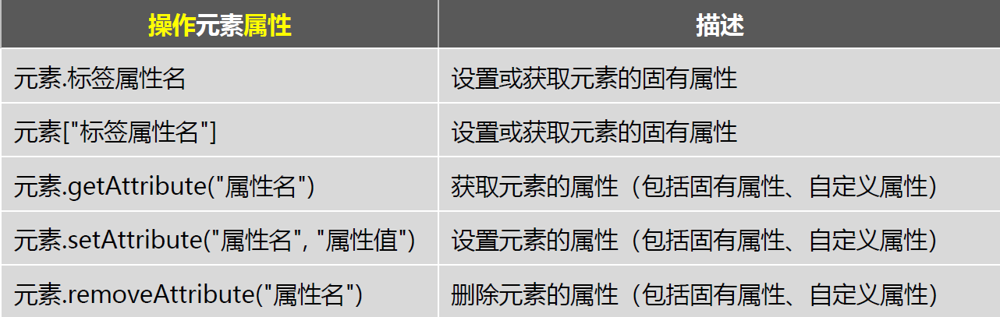

## 事件

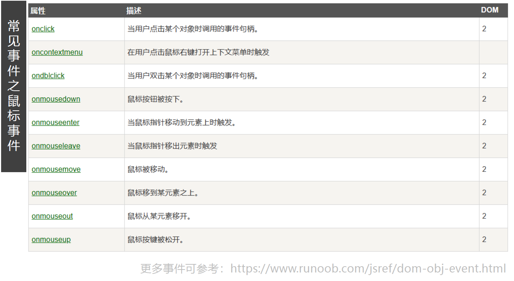

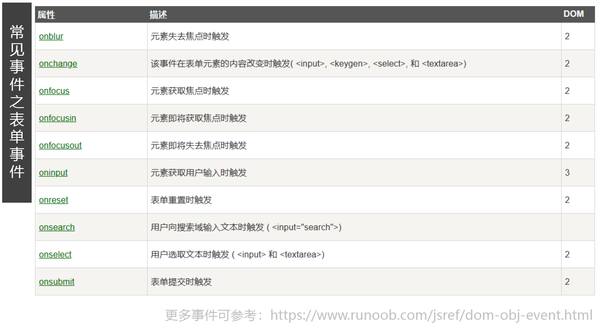

+ `createElement();`
+ `父元素.removeChild(被删除元素);`
+ `被删除元素.remove();`

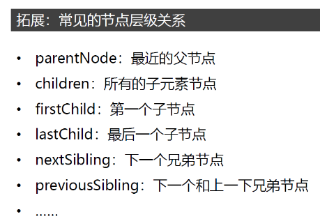

# 六 bootstrap

## 概述 栅格系统I

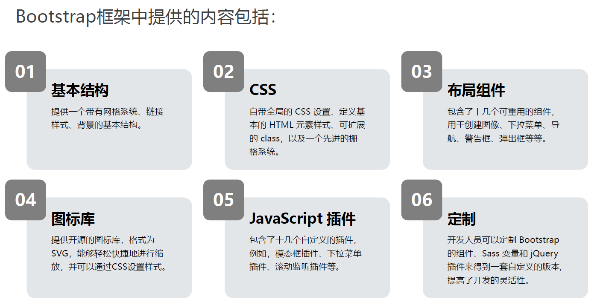

**响应式布局**

> 简而言之，就是一个网站能够兼容多个终端 
>
> 而不是为每个终端做一个特定的版本

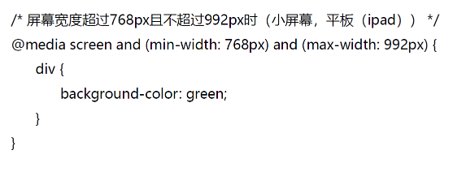

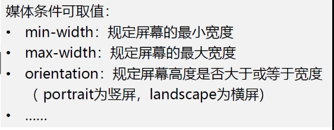

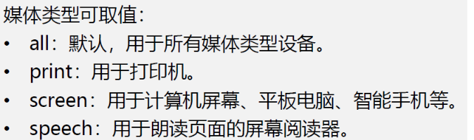

**bootstrap的下载与使用**

**栅格系统**

+ `.container`   *// 固定的宽度且居中*
+ `.container-fluid`

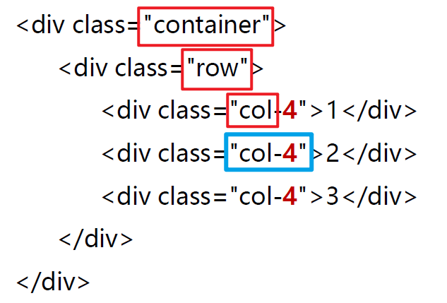

断点

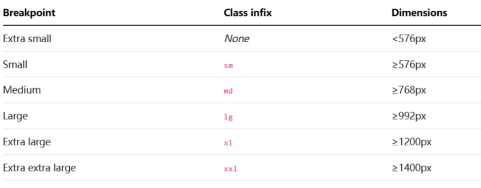

## 栅格系统II

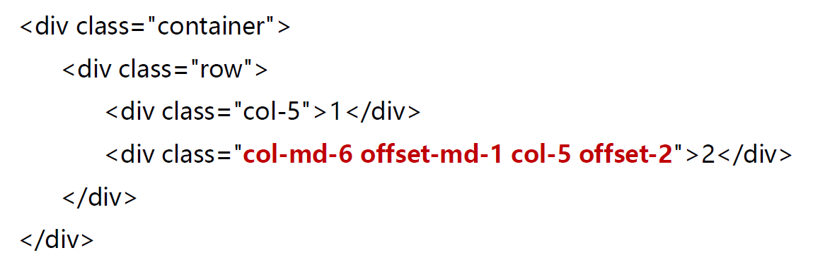

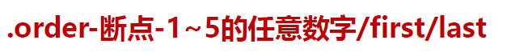

## 弹性布局I

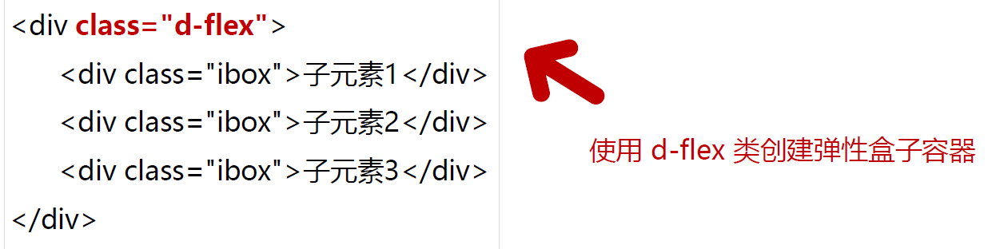

<详述>

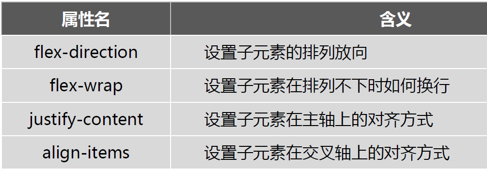

</详述>

## 弹性布局II

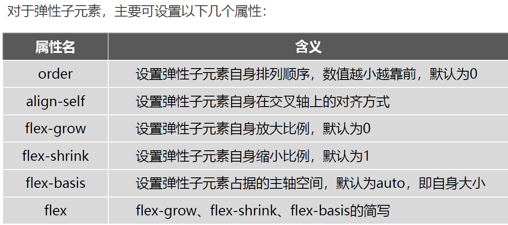
