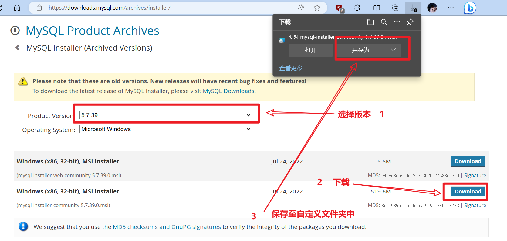
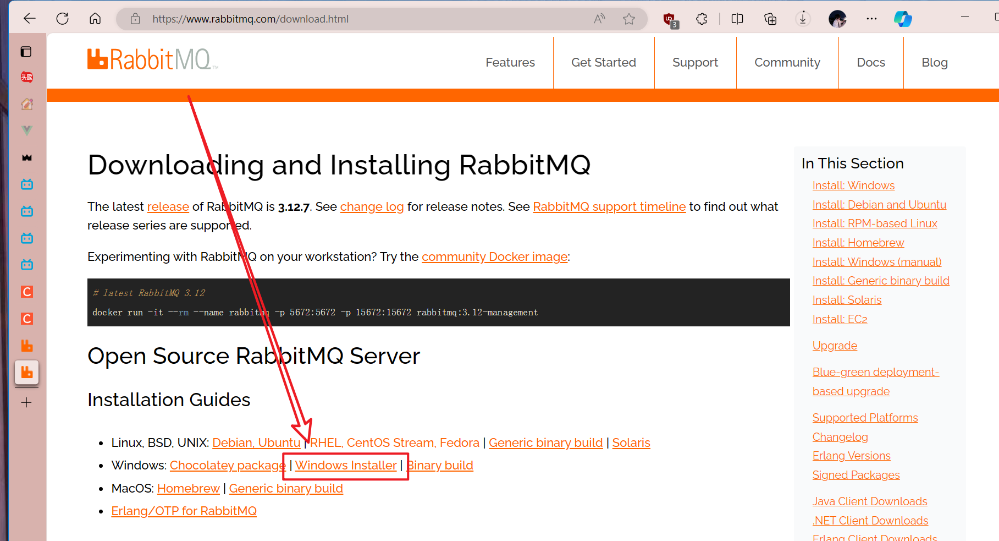
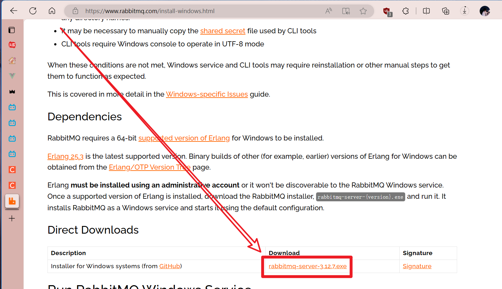

# Redis

1. 安装Redis

    1. 去 菜鸟编程 找到 Redis 的下载链接 (链接指向位于 GitHub ), 

        + [Redis 安装 | 菜鸟教程](https://www.runoob.com/redis/redis-install.html)

        + [Redis安装 | GitHub](https://github.com/tporadowski/redis/releases)

    2. 下载压缩包, 解压至自定义的文件夹内 (文件夹命名为 Redis)

        

2. 启动Redis服务

    1. 打开命令行, 切换目录到 Redis 文件夹
    1. 输入 `redis-server(.exe redis.windows.conf)`  // 括号内内容可省略

    + *注意: 如果关掉该命令行窗口, Redis服务也会关掉*

        

3. 启动Redis客户端 *(连接redis服务)*

    

    + **CLI** *(命令行接口)*

    1. 另打开一个命令行窗口, 同样切换目录到 Redis 文件夹

    1. 输入 `redis-cli(.exe -h 127.0.0.1 -p 6379)` // 括号内内容可省略

        

    + **GUI** *(图形用户接口)*

    1. 去Redis官网下载RedisInsight  =>  [RedisInsight | Redis](https://redis.io/docs/ui/insight/)
    1. 在Redis服务启动的情况下 *(步骤2)* 打开该软件并操作 (操作方法略)

# MySQL

1. 去官网下载安装包  [MySQL :: Download MySQL Installer](https://dev.mysql.com/downloads/installer/)

    

2. 双击msi文件开始安装, 选择service only, 如何确定安装目录, 之后一直点击 `next` | `execute` | `finish` 即可
2. 后续可能需要**配置环境变量**、**新增my.ini**和**命令行初始化**等操作, 详见 [MySQL-mysql 8.0.11安装教程 - Laumians - 博客园 (cnblogs.com)](https://www.cnblogs.com/laumians-notes/p/9069498.html)

# Erlang

1. 下载 http://www.erlang.org/downloads ??
1. 配置环境变量
    + `ERLANG_HOME`    *erlang的安装目录*
    + `Path`     `%ERLANG_HOME%\bin`
1. 测试:   打开cmd输入命令:`erl`

# RabbitMQ

1. 先安装**Erlang**

1. **[下载安装程序]**  

    1. 打开链接: http://www.rabbitmq.com/download.html
    1. 如图点击
    1. 

1. 下载安程序完毕后, **双击程序**以安装Rabbit *(注意更改文件路径)*

1. **[安装插件rabbitmq_management]** 

    1. 用cmd窗口打开至`sbin`目录下:
    1. 用命令 `rabbitmq-plugins enable rabbitmq_management` 来安装插件`rabbitmq_management`
    1. 再次调用`rabbitmq-plugins list`来查看插件中是否有`rabbitmq_management`

1. **[运行]**
    + 打开sbin目录，双击 **`rabbitmq-server.bat`**
    
    + 等几秒钟看到这个界面后，访问: http://localhost:15672
    + 默认用户名和密码都是 **`guest`**
