# 克隆GitHub

## 克隆到IDEA

1. 复制HTTPS链接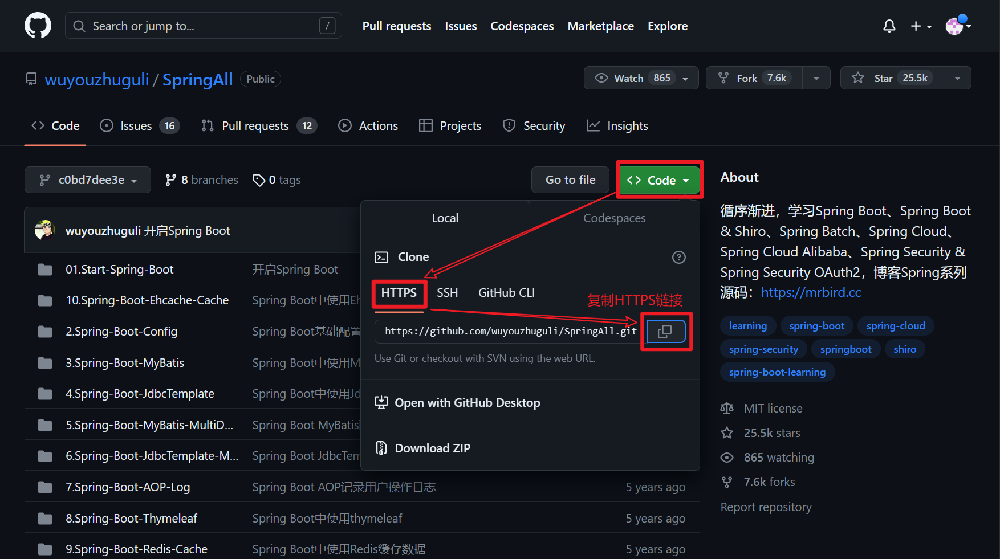

2. 

3. 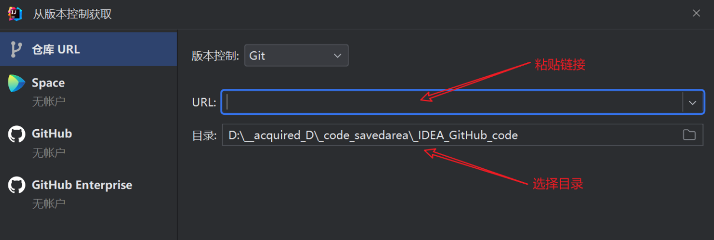

## git bash克隆至文件夹

1. 同`IDEA克隆`的  *复制HTTPS链接*
1. 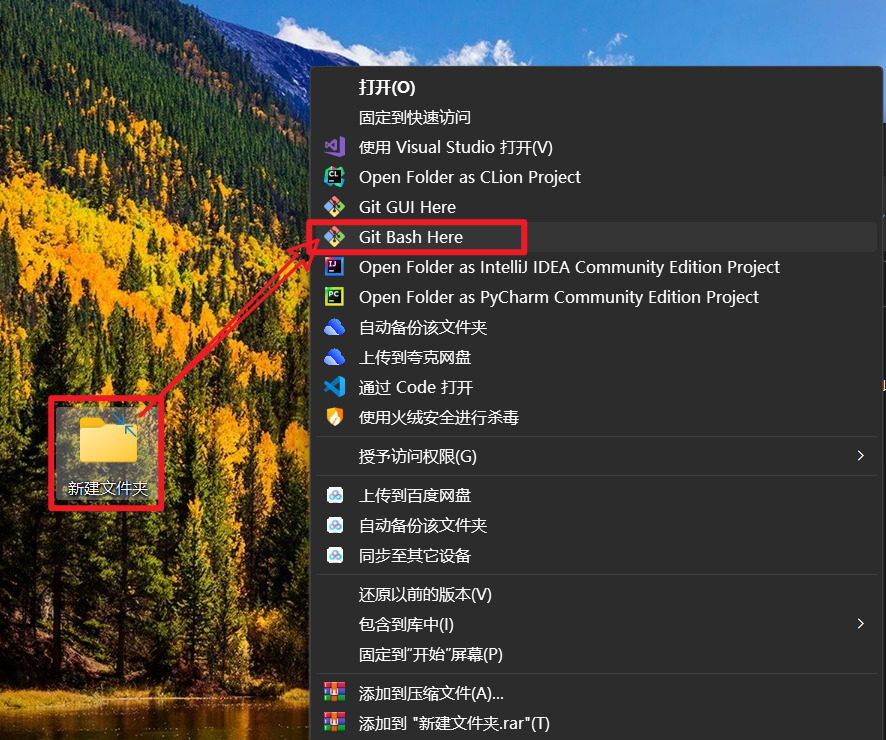

3. 语法`git clone HTTPS_Url`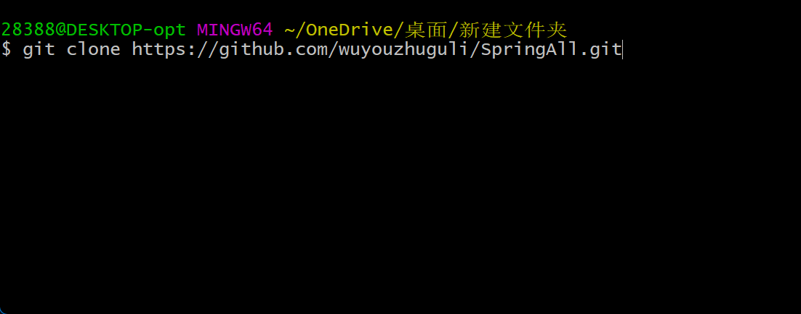

# ==IDEA 中 Git 的版本控制==

## 部分功能介绍

+ 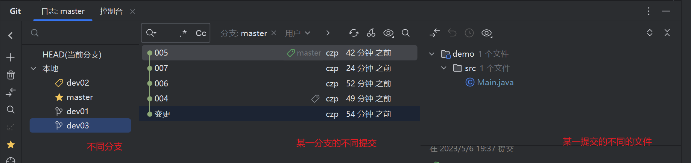

+ 

## 示例图

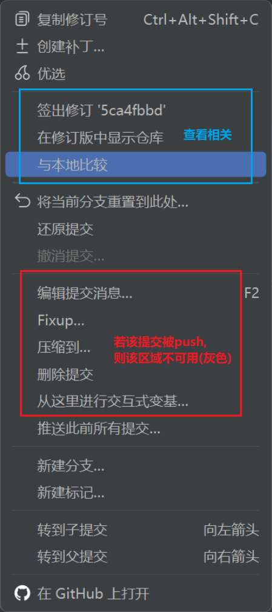

## 查看相关

+ 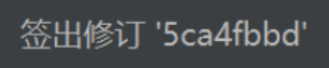**将当前分支`HEAD`移至此处** 以查看或更改该提交的代码, *如需返回原本的提交需要对原本提交执行同样的操作("签出checkout")*

+ 在新的Tab查看该提交对应的仓库内容  *所谓仓库, 即该提交以及之前所有提交的集合*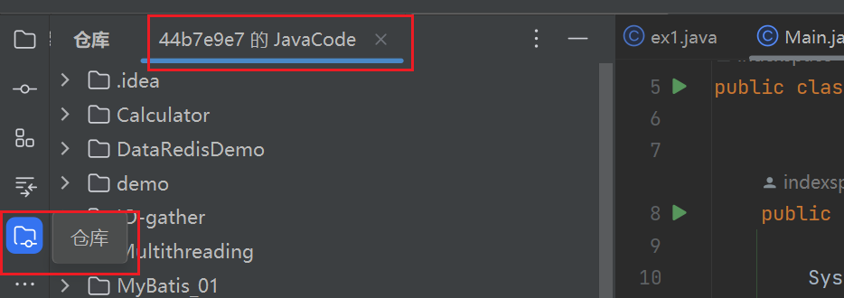

+ 在新的Tab查看该提交与本地的差异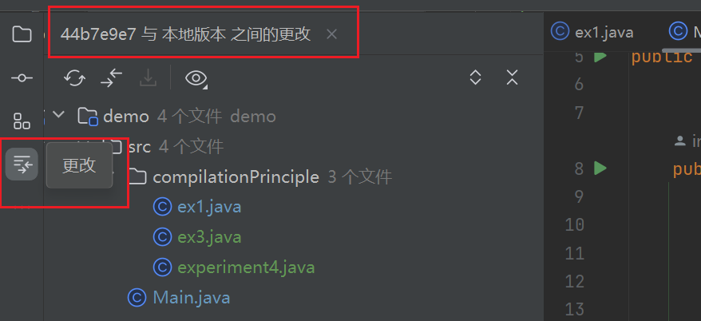

## 删除与撤销

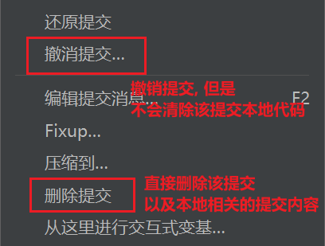

## 压缩到...

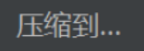

可以同时选中**多条未push的提交**, 然后右键这些提交并**点击"压缩到..."**以将这些提交**合并成一个提交指定这些提交的message**

## 新建分支 转到子(父)提交

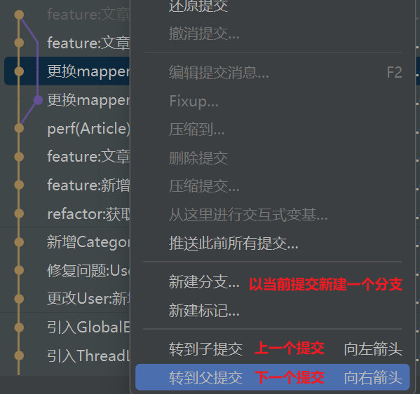

## ==如何解决合并冲突==

当push时抛出合并冲突, 我们:

1. 点击蓝色的"合并"
1. 再次点击蓝色的"合并"
1. 对比差异, 进行取舍与更改
1. 点击蓝色的"应用"
1. `commit`解决合并冲突的提交 并 将两次提交一并`push`

# (远程&本地)仓库的同步

在本地仓库打开**git bash**

+ 将本地同步至远程
    1. `git add .`
    1. `git commit -m "myCommitMessage"`
    1. `git push`  // 这一步 可能出错, 需要用图形化界面来键入``username`(gitee绑定的邮箱)和`password`(gitee登录的密码)

+ 将远程同步至本地
    + `git pull`