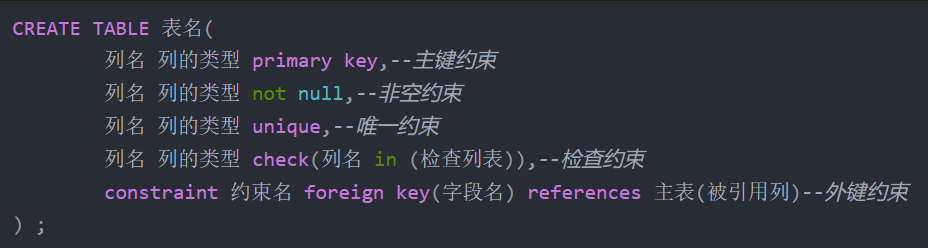
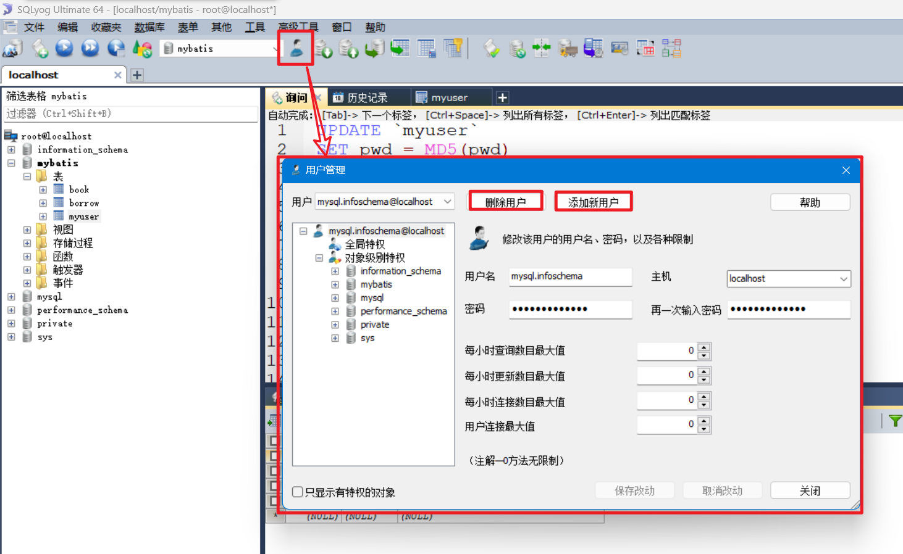
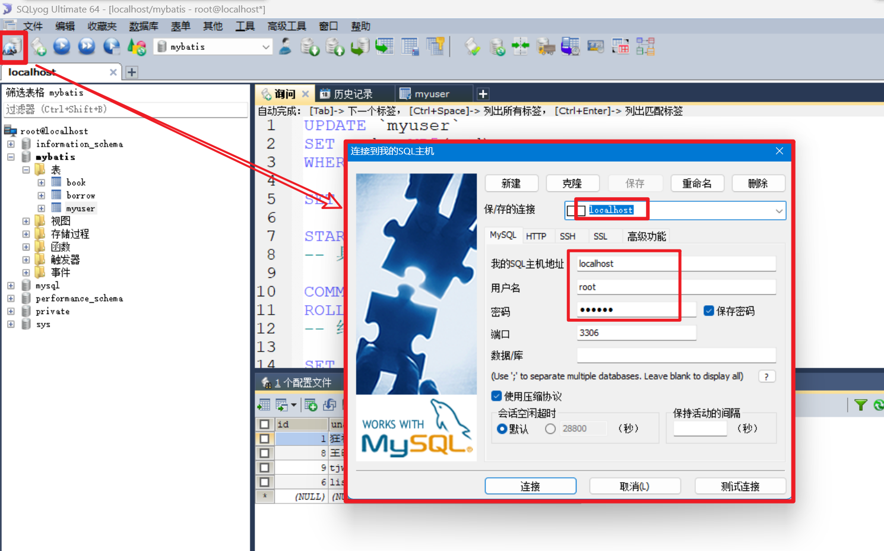
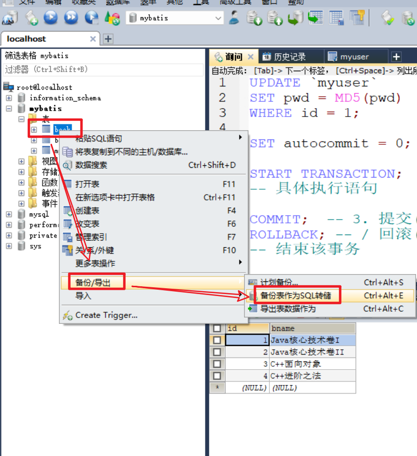
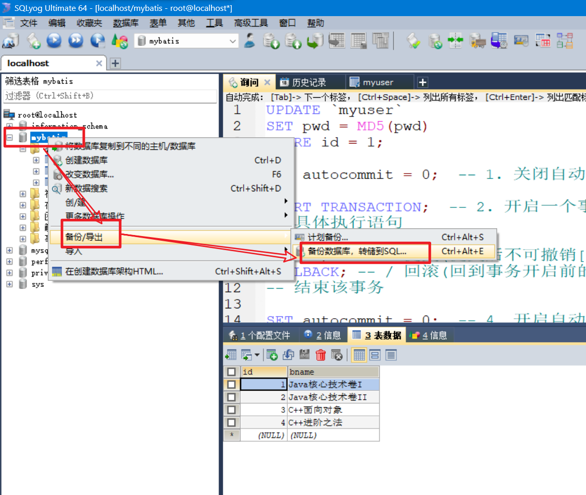
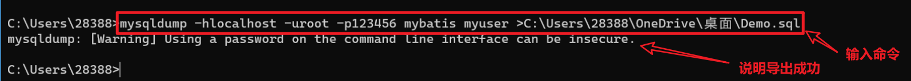
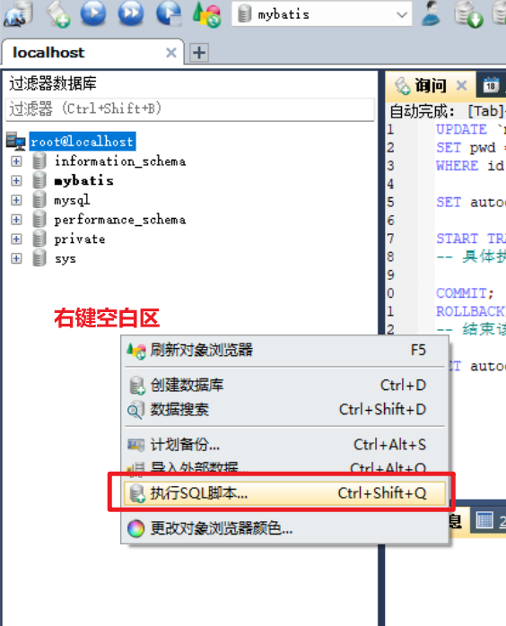
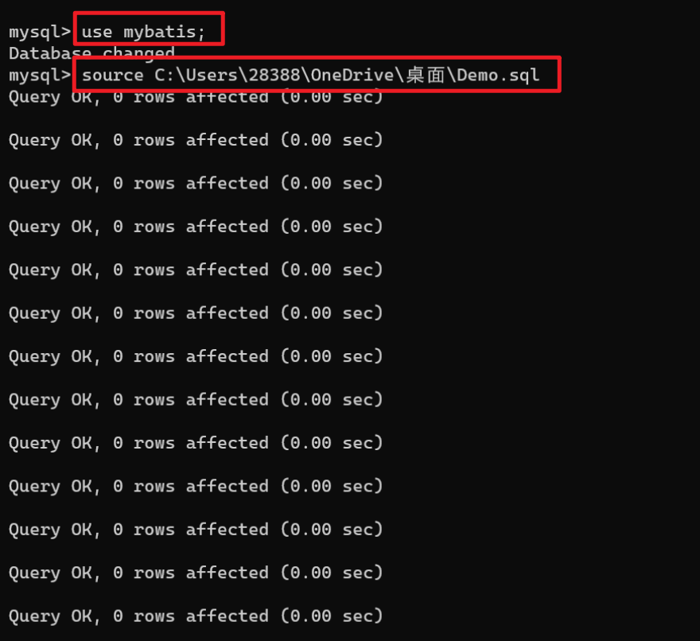

# 基础语法

## database

+ `create database 库名;`
+ `drop database 库名;`
+ `use 库名;`
+ `show databases;`

## table

> `表名`可以写成`库名.表名`的形式, 也可以提前用`use 库名;`来指定库名

+ **`create table 表名(列1 类型 其他, ..., 列n 类型 其他);` **   // 注意**列**在前, 类型的多样, 其他的具体语法
+ `drop table 表名;`
+ `desc 表名;`  //查看表结构

## alter table ..

+ `alter table 表名 raname to 新表名;`
+ `alter table 表名 add 列 类型 其他;`
+ `alter table 表名 drop 列;`
+ `alter table 表名 modify 列 新类型 (其他);`
+ `alter table 表名 change column 旧列 新列 新类型 (新其他);`

## CURD

+ `insert into 库名.表名(字段1, .., 字段n) values(值1, .., 值n),(...),(...)...;`

    + ```mysql
        insert into test02.login(name, pwd) values("czp", "1234");
        ```

    + ```mysql
        insert into test02.login(name, pwd) values("czp", "1234"),("tjw","helloworld");
        ```

+ `delete from 库名.表名 [where ...]`   //不加where语句会删除全部数据!!!

+ `update 库名.表名 set 赋值语句 [where ..]`

+ ```mysql
    select [distinct] *|列名1,列名2
    from 表|视图 
    [where 条件] 
    [group by 列 [having 条件] ]  
    [order by 列 asc|desc]
    [limit 显示数量 offset 跳过数量] | [limit 跳过数量, 显示数量];
    ```

+ 多表联查(举例)

    + ```mysql
        select * 
        from a 
        inner|left|right join b           -- 内左右
        on a.id=b.id               
        ```
        
    + ```mysql
        select * from a
        union   -- union自动去重, union all不去重
        select * from b
        ```


## 其他

### 视图

+ `create view xxx(字段1, .., 字段n) as select语句;`

+ `drop view xxx;`

    

### 约束




### 索引

+ `create [unique] index index_name on table_name(column_name);`
+ `drop            index index_name on table_name;`


# ! MySQL优化

[ sql语句优化的30种方法_sql语句性能调优_CSDN博客](https://blog.csdn.net/i_am_xiaobai/article/details/123414261?ops_request_misc=%7B%22request%5Fid%22%3A%22168794482416800192243237%22%2C%22scm%22%3A%2220140713.130102334..%22%7D&request_id=168794482416800192243237&biz_id=0&utm_medium=distribute.pc_search_result.none-task-blog-2~all~sobaiduend~default-1-123414261-null-null.142^v88^control_2,239^v2^insert_chatgpt&utm_term=sql语句调优&spm=1018.2226.3001.4187)

[Mysql调优系列视频【索引】【索引优化】【SQL优化】_哔哩哔哩_bilibili](https://www.bilibili.com/video/BV1Ph4y137x5/?spm_id_from=333.1007.top_right_bar_window_history.content.click)


# 事务

## 执行流程

1. 关闭自动提交
1. 开启一个事务
1. 提交 / 回滚
1. 开启自动提交

```mysql
SET autocommit = 0;  -- 1. 关闭自动提交

START TRANSACTION;  -- 2. 开启一个事务
-- 具体执行语句

COMMIT;  -- 3. 提交(提交后不可撤销[持久化])
ROLLBACK; -- / 回滚(回到事务开启前的状态)
-- 结束该事务

SET autocommit = 0;  -- 4. 开启自动提交
```


## 隔离级别

1. **读未提交**(Read uncommitted)

    > 一个事务可以读取另一个未提交事务的数据

1. **读已提交**(Read committed)

    > 处于Read committed （读已提交）级别的事务**可以看到**其他事务**对数据的修改**。

1. **重复读**(Repeatable read)

    > 在开始读取数据（事务开启）时，**不再允许修改**操作, 但允许插入数据

1. **序列化**(Serializable)

    > 数据库事务的**最高隔离**级别。
    >
    > 在此级别下，事务**串行执行**。
    >
    > 但是**效率低下**，耗费数据库性能，不推荐使用。


+ 隔离级别的**查询**

    + Mysql8以前：`SELECT @@GLOBAL.tx_isolation, @@tx_isolation;`

    + Mysql8开始：`SELECT @@GLOBAL.transaction_isolation, @@transaction_isolation;`

+ 关于**读数据的问题**

    + 脏读：读到了其他事务未提交的数据(即脏数据)

    + 不可重复读：是指在数据库访问中，一个事务内的多次相同查询却返回了不同数据。

    + 幻读：指同一个事务内多次查询返回的结果集不一样，比如增加了行记录。

+ 脏读、不可重复读、幻读 与 隔离级别的**关联**

    | 隔离级别 \| 问题存在否 \ 具体问题 | 脏读 | 不可重复读 | 幻读 |                                        |
    | --------------------------------- | ---- | ---------- | ---- | -------------------------------------- |
    | READ UNCOMMITTED                  | 1    | 1          | 1    |                                        |
    | READ COMMITTED                    | 0    | 1          | 1    | 可见数据的提交,  **避免脏读**          |
    | REPEATABLE READ                   | 0    | 0          | 1    | 事务期间禁止update, **避免不可重复读** |
    | SERIALIZABLE                      | 0    | 0          | 0    | 串行执行*(禁止insert)*                 |


# *索引


# 用户管理

## 用户操作

> 通过 **SQLyog **的 **用户**按钮 可以实现 用户的**创建**(权限设置)与**删除**



> 创建和删除的用户信息与参数统一存放在 `mysql.user`的表中
>
> 上面的界面化操作本质是在修改这张表, 当然**也可以通过`mysql`语句来管理用户**

## 测试

> 按照创建的**用户参数**来创建一个新的**连接**



> 连接完成后, 新的连接就是一个新的用户


# 备份

## 导出

### SQLyog导出

导出表



导出库

	


### 命令行导出

导出命令的模板:

**mysqldump**  -h*主机名*  -u*用户名*  -p*密码*  *库名*  [*表名*]  >*导出到的绝对路径* \ 文件名.sql 

实例

`mysqldump -hlocalhost -uroot -p123456 mybatis myuser >C:\Users\28388\OneDrive\桌面\Demo.sql`

*忽略表名这导出库*




## 导入

### SQLyog导入




### 命令行导入

```bash
mysql -u用户名 -p密码   # 登录账号
use 库名    # 切换到指定库
source 文件地址\文件名.sql    # 将指定sql文件导入

# 或者 ===================
mysql -u用户名 -p密码 库名 
```





# 锁

## 锁的分类

> 全局锁、表级锁和行锁


## 表级锁

+ 上锁

    + 模板:

        **lock tables** *表名1* **read/wirte**[, 表名2 read/wirte];

    + 举例: 

        ```mysql
        LOCK TABLES `pass` WRITE;
        ```

+ 解锁

    + 模板:

        ```mysql
        UNLOCK TABLES;
        ```

表级锁的**三种情况**:

1. 未上任何锁;
1. 有且仅有写锁;
1. 有一至多个读锁;

