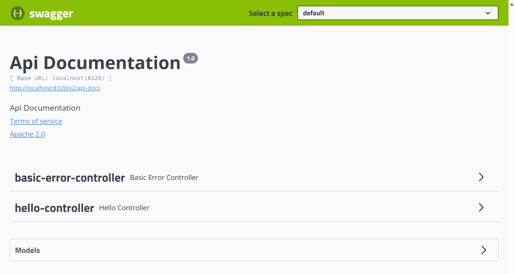
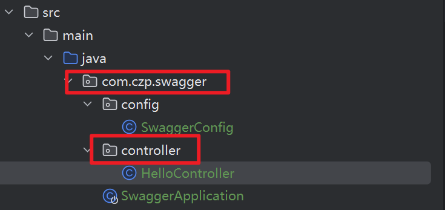
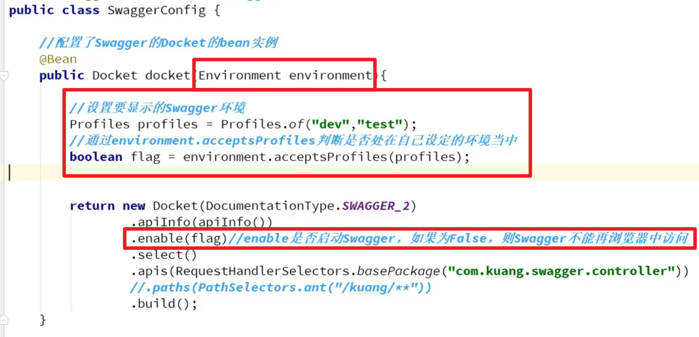
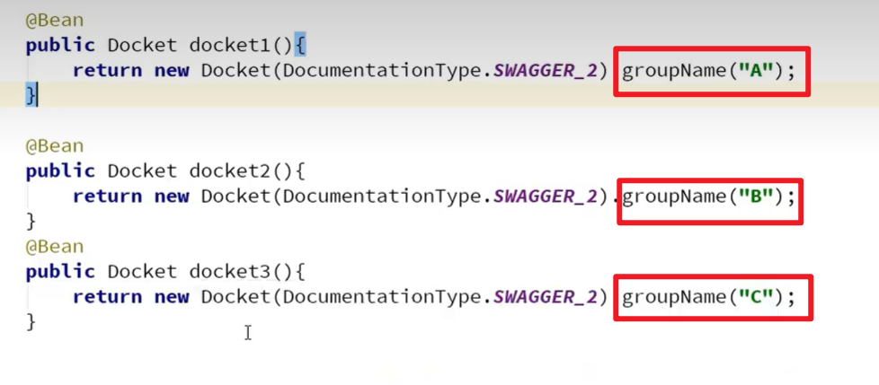
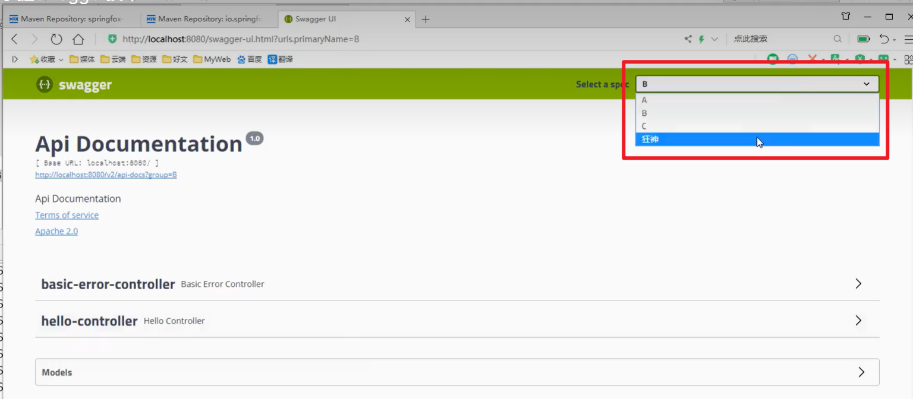
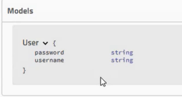
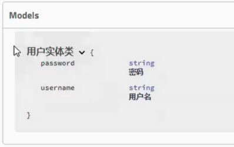
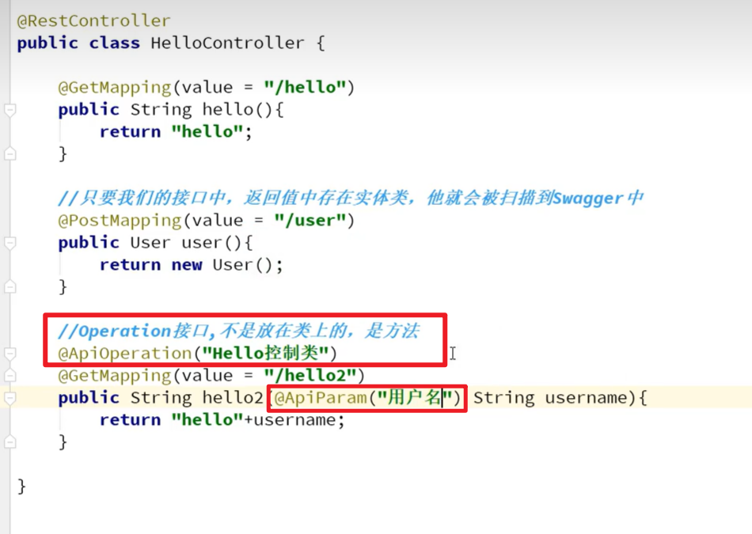
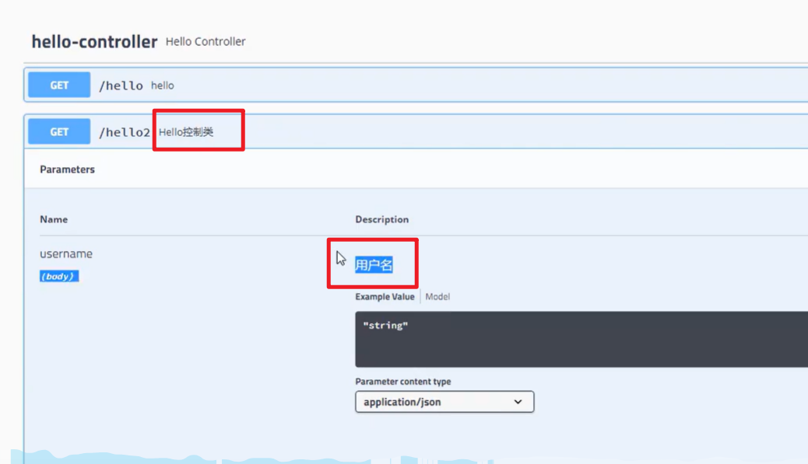

# 简介

> 比较流行的**API**框架;
>
> API**文档**在线**自动生成**工具   *// API文档和API定义同步*
>
> 可以**在线测试**API**接口**


# SpringBoot集成swagger

1. 建立并运行SpringBoot项目的Demo

1. 导入swagger的依赖

    ```xml
    <!-- https://mvnrepository.com/artifact/io.springfox/springfox-swagger2 -->
    <dependency>
        <groupId>io.springfox</groupId>
        <artifactId>springfox-swagger2</artifactId>
        <version>2.9.2</version>
    </dependency>

    <!-- https://mvnrepository.com/artifact/io.springfox/springfox-swagger-ui -->
    <dependency>
        <groupId>io.springfox</groupId>
        <artifactId>springfox-swagger-ui</artifactId>
        <version>2.9.2</version>
    </dependency>
    ```

1. 编写swagger的config文件

    

1. 测试运行: `http://localhost:8080/swagger-ui.html`

	

> **! 注意**:
>
> 2.6.1 的 springboot 不支持 2.9.2 的 swagger 配置，报空指针错误
>
> 在 `application.properties`中加入
> ```properties
> spring.mvc.pathmatch.matching-strategy=ANT_PATH_MATCHER
> ```
> 即可


# 配置swagger

## 配置信息 *ApiInfo*


## 扫描接口 *apis*

```java
@Bean
public Docket docket(){

    return new Docket(DocumentationType.SWAGGER_2)
        // 为Docket设置信息
        .apiInfo(apiInfo())
        // 转化为ApiSelectorBuilder才可以设置扫描 ======================
        .select()
        // 指定扫描的包, 包下的API将被写成文档
        .apis(RequestHandlerSelectors.basePackage("com.czp.swagger.controller"))
        // 再转化为Docket返回 ==========================================
        .build();
}
```

> 项目结构如下


##  设置开关

> 我们想要特定的环境下用swagger, 而其他环境不用, 该怎么办呢?

> 根据不同环境来设置swagger的开与关

+ 写几套环境
    +  application.yml     `spring.profiles.active=dev`
    + application-dev.yml    `server.port=8081`
    + application-pro.yml     `server.port=8082`
+ 在SwaggerConfig配置


## 分组

不同的Docket设置不同的`groupName("")`以实现分组

效果如下: 


## 注释

> 当一个**实体类**被某个接口作为返回值时, `swagger`的 **model **就可以显示该 实体类


我们可以通过在**源码**中增加**注解**以在swagger的**model**的实体类增加**注释**

>  `@ApiModel("类注释")`
>
> `@ApiModelProperty("属性注释")`

	

效果如下: 


*其他注释*



效果: 
