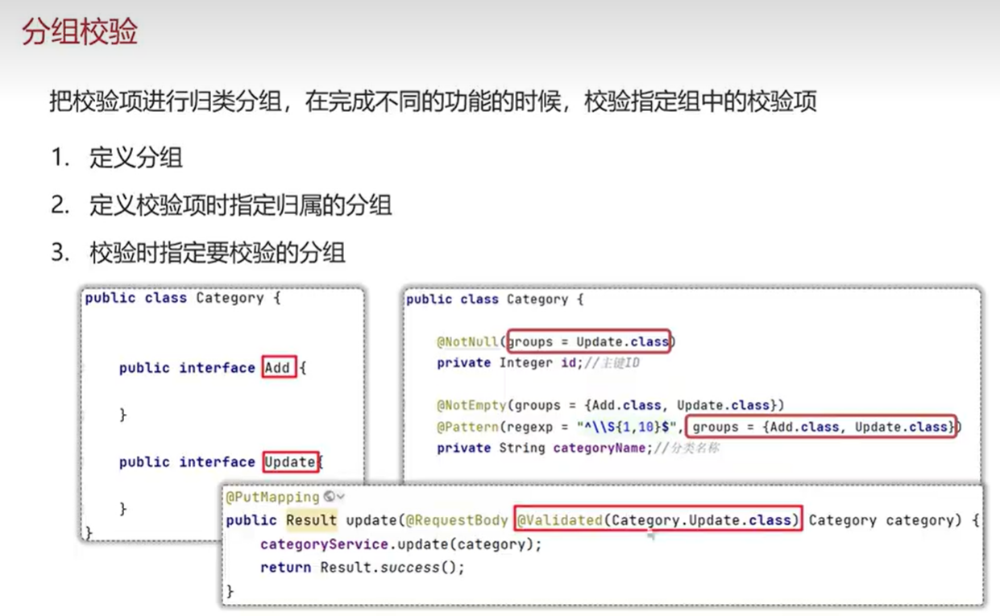
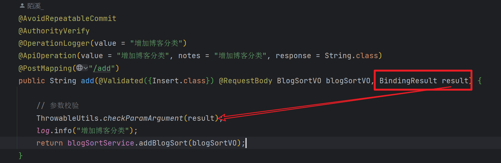
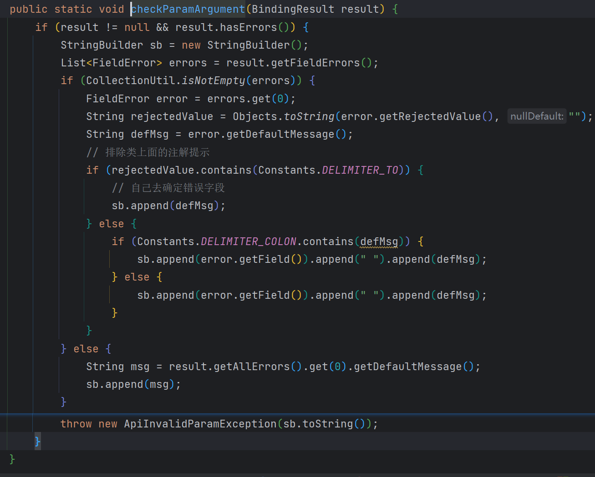

# 相关链接

Validated: [@Validated分组校验_CSDN博客](https://blog.csdn.net/goxingman/article/details/130201679?ops_request_misc=&request_id=&biz_id=102&utm_term=@Validated({GetList.class})&utm_medium=distribute.pc_search_result.none-task-blog-2~all~sobaiduweb~default-0-130201679.142^v95^chatgptT3_1&spm=1018.2226.3001.4187)

valid && validated && BindingResult: [@Valid，@Validated 的分组校验和嵌套检验_CSDN博客](https://jiming.blog.csdn.net/article/details/127965610?spm=1001.2101.3001.6650.3&utm_medium=distribute.pc_relevant.none-task-blog-2~default~CTRLIST~Rate-3-127965610-blog-130201679.235^v38^pc_relevant_default_base&depth_1-utm_source=distribute.pc_relevant.none-task-blog-2~default~CTRLIST~Rate-3-127965610-blog-130201679.235^v38^pc_relevant_default_base&utm_relevant_index=6)

# 流程

1. 定义多个不同名的空接口, 即**校验分组**;

1. 在实体类的某些属性上加上**校验相关注解**, 并指定<u>校验分组</u>*(如不指定,则默认Default.class)* ,如果被校验属性为引用类型且其属性也含有校验参数,则可加上**`@Valid`注解**以实现***嵌套查询***

1. 在使用被校验实体类的控制层的参数前加上**`@Validated`注解**, 并指定<u>校验分组</u>;

    > 实体类 会根据控制层传入的校验分组 来对含对应校验分组的校验注解下的属性 进行校验操作
    >
    > 被`@Valid`注解修饰的属性会进一步去进行校验操作

# BindingResult

> 可以获取校验信息（如校验注解内的Message值）, 属于非自定义类

在控制层中, 作为为参数直接获取BindingResult对象

如何对BindingResult对象进行一系列操作来获取错误信息, 这里我们用自定义封装函数来实现

