# 常见代码流程

## 新增员工接口

### Controller

```java
package com.sky.controller.admin;

import com.sky.dto.EmployeeDTO;
import // 其他package

@RestController
@RequestMapping("/admin/employee")
@Slf4j
public class EmployeeController {

    @Autowired
    private EmployeeService employeeService;
    
    // 其他code

    @PostMapping
    @ApiOperation("新增员工")
    public Result save(@RequestBody EmployeeDTO employeeDTO) {
        log.info("新增员工: {}", employeeDTO);
        employeeService.save(employeeDTO);
        return Result.success();
    }

}
```

### Service

```java
import com.sky.dto.EmployeeDTO;
import // 其他package
    
public interface EmployeeService {

    // 其他code
    
    void save(EmployeeDTO employeeDTO);

}
```

### ServiceImpl

```java
package com.sky.service.impl;

import org.springframework.beans.BeanUtils;
import org.springframework.util.DigestUtils;
import // 其他package

@Service
public class EmployeeServiceImpl implements EmployeeService {

    @Autowired
    private EmployeeMapper employeeMapper;

    // 其他code

    public void save(EmployeeDTO employeeDTO) {
        Employee employee = new Employee();
        BeanUtils.copyProperties(employeeDTO, employee);
        employee.setPassword( DigestUtils.md5DigestAsHex(
            PasswordConstant.DEFAULT_PASSWORD.getBytes()) );
        employee.setStatus(StatusConstant.ENABLE);
        employee.setCreateTime(LocalDateTime.now());
        employee.setUpdateTime(LocalDateTime.now());
        employee.setCreateUser(10L);
        employee.setUpdateUser(10L);

        employeeMapper.insert(employee);
    }

}
```

### Mapper

```java
package com.sky.mapper;

import com.sky.entity.Employee;
import org.apache.ibatis.annotations.Insert;
import org.apache.ibatis.annotations.Mapper;
import org.apache.ibatis.annotations.Select;

@Mapper
public interface EmployeeMapper {

    @Insert("insert into employee (name, username, password, phone, sex, id_number, status, create_time, update_time,  create_user, update_user) values (#{name}, #{username}, #{password}, #{phone}, #{sex}, #{idNumber}, #{status}, #{createTime}, #{updateTime}, #{createUser}, #{updateUser})")
    void insert(Employee employee);

}
```


## 分页查询

### 前提配置

#### 依赖

```xml
<dependency>
   <groupId>com.github.pagehelper</groupId>
   <artifactId>pagehelper-spring-boot-starter</artifactId>
   <version>1.3.0</version>
</dependency>
```

#### Result

```java
@Data
public class Result<T> implements Serializable {

    private Integer code; //编码：1成功，0为失败
    private String msg; // 失败时返回的信息
    private T data; // 正确时可以返回的数据, 可为空

    public static <T> Result<T> success() {
        Result<T> result = new Result<T>();
        result.code = 1;
        return result;
    }

    public static <T> Result<T> success(T object) {
        Result<T> result = new Result<T>();
        result.data = object;
        result.code = 1;
        return result;
    }

    public static <T> Result<T> error(String msg) {
        Result result = new Result();
        result.msg = msg;
        result.code = 0;
        return result;
    }

}
```

#### PageResult

```java
@Data
@AllArgsConstructor
@NoArgsConstructor
public class PageResult implements Serializable {

    private long total;  //总记录数

    private List records;  //当前页数据集合

}
```

#### XxxPageQueryDTO

```java
@Data
public class XxxPageQueryDTO implements Serializable {

    // 指定的要检索的属性 为空则为正常查询
    private String name;

    // 页码
    private int page;

    // 每页显示记录数
    private int pageSize;

}
```


### Controller

```java
@GetMapping("/ooo")
public Result<PageResult> page(XxxPageQueryDTO xxxPageQueryDTO){
        return Result.success(XxxService.pageQuery(xxxPageQueryDTO));
    }	
```

### Service

```java
PageResult pageQuery(XxxPageQueryDTO xxxPageQueryDTO);
```

### ServiceImpl

```java
public PageResult pageQuery(XxxPageQueryDTO xxxPageQueryDTO) {
        PageHelper.startPage(xxxPageQueryDTO.getPage(), xxxPageQueryDTO.getPageSize());
        Page<Xxx> page = xxxMapper.pageQuery(xxxPageQueryDTO);

        long total = page.getTotal();
        List<Xxx> records = page.getResult();
        return new PageResult(total, records);
    }
```

### Mapper.java

```java
Page<Xxx> pageQuery(XxxPageQueryDTO xxxPageQueryDTO);
```

### Mapper.xml

```xml
<?xml version="1.0" encoding="UTF-8" ?>
<!DOCTYPE mapper PUBLIC "-//mybatis.org//DTD Mapper 3.0//EN" "http://mybatis.org/dtd/mybatis-3-mapper.dtd" >

<mapper namespace="com.xxx.mapper.xxxMapper">
    
    <select id="pageQuery" resultType="com.xxx.entity.Xxx">
		select * from xxx
        
		<!--if have properties, then get these specific items-->
		<where>
			<if test="name != null and name != ''">
				and name like concat('%',#{name},'%')
			</if>
		</where>
	</select>
</mapper>
```


## ConfigurationProperties

### 配置文件 application.xml

```yml
a:
  bb:
    c-cc: 7200000
    d-ddd: token
```

### 配置属性类 BbProperties.java

```java
@ConfigurationProperties(prefix = "a.bb")
@Component
@Data
public class BbProperties {
    private long cCc;
    private String dDdd;
}
```

### 使用属性的Java类

```java
// ...
public class ... {

    @Autowired
    private BbProperties bbProperties;
    
    ... func( bbPropeerties.getdDdd() )  ...
}
```


## 缓存的使用与清理

### 缓存的使用

```java
	@Autowired
    private RedisTemplate redisTemplate;
	/**
     * 根据分类id查询菜品
     *
     * @param categoryId
     * @return
     */
    @GetMapping("/list")
    @ApiOperation("根据分类id查询菜品")
    public Result<List<DishVO>> list(Long categoryId) {

        //构造redis中的key，规则：dish_分类id ===================
        String key = "dish_" + categoryId;

        //查询redis中是否存在菜品数据
        List<DishVO> list = (List<DishVO>) redisTemplate.opsForValue().get(key);
        if(list != null && list.size() > 0){
            //如果存在，直接返回，无须查询数据库
            return Result.success(list);
        }
		// ====================================================
        
        Dish dish = new Dish();
        dish.setCategoryId(categoryId);
        dish.setStatus(StatusConstant.ENABLE);//查询起售中的菜品

        //如果不存在，查询数据库，将查询到的数据放入redis中
        list = dishService.listWithFlavor(dish);
        ////////////////////////////////////////////////////////
        redisTemplate.opsForValue().set(key, list);

        return Result.success(list);
    }
```

### 缓存的清理

```java
	@Autowired
    private RedisTemplate redisTemplate;
	/**
     * 清理缓存数据
     * @param pattern
     */
	// ========================================
    private void cleanCache(String pattern){
        Set keys = redisTemplate.keys(pattern);
        redisTemplate.delete(keys);
    }
	// ========================================

	/**
     * 新增菜品
     *
     * @param dishDTO
     * @return
     */
    @PostMapping
    @ApiOperation("新增菜品")
    public Result save(@RequestBody DishDTO dishDTO) {
        log.info("新增菜品：{}", dishDTO);
        dishService.saveWithFlavor(dishDTO);

        // =============清理缓存数据=============
        String key = "dish_" + dishDTO.getCategoryId();
        cleanCache(key);
        // =====================================
        
        return Result.success();
    }
```


# 框架/中间件

## Knife4j (swagger增强解决方案)

### 依赖

```xml
<dependency>
		<groupId>com.github.xiaoymin</groupId>
		<artifactId>knife4j-spring-boot-starter</artifactId>
		<version>${knife4j}</version>
</dependency>
```

### 配置

WebMvcConfiguration

```java
@Configuration
@Slf4j
public class WebMvcConfiguration extends WebMvcConfigurationSupport {
    @Bean
    public Docket docket() {
        ApiInfo apiInfo = new ApiInfoBuilder()
                .title("苍穹外卖项目接口文档")
                .version("2.0")
                .description("苍穹外卖项目接口文档")
                .build();
        Docket docket = new Docket(DocumentationType.SWAGGER_2)
                .apiInfo(apiInfo)
                .select()
                .apis(RequestHandlerSelectors.basePackage("com.sky.controller"))
                .paths(PathSelectors.any())
                .build();
        return docket;
    }

    /**
     * 设置静态资源映射
     * @param registry
     */
    protected void addResourceHandlers(ResourceHandlerRegistry registry) {
        registry.addResourceHandler("/doc.html").addResourceLocations("classpath:/META-INF/resources/");
        registry.addResourceHandler("/webjars/**").addResourceLocations("classpath:/META-INF/resources/webjars/");
    }
}
```

### 测试

web访问:

```basic
localhost:8080/doc.html
```


## Redis

### 1. Redis入门

#### 1.1 Redis简介

Redis是一个基于**内存**的key-value结构数据库。Redis 是互联网技术领域使用最为广泛的**存储中间件**。

**官网：**https://redis.io
**中文网：**https://www.redis.net.cn/

**key-value结构存储：**

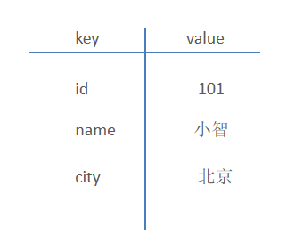 

**主要特点：**

- 基于内存存储，读写性能高  
- 适合存储热点数据（热点商品、资讯、新闻）
- 企业应用广泛

Redis是用C语言开发的一个开源的高性能键值对(key-value)数据库，官方提供的数据是可以达到100000+的QPS（每秒内查询次数）。它存储的value类型比较丰富，也被称为结构化的NoSql数据库。

NoSql（Not Only SQL），不仅仅是SQL，泛指**非关系型数据库**。NoSql数据库并不是要取代关系型数据库，而是关系型数据库的补充。

**关系型数据库(RDBMS)：**

- Mysql
- Oracle
- DB2
- SQLServer

**非关系型数据库(NoSql)：**

- Redis
- Mongo db
- MemCached


#### 1.2 Redis下载与安装

##### 1.2.1 Redis下载

Redis安装包分为windows版和Linux版：

- Windows版下载地址：https://github.com/microsoftarchive/redis/releases
- Linux版下载地址： https://download.redis.io/releases/ 

资料中已提供好的安装包：

 


##### 1.2.2 Redis安装

**1）在Windows中安装Redis(项目中使用)**

Redis的Windows版属于绿色软件，直接解压即可使用，解压后目录结构如下：

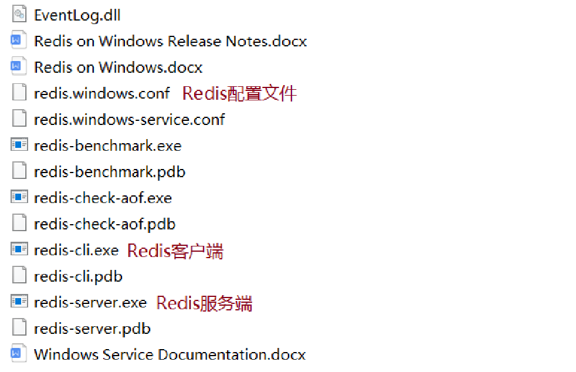 


**2）在Linux中安装Redis(简单了解)**

在Linux系统安装Redis步骤：

1. 将Redis安装包上传到Linux
1. 解压安装包，命令：tar -zxvf redis-4.0.0.tar.gz -C /usr/local
1. 安装Redis的依赖环境gcc，命令：yum install gcc-c++
1. 进入/usr/local/redis-4.0.0，进行编译，命令：make
1. 进入redis的src目录进行安装，命令：make install

安装后重点文件说明：

- /usr/local/redis-4.0.0/src/redis-server：Redis服务启动脚本
- /usr/local/redis-4.0.0/src/redis-cli：Redis客户端脚本
- /usr/local/redis-4.0.0/redis.conf：Redis配置文件


#### 1.3 Redis服务启动与停止

以window版Redis进行演示：

##### 1.3.1 服务启动命令

**redis-server.exe redis.windows.conf**

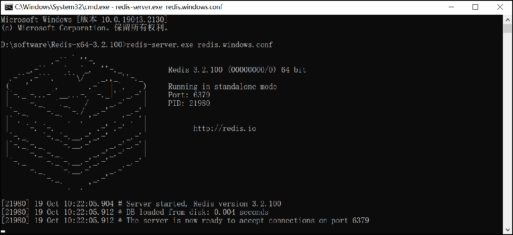 

Redis服务默认端口号为 **6379** ，通过快捷键**Ctrl + C** 即可停止Redis服务

当Redis服务启动成功后，可通过客户端进行连接。


##### 1.3.2 客户端连接命令

**redis-cli.exe**

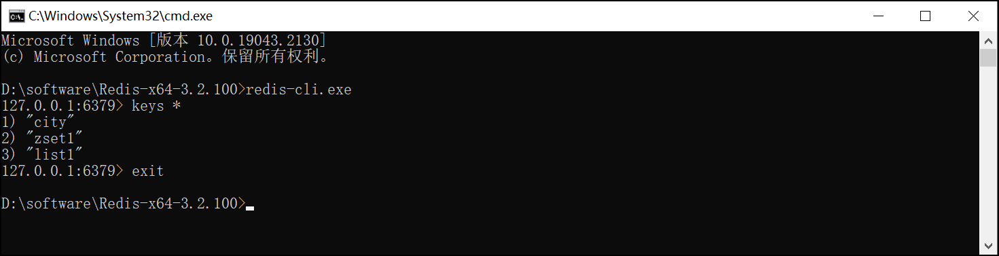 

通过redis-cli.exe命令默认连接的是本地的redis服务，并且使用默认6379端口。也可以通过指定如下参数连接：

- -h ip地址
- -p 端口号
- -a 密码（如果需要）


##### 1.3.3 修改Redis配置文件

设置Redis服务密码，修改redis.windows.conf

```
requirepass 123456
```

**注意：**

- 修改密码后需要重启Redis服务才能生效
- Redis配置文件中 # 表示注释

重启Redis后，再次连接Redis时，需加上密码，否则连接失败。

```
redis-cli.exe -h localhost -p 6379 -a 123456
```

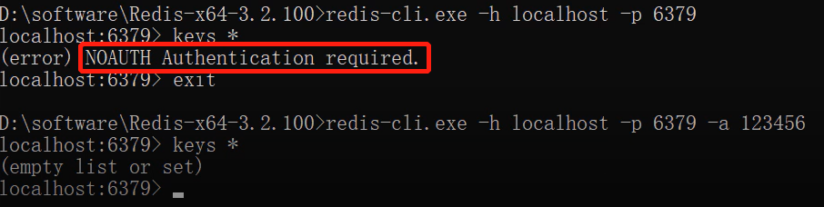 

此时，-h 和 -p 参数可省略不写。


##### 1.3.4 Redis客户端图形工具

默认提供的客户端连接工具界面不太友好，同时操作也较为麻烦，接下来，引入一个Redis客户端图形工具。

在当天资料中已提供安装包，直接安装即可。

 

安装完毕后，直接双击启动

**新建连接**

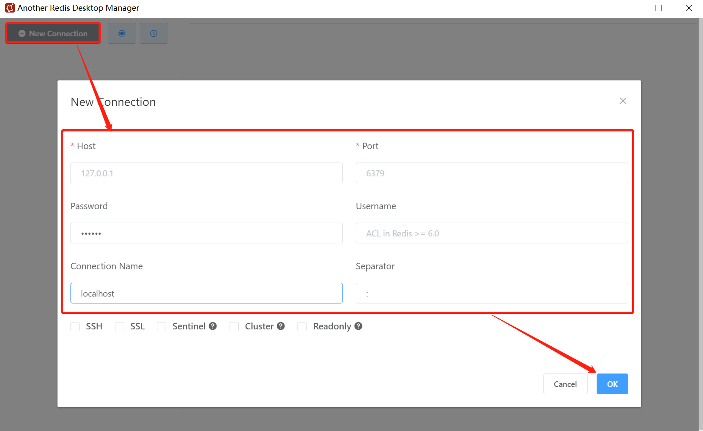  

**连接成功** 

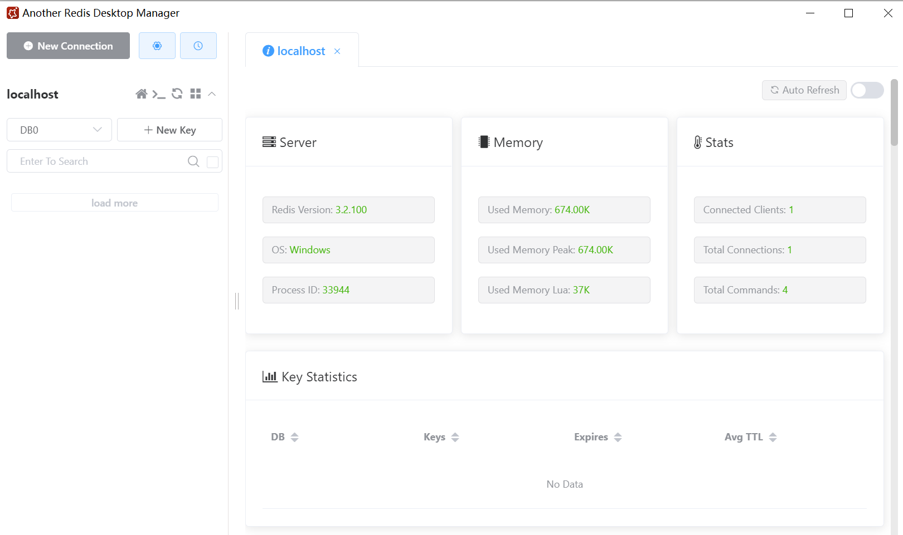  


### 2. Redis数据类型

#### 2.1 五种常用数据类型介绍

Redis存储的是key-value结构的数据，其中key是字符串类型，value有5种常用的数据类型：

- 字符串 string
- 哈希 hash
- 列表 list
- 集合 set
- 有序集合 sorted set / zset


#### 2.2 各种数据类型特点

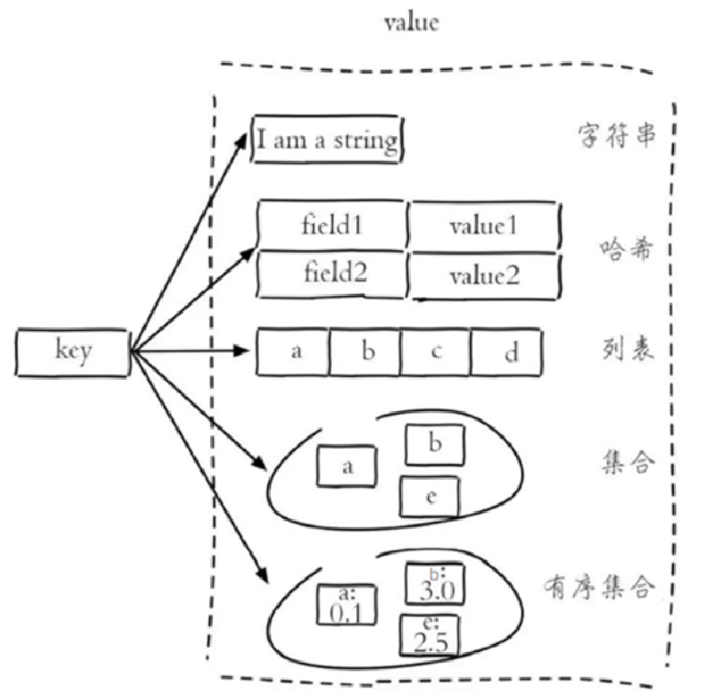 

**解释说明：**

- 字符串(string)：普通字符串，Redis中最简单的数据类型
- 哈希(hash)：也叫散列，类似于Java中的HashMap结构
- 列表(list)：按照插入顺序排序，可以有重复元素，类似于Java中的LinkedList
- 集合(set)：无序集合，没有重复元素，类似于Java中的HashSet
- 有序集合(sorted set/zset)：集合中每个元素关联一个分数(score)，根据分数升序排序，没有重复元素


### 3. Redis常用命令

#### 3.1 字符串操作命令

Redis 中字符串类型常用命令：

- **SET** key value 					         设置指定key的值
- **GET** key                                        获取指定key的值
- **SETEX** key seconds value         设置指定key的值，并将 key 的过期时间设为 seconds 秒
- **SETNX** key value                        只有在 key    不存在时设置 key 的值

更多命令可以参考Redis中文网：https://www.redis.net.cn


#### 3.2 哈希操作命令

Redis hash 是一个string类型的 field 和 value 的映射表，hash特别适合用于存储对象，常用命令：

- **HSET** key field value             将哈希表 key 中的字段 field 的值设为 value
- **HGET** key field                       获取存储在哈希表中指定字段的值
- **HDEL** key field                       删除存储在哈希表中的指定字段
- **HKEYS** key                              获取哈希表中所有字段
- **HVALS** key                              获取哈希表中所有值

 


#### 3.3 列表操作命令

Redis 列表是简单的字符串列表，按照插入顺序排序，常用命令：

- **LPUSH** key value1 [value2]         将一个或多个值插入到列表头部
- **LRANGE** key start stop                获取列表指定范围内的元素
- **RPOP** key                                       移除并获取列表最后一个元素
- **LLEN** key                                        获取列表长度
- **BRPOP** key1 [key2 ] timeout       移出并获取列表的最后一个元素， 如果列表没有元素会阻塞列表直到等待超    时或发现可弹出元素为止

 


#### 3.4 集合操作命令

Redis set 是string类型的无序集合。集合成员是唯一的，这就意味着集合中不能出现重复的数据，常用命令：

- **SADD** key member1 [member2]            向集合添加一个或多个成员
- **SMEMBERS** key                                         返回集合中的所有成员
- **SCARD** key                                                  获取集合的成员数
- **SINTER** key1 [key2]                                   返回给定所有集合的交集
- **SUNION** key1 [key2]                                 返回所有给定集合的并集
- **SREM** key member1 [member2]            移除集合中一个或多个成员

 


#### 3.5 有序集合操作命令

Redis有序集合是string类型元素的集合，且不允许有重复成员。每个元素都会关联一个double类型的分数。常用命令：

常用命令：

- **ZADD** key score1 member1 [score2 member2]     向有序集合添加一个或多个成员
- **ZRANGE** key start stop [WITHSCORES]                     通过索引区间返回有序集合中指定区间内的成员
- **ZINCRBY** key increment member                              有序集合中对指定成员的分数加上增量 increment
- **ZREM** key member [member ...]                                移除有序集合中的一个或多个成员

 


#### 3.6 通用命令

Redis的通用命令是不分数据类型的，都可以使用的命令：

- KEYS pattern 		查找所有符合给定模式( pattern)的 key 
- EXISTS key 		检查给定 key 是否存在
- TYPE key 		返回 key 所储存的值的类型
- DEL key 		该命令用于在 key 存在是删除 key


### 4.在Java中操作Redis

#### 4.1 Redis的Java客户端

前面我们讲解了Redis的常用命令，这些命令是我们操作Redis的基础，那么我们在java程序中应该如何操作Redis呢？这就需要使用Redis的Java客户端，就如同我们使用JDBC操作MySQL数据库一样。

Redis 的 Java 客户端很多，常用的几种：

- Jedis
- Lettuce
- Spring Data Redis

Spring 对 Redis 客户端进行了整合，提供了 Spring Data Redis，在Spring Boot项目中还提供了对应的Starter，即 spring-boot-starter-data-redis。

我们重点学习**Spring Data Redis**。


#### 4.2 Spring Data Redis使用方式

##### 4.2.1 介绍

Spring Data Redis 是 Spring 的一部分，提供了在 Spring 应用中通过简单的配置就可以访问 Redis 服务，对 Redis 底层开发包进行了高度封装。在 Spring 项目中，可以使用Spring Data Redis来简化 Redis 操作。

网址：https://spring.io/projects/spring-data-redis

 

Spring Boot提供了对应的Starter，maven坐标：

```xml
<dependency>
	<groupId>org.springframework.boot</groupId>
	<artifactId>spring-boot-starter-data-redis</artifactId>
</dependency>
```

Spring Data Redis中提供了一个高度封装的类：**RedisTemplate**，对相关api进行了归类封装,将同一类型操作封装为operation接口，具体分类如下：

- ValueOperations：string数据操作
- SetOperations：set类型数据操作
- ZSetOperations：zset类型数据操作
- HashOperations：hash类型的数据操作
- ListOperations：list类型的数据操作


##### 4.2.2 环境搭建

进入到sky-server模块

**1). 导入Spring Data Redis的maven坐标(已完成)**

```xml
<dependency>
     <groupId>org.springframework.boot</groupId>
     <artifactId>spring-boot-starter-data-redis</artifactId>
</dependency>
```


**2). 配置Redis数据源**

在application-dev.yml中添加

```yaml
sky:
  redis:
    host: localhost
    port: 6379
    password: 123456
    database: 10
```

**解释说明：**

database:指定使用Redis的哪个数据库，Redis服务启动后默认有16个数据库，编号分别是从0到15。

可以通过修改Redis配置文件来指定数据库的数量。

在application.yml中添加读取application-dev.yml中的相关Redis配置

```yaml
spring:
  profiles:
    active: dev
  redis:
    host: ${sky.redis.host}
    port: ${sky.redis.port}
    password: ${sky.redis.password}
    database: ${sky.redis.database}
```


**3). 编写配置类，创建RedisTemplate对象**

```java
package com.sky.config;

import lombok.extern.slf4j.Slf4j;
import org.springframework.context.annotation.Bean;
import org.springframework.context.annotation.Configuration;
import org.springframework.data.redis.connection.RedisConnectionFactory;
import org.springframework.data.redis.core.RedisTemplate;
import org.springframework.data.redis.serializer.StringRedisSerializer;

@Configuration
@Slf4j
public class RedisConfiguration {

    @Bean
    public RedisTemplate redisTemplate(RedisConnectionFactory redisConnectionFactory){
        log.info("开始创建redis模板对象...");
        RedisTemplate redisTemplate = new RedisTemplate();
        //设置redis的连接工厂对象
        redisTemplate.setConnectionFactory(redisConnectionFactory);
        //设置redis key的序列化器
        redisTemplate.setKeySerializer(new StringRedisSerializer());
        return redisTemplate;
    }
}
```

**解释说明：**

当前配置类不是必须的，因为 Spring Boot 框架会自动装配 RedisTemplate 对象，但是默认的key序列化器为

JdkSerializationRedisSerializer，导致我们存到Redis中后的数据和原始数据有差别，故设置为

StringRedisSerializer序列化器。


**4). 通过RedisTemplate对象操作Redis**

在test下新建测试类

```java
package com.sky.test;

import org.junit.jupiter.api.Test;
import org.springframework.beans.factory.annotation.Autowired;
import org.springframework.boot.test.context.SpringBootTest;
import org.springframework.data.redis.core.*;

@SpringBootTest
public class SpringDataRedisTest {
    @Autowired
    private RedisTemplate redisTemplate;

    @Test
    public void testRedisTemplate(){
        System.out.println(redisTemplate);
        //string数据操作
        ValueOperations valueOperations = redisTemplate.opsForValue();
        //hash类型的数据操作
        HashOperations hashOperations = redisTemplate.opsForHash();
        //list类型的数据操作
        ListOperations listOperations = redisTemplate.opsForList();
        //set类型数据操作
        SetOperations setOperations = redisTemplate.opsForSet();
        //zset类型数据操作
        ZSetOperations zSetOperations = redisTemplate.opsForZSet();
    }
}
```

测试：

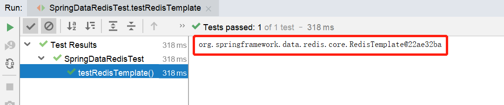 

说明RedisTemplate对象注入成功，并且通过该RedisTemplate对象获取操作5种数据类型相关对象。

上述环境搭建完毕后，接下来，我们就来具体对常见5种数据类型进行操作。


##### 4.2.3 操作常见类型数据

**1). 操作字符串类型数据**

```java
	/**
     * 操作字符串类型的数据
     */
    @Test
    public void testString(){
        // set get setex setnx
        redisTemplate.opsForValue().set("name","小明");
        String city = (String) redisTemplate.opsForValue().get("name");
        System.out.println(city);
        redisTemplate.opsForValue().set("code","1234",3, TimeUnit.MINUTES);
        redisTemplate.opsForValue().setIfAbsent("lock","1");
        redisTemplate.opsForValue().setIfAbsent("lock","2");
    }
```


**2). 操作哈希类型数据**

```java
	/**
     * 操作哈希类型的数据
     */
    @Test
    public void testHash(){
        //hset hget hdel hkeys hvals
        HashOperations hashOperations = redisTemplate.opsForHash();

        hashOperations.put("100","name","tom");
        hashOperations.put("100","age","20");

        String name = (String) hashOperations.get("100", "name");
        System.out.println(name);

        Set keys = hashOperations.keys("100");
        System.out.println(keys);

        List values = hashOperations.values("100");
        System.out.println(values);

        hashOperations.delete("100","age");
    }
```


**3). 操作列表类型数据**

```java
	/**
     * 操作列表类型的数据
     */
    @Test
    public void testList(){
        //lpush lrange rpop llen
        ListOperations listOperations = redisTemplate.opsForList();

        listOperations.leftPushAll("mylist","a","b","c");
        listOperations.leftPush("mylist","d");

        List mylist = listOperations.range("mylist", 0, -1);
        System.out.println(mylist);

        listOperations.rightPop("mylist");

        Long size = listOperations.size("mylist");
        System.out.println(size);
    }
```


**4). 操作集合类型数据**

```java
	/**
     * 操作集合类型的数据
     */
    @Test
    public void testSet(){
        //sadd smembers scard sinter sunion srem
        SetOperations setOperations = redisTemplate.opsForSet();

        setOperations.add("set1","a","b","c","d");
        setOperations.add("set2","a","b","x","y");

        Set members = setOperations.members("set1");
        System.out.println(members);

        Long size = setOperations.size("set1");
        System.out.println(size);

        Set intersect = setOperations.intersect("set1", "set2");
        System.out.println(intersect);

        Set union = setOperations.union("set1", "set2");
        System.out.println(union);

        setOperations.remove("set1","a","b");
    }
```


**5). 操作有序集合类型数据**

```java
	/**
     * 操作有序集合类型的数据
     */
    @Test
    public void testZset(){
        //zadd zrange zincrby zrem
        ZSetOperations zSetOperations = redisTemplate.opsForZSet();

        zSetOperations.add("zset1","a",10);
        zSetOperations.add("zset1","b",12);
        zSetOperations.add("zset1","c",9);

        Set zset1 = zSetOperations.range("zset1", 0, -1);
        System.out.println(zset1);

        zSetOperations.incrementScore("zset1","c",10);

        zSetOperations.remove("zset1","a","b");
    }
```


**6). 通用命令操作**

```java
	/**
     * 通用命令操作
     */
    @Test
    public void testCommon(){
        //keys exists type del
        Set keys = redisTemplate.keys("*");
        System.out.println(keys);

        Boolean name = redisTemplate.hasKey("name");
        Boolean set1 = redisTemplate.hasKey("set1");

        for (Object key : keys) {
            DataType type = redisTemplate.type(key);
            System.out.println(type.name());
        }

        redisTemplate.delete("mylist");
    }
```


## Spring Cache

### 1 介绍

Spring Cache 是一个框架，实现了基于注解的缓存功能，只需要简单地加一个注解，就能实现缓存功能。

Spring Cache 提供了一层抽象，底层可以切换不同的缓存实现，例如：

- EHCache
- Caffeine
- Redis(常用)

**起步依赖：**

```xml
<dependency>
	<groupId>org.springframework.boot</groupId>
	<artifactId>spring-boot-starter-cache</artifactId>  		            		       	 <version>2.7.3</version> 
</dependency>
```


### 2 常用注解

在SpringCache中提供了很多缓存操作的注解，常见的是以下的几个：

| **注解**       | **说明**                                                     |
| -------------- | ------------------------------------------------------------ |
| @EnableCaching | 开启缓存注解功能，通常加在启动类上                           |
| @Cacheable     | 在方法执行前先查询缓存中是否有数据，如果有数据，则直接返回缓存数据；如果没有缓存数据，调用方法并将方法返回值放到缓存中 |
| @CachePut      | 将方法的返回值放到缓存中                                     |
| @CacheEvict    | 将一条或多条数据从缓存中删除                                 |

在spring boot项目中，使用缓存技术只需在项目中导入相关缓存技术的依赖包，并在启动类上使用@EnableCaching开启缓存支持即可。

例如，使用Redis作为缓存技术，只需要导入Spring data Redis的maven坐标即可。


### 3 入门案例

#### 1). 环境准备

**导入基础工程:**底层已使用Redis缓存实现

基础环境的代码，在我们今天的资料中已经准备好了， 大家只需要将这个工程导入进来就可以了。导入进来的工程结构如下： 

 

**数据库准备:**

创建名为spring_cache_demo数据库，将springcachedemo.sql脚本直接导入数据库中。

 

**引导类上加@EnableCaching:**

```java
package com.itheima;

import lombok.extern.slf4j.Slf4j;
import org.springframework.boot.SpringApplication;
import org.springframework.boot.autoconfigure.SpringBootApplication;
import org.springframework.cache.annotation.EnableCaching;

@Slf4j
@SpringBootApplication
@EnableCaching//开启缓存注解功能
public class CacheDemoApplication {
    public static void main(String[] args) {
        SpringApplication.run(CacheDemoApplication.class,args);
        log.info("项目启动成功...");
    }
}
```


#### 2). @CachePut注解

**@CachePut 说明：** 

​	作用: 将方法返回值，放入缓存

​	value: 缓存的名称, 每个缓存名称下面可以有很多key

​	key: 缓存的key  ----------> 支持Spring的表达式语言SPEL语法


**在save方法上加注解@CachePut**

当前UserController的save方法是用来保存用户信息的，我们希望在该用户信息保存到数据库的同时，也往缓存中缓存一份数据，我们可以在save方法上加上注解 @CachePut，用法如下：

```java
	/**
	* CachePut：将方法返回值放入缓存
	* value：缓存的名称，每个缓存名称下面可以有多个key
	* key：缓存的key
	*/
	@PostMapping
    @CachePut(value = "userCache", key = "#user.id")//key的生成：userCache::1
    public User save(@RequestBody User user){
        userMapper.insert(user);
        return user;
    }
```

**说明：**key的写法如下

#user.id : #user指的是方法形参的名称, id指的是user的id属性 , 也就是使用user的id属性作为key ;

#result.id : #result代表方法返回值，该表达式 代表以返回对象的id属性作为key ；

#p0.id：#p0指的是方法中的第一个参数，id指的是第一个参数的id属性,也就是使用第一个参数的id属性作为key ;

#a0.id：#a0指的是方法中的第一个参数，id指的是第一个参数的id属性,也就是使用第一个参数的id属性作为key ;

#root.args[0].id:#root.args[0]指的是方法中的第一个参数，id指的是第一个参数的id属性,也就是使用第一个参数

的id属性作为key ;

**启动服务,通过swagger接口文档测试，访问UserController的save()方法**

因为id是自增，所以不需要设置id属性

  

**查看user表中的数据**

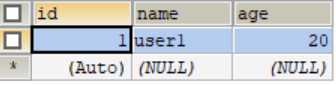 

**查看Redis中的数据**

 


#### 3). @Cacheable注解

**@Cacheable 说明:**

​	作用: 在方法执行前，spring先查看缓存中是否有数据，如果有数据，则直接返回缓存数据；若没有数据，调用方法并将方法返回值放到缓存中

​	value: 缓存的名称，每个缓存名称下面可以有多个key

​	key: 缓存的key  ----------> 支持Spring的表达式语言SPEL语法


 **在getById上加注解@Cacheable**

```java
	/**
	* Cacheable：在方法执行前spring先查看缓存中是否有数据，如果有数据，则直接返回缓存数据；若没有数据，	  *调用方法并将方法返回值放到缓存中
	* value：缓存的名称，每个缓存名称下面可以有多个key
	* key：缓存的key
	*/
	@GetMapping
    @Cacheable(cacheNames = "userCache",key="#id")
    public User getById(Long id){
        User user = userMapper.getById(id);
        return user;
    }
```

**重启服务,通过swagger接口文档测试，访问UserController的getById()方法**

第一次访问，会请求我们controller的方法，查询数据库。后面再查询相同的id，就直接从Redis中查询数据，不用再查询数据库了，就说明缓存生效了。

提前在redis中手动删除掉id=1的用户数据

 

**查看控制台sql语句：**说明从数据库查询的用户数据

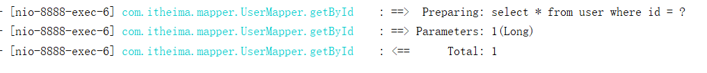 

**查看Redis中的缓存数据：**说明已成功缓存

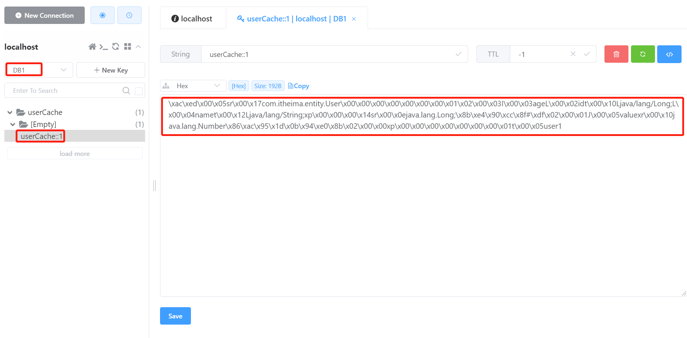 

再次查询相同id的数据时，直接从redis中直接获取，不再查询数据库。


#### 4). @CacheEvict注解

**@CacheEvict 说明：** 

​	作用: 清理指定缓存

​	value: 缓存的名称，每个缓存名称下面可以有多个key

​	key: 缓存的key  ----------> 支持Spring的表达式语言SPEL语法


**在 delete 方法上加注解@CacheEvict**

```java
	@DeleteMapping
    @CacheEvict(cacheNames = "userCache",key = "#id")//删除某个key对应的缓存数据
    public void deleteById(Long id){
        userMapper.deleteById(id);
    }

	@DeleteMapping("/delAll")
    @CacheEvict(cacheNames = "userCache",allEntries = true)//删除userCache下所有的缓存数据
    public void deleteAll(){
        userMapper.deleteAll();
    }
```

**重启服务,通过swagger接口文档测试，访问UserController的deleteAll()方法**

 

**查看user表：**数据清空

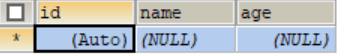 

**查询Redis缓存数据**

 

### 4 总结流程

**maven坐标**

```xml
<dependency>
	<groupId>org.springframework.boot</groupId>
	<artifactId>spring-boot-starter-cache</artifactId>  		            		       	 <version>2.7.3</version> 
</dependency>
```

**启动类注解**

```java
@EnableCaching   // 开启缓存注解功能，通常加在启动类上
@SpringBootApplication
public class XxxApplication {
    public static void main(String[] args) {
        SpringApplication.run(XxxApplication.class, args);
    }
}
```

**使用**

在普通类上使用, 详见入门案例


## Spring Task

### 1 介绍

**Spring Task** 是Spring框架提供的任务调度工具，可以按照约定的时间自动执行某个代码逻辑。

**定位：**定时任务框架

**作用：**定时自动执行某段Java代码


  为什么要在Java程序中使用Spring Task？

**应用场景：**

1). 信用卡每月还款提醒

 


2). 银行贷款每月还款提醒

 


3). 火车票售票系统处理未支付订单

 


4). 入职纪念日为用户发送通知

 


**强调：**只要是需要定时处理的场景都可以使用Spring Task


### 2 cron表达式

**cron表达式**其实就是一个字符串，通过cron表达式可以**定义任务触发的时间**

**构成规则：**分为6或7个域，由空格分隔开，每个域代表一个含义

每个域的含义分别为：秒、分钟、小时、日、月、周、年(可选)

**举例：**

2022年10月12日上午9点整 对应的cron表达式为：**0 0 9 12 10 ? 2022**

 

**说明：**一般**日**和**周**的值不同时设置，其中一个设置，另一个用？表示。


**比如：**描述2月份的最后一天，最后一天具体是几号呢？可能是28号，也有可能是29号，所以就不能写具体数字。

为了描述这些信息，提供一些特殊的字符。这些具体的细节，我们就不用自己去手写，因为这个cron表达式，它其实有在线生成器。

cron表达式在线生成器：https://cron.qqe2.com/

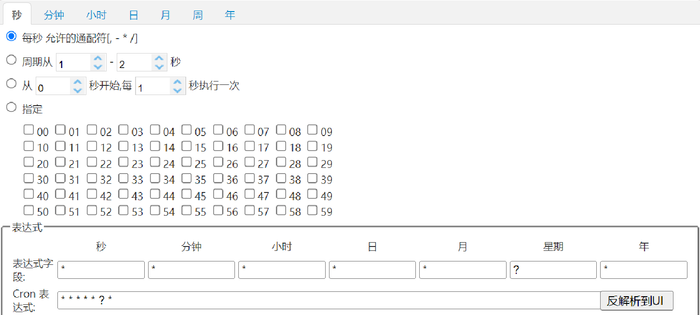 


可以直接在这个网站上面，只要根据自己的要求去生成corn表达式即可。所以一般就不用自己去编写这个表达式。

**通配符：**

\* 表示所有值； 

? 表示未说明的值，即不关心它为何值； 

\- 表示一个指定的范围； 

, 表示附加一个可能值； 

/ 符号前表示开始时间，符号后表示每次递增的值；

**cron表达式案例：**

*/5 * * * * ? 每隔5秒执行一次

0 */1 * * * ? 每隔1分钟执行一次

0 0 5-15 * * ? 每天5-15点整点触发

0 0/3 * * * ? 每三分钟触发一次

0 0-5 14 * * ? 在每天下午2点到下午2:05期间的每1分钟触发 

0 0/5 14 * * ? 在每天下午2点到下午2:55期间的每5分钟触发

0 0/5 14,18 * * ? 在每天下午2点到2:55期间和下午6点到6:55期间的每5分钟触发

0 0/30 9-17 * * ? 朝九晚五工作时间内每半小时

0 0 10,14,16 * * ? 每天上午10点，下午2点，4点 


### 3 入门案例

#### 3.1 使用步骤

1). 导入maven坐标 spring-context（已存在）

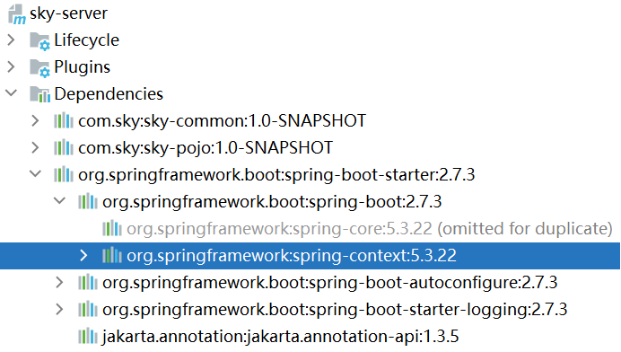 

2). 启动类添加注解 @EnableScheduling 开启任务调度

3). 自定义定时任务类


#### 3.2 代码开发

**编写定时任务类：**

进入sky-server模块中

```java
package com.sky.task;

import lombok.extern.slf4j.Slf4j;
import org.springframework.scheduling.annotation.Scheduled;
import org.springframework.stereotype.Component;

import java.util.Date;

/**
 * 自定义定时任务类
 */
@Component
@Slf4j
public class MyTask {

    /**
     * 定时任务 每隔5秒触发一次
     */
    @Scheduled(cron = "0/5 * * * * ?")
    public void executeTask(){
        log.info("定时任务开始执行：{}",new Date());
    }
}
```

**开启任务调度：**

启动类添加注解 @EnableScheduling

```java
package com.sky;

import lombok.extern.slf4j.Slf4j;
import org.springframework.boot.SpringApplication;
import org.springframework.boot.autoconfigure.SpringBootApplication;
import org.springframework.cache.annotation.EnableCaching;
import org.springframework.scheduling.annotation.EnableScheduling;
import org.springframework.transaction.annotation.EnableTransactionManagement;

@SpringBootApplication
@EnableTransactionManagement //开启注解方式的事务管理
@Slf4j
@EnableCaching
@EnableScheduling
public class SkyApplication {
    public static void main(String[] args) {
        SpringApplication.run(SkyApplication.class, args);
        log.info("server started");
    }
}
```


#### 3.3 功能测试

启动服务，查看日志

 

每隔5秒执行一次。


## Apache Echarts //可视化

### 1 介绍

Apache ECharts 是一款基于 Javascript 的数据可视化图表库，提供直观，生动，可交互，可个性化定制的数据可视化图表。
官网地址：https://echarts.apache.org/zh/index.html

 


**常见效果展示：**

1). 柱形图

 


2). 饼形图

 


3). 折线图

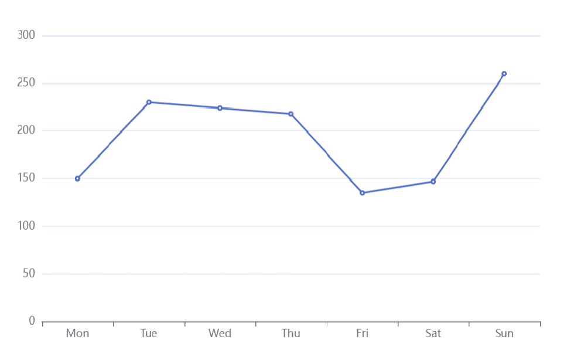 


**总结：**不管是哪种形式的图形，最本质的东西实际上是数据，它其实是对数据的一种可视化展示。


### 2 入门案例

Apache Echarts官方提供的快速入门：https://echarts.apache.org/handbook/zh/get-started/

**效果展示：**

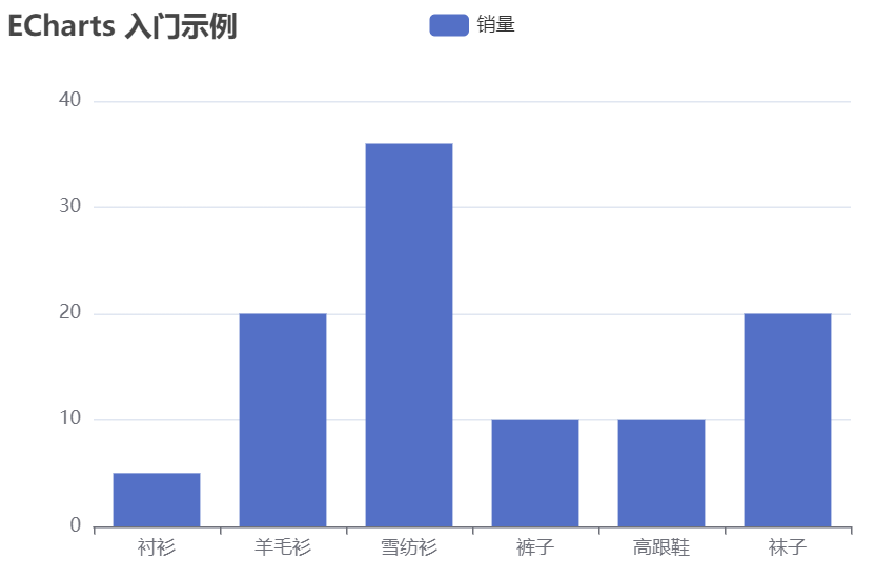 


**实现步骤：**

1). 引入echarts.js 文件(当天资料已提供)

2). 为 ECharts 准备一个设置宽高的 DOM

3). 初始化echarts实例

4). 指定图表的配置项和数据

5). 使用指定的配置项和数据显示图表


**代码开发：**

```html
<!DOCTYPE html>
<html>
  <head>
    <meta charset="utf-8" />
    <title>ECharts</title>
    <!-- 引入刚刚下载的 ECharts 文件 -->
    <script src="echarts.js"></script>
  </head>
  <body>
    <!-- 为 ECharts 准备一个定义了宽高的 DOM -->
    <div id="main" style="width: 600px;height:400px;"></div>
    <script type="text/javascript">
      // 基于准备好的dom，初始化echarts实例
      var myChart = echarts.init(document.getElementById('main'));

      // 指定图表的配置项和数据
      var option = {
        title: {
          text: 'ECharts 入门示例'
        },
        tooltip: {},
        legend: {
          data: ['销量']
        },
        xAxis: {
          data: ['衬衫', '羊毛衫', '雪纺衫', '裤子', '高跟鞋', '袜子']
        },
        yAxis: {},
        series: [
          {
            name: '销量',
            type: 'bar',
            data: [5, 20, 36, 10, 10, 20]
          }
        ]
      };

      // 使用刚指定的配置项和数据显示图表。
      myChart.setOption(option);
    </script>
  </body>
</html>
```


**测试：**(当天资料中已提供)

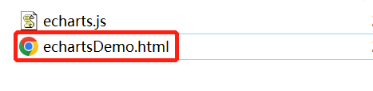 

使用浏览器方式打开即可。


**总结：**使用Echarts，重点在于研究当前图表所需的数据格式。通常是需要后端提供符合格式要求的动态数据，然后响应给前端来展示图表。


## Apache POI  //Excel

### 1 介绍

Apache POI 是一个处理Miscrosoft Office各种文件格式的开源项目。简单来说就是，我们可以使用 POI 在 Java 程序中对Miscrosoft Office各种文件进行读写操作。
一般情况下，POI 都是用于操作 Excel 文件。

 

**Apache POI 的应用场景：**

- 银行网银系统导出交易明细

     

- 各种业务系统导出Excel报表

    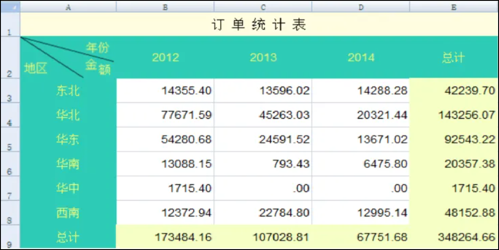 

- 批量导入业务数据

    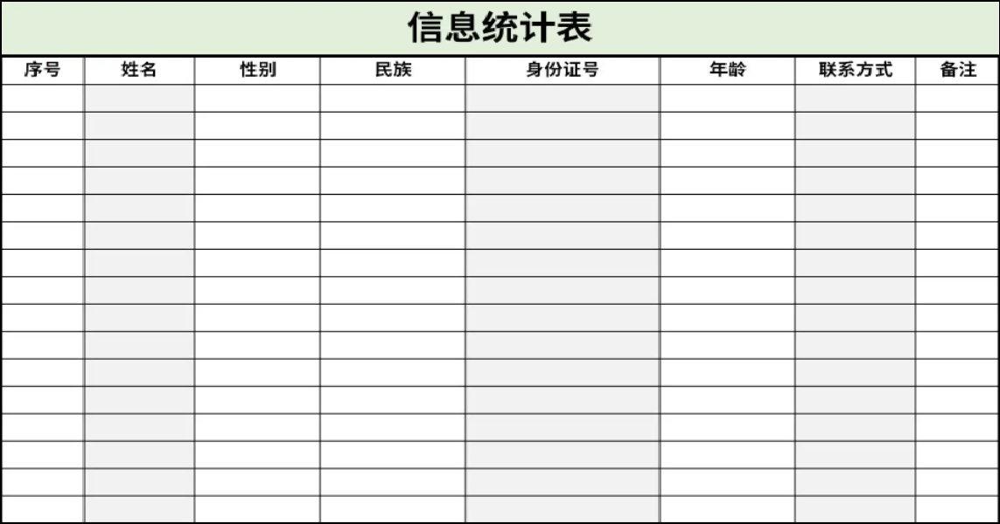 


### 2 入门案例

Apache POI既可以将数据写入Excel文件，也可以读取Excel文件中的数据，接下来分别进行实现。

**Apache POI的maven坐标：**(项目中已导入)

```xml
<dependency>
    <groupId>org.apache.poi</groupId>
    <artifactId>poi</artifactId>
    <version>3.16</version>
</dependency>
<dependency>
    <groupId>org.apache.poi</groupId>
    <artifactId>poi-ooxml</artifactId>
    <version>3.16</version>
</dependency>
```


#### 2.1 将数据写入Excel文件

**1). 代码开发**

```java
package com.sky.test;

import org.apache.poi.xssf.usermodel.XSSFCell;
import org.apache.poi.xssf.usermodel.XSSFRow;
import org.apache.poi.xssf.usermodel.XSSFSheet;
import org.apache.poi.xssf.usermodel.XSSFWorkbook;
import java.io.File;
import java.io.FileInputStream;
import java.io.FileOutputStream;

public class POITest {

    /**
     * 基于POI向Excel文件写入数据
     * @throws Exception
     */
    public static void write() throws Exception{
        //在内存中创建一个Excel文件对象
        XSSFWorkbook excel = new XSSFWorkbook();
        //创建Sheet页
        XSSFSheet sheet = excel.createSheet("itcast");

        //在Sheet页中创建行，0表示第1行
        XSSFRow row1 = sheet.createRow(0);
        //创建单元格并在单元格中设置值，单元格编号也是从0开始，1表示第2个单元格
        row1.createCell(1).setCellValue("姓名");
        row1.createCell(2).setCellValue("城市");

        XSSFRow row2 = sheet.createRow(1);
        row2.createCell(1).setCellValue("张三");
        row2.createCell(2).setCellValue("北京");

        XSSFRow row3 = sheet.createRow(2);
        row3.createCell(1).setCellValue("李四");
        row3.createCell(2).setCellValue("上海");

        FileOutputStream out = new FileOutputStream(new File("D:\\itcast.xlsx"));
        //通过输出流将内存中的Excel文件写入到磁盘上
        excel.write(out);

        //关闭资源
        out.flush();
        out.close();
        excel.close();
    }
    public static void main(String[] args) throws Exception {
        write();
    }
}
```

**2). 实现效果**

在D盘中生成itcast.xlsx文件，创建名称为itcast的Sheet页，同时将内容成功写入。

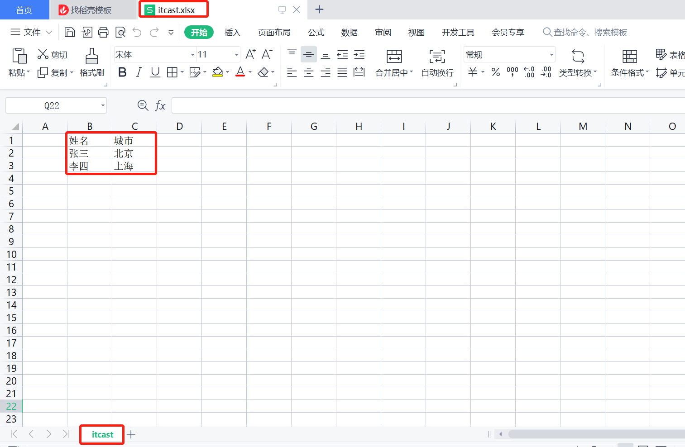 


#### 2.2 读取Excel文件中的数据

**1). 代码开发**

```java
package com.sky.test;

import org.apache.poi.xssf.usermodel.XSSFCell;
import org.apache.poi.xssf.usermodel.XSSFRow;
import org.apache.poi.xssf.usermodel.XSSFSheet;
import org.apache.poi.xssf.usermodel.XSSFWorkbook;
import java.io.File;
import java.io.FileInputStream;
import java.io.FileOutputStream;

public class POITest {
    /**
     * 基于POI读取Excel文件
     * @throws Exception
     */
    public static void read() throws Exception{
        FileInputStream in = new FileInputStream(new File("D:\\itcast.xlsx"));
        //通过输入流读取指定的Excel文件
        XSSFWorkbook excel = new XSSFWorkbook(in);
        //获取Excel文件的第1个Sheet页
        XSSFSheet sheet = excel.getSheetAt(0);

        //获取Sheet页中的最后一行的行号
        int lastRowNum = sheet.getLastRowNum();

        for (int i = 0; i <= lastRowNum; i++) {
            //获取Sheet页中的行
            XSSFRow titleRow = sheet.getRow(i);
            //获取行的第2个单元格
            XSSFCell cell1 = titleRow.getCell(1);
            //获取单元格中的文本内容
            String cellValue1 = cell1.getStringCellValue();
            //获取行的第3个单元格
            XSSFCell cell2 = titleRow.getCell(2);
            //获取单元格中的文本内容
            String cellValue2 = cell2.getStringCellValue();

            System.out.println(cellValue1 + " " +cellValue2);
        }

        //关闭资源
        in.close();
        excel.close();
    }

    public static void main(String[] args) throws Exception {
        read();
    }
}

```


**2). 实现效果**

将itcast.xlsx文件中的数据进行读取

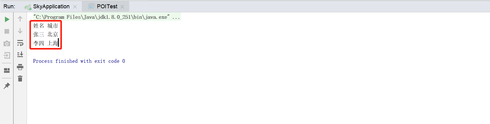 


# 其他

## 工具类

1. StringUtils
1. DigestUtils
    + `import org.springframework.util.DigestUtils;`
    + ` String inputMD = "deqwfdeqe";
         String outputMD = DigestUtils.md5DigestAsHex(inputMD.getBytes());`

3. BeanUtils
    + `BeanUtils.copyProperties(employeeDTO, employee);`   //`employeeDTO`的所有属性赋值给`employee`

4. EntityUtils
    + `EntityUtils.toString(entity)`


## 常用类

### LocalDateTime

```java 
LocalDateTime now = LocalDateTime.now(); // 获取当前时间
int year = now.getYear(); // 获取年份
int month = now.getMonthValue(); // 获取月份
int day = now.getDayOfMonth(); // 获取月中的天数
LocalDateTime now3 = now.plusDays(7); // 在当前时间加上7天
// ......
```

### ThreadLocal<>

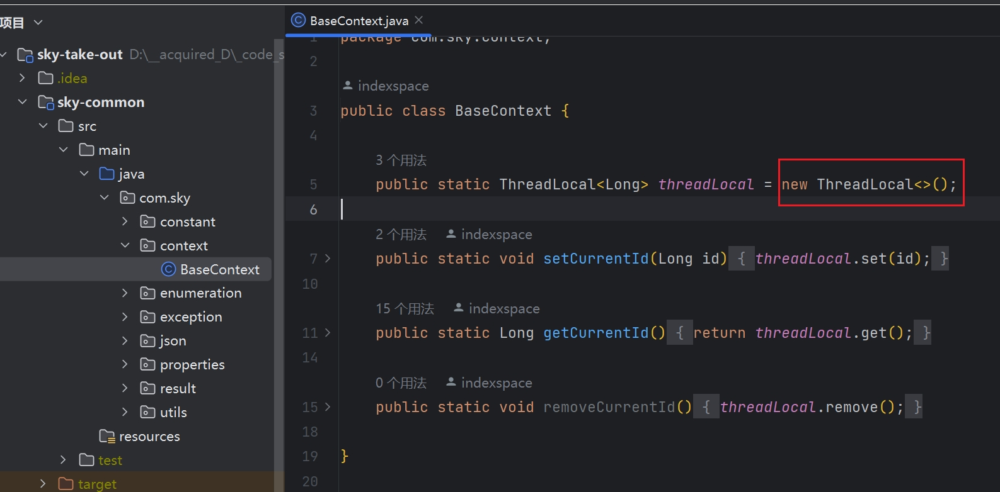


## 注解

### @JsonFormat

>  可用以解决后台到**前台**时间格式保持一致的问题

#### maven坐标

```xml
<!--JsonFormat-->

<dependency>
    <groupId>com.fasterxml.jackson.core</groupId>
    <artifactId>jackson-annotations</artifactId>
    <version>2.8.8</version>
</dependency>

<dependency>
    <groupId>com.fasterxml.jackson.core</groupId>
    <artifactId>jackson-databind</artifactId>
    <version>2.8.8</version>
</dependency>

<dependency>
    <groupId>org.codehaus.jackson</groupId>
    <artifactId>jackson-mapper-asl</artifactId>
    <version>1.9.13</version>
</dependency>
```

#### demo

```java

import java.util.Date;
 
import com.fasterxml.jackson.annotation.JsonFormat;
 
public class TestClass {
 
    //设置时区为上海时区，时间格式自己据需求定。
    @JsonFormat(pattern="yyyy-MM-dd",timezone = "GMT+8")
    private Date testTime;
 
    
    public Date gettestTime() {
        return testTime;
    }
 
    public void settestTime(Date testTimee) {
        this.testTime= testTime;
    }
```


### @DateTimeFormat

> 可用以解决前台到**后台**时间格式保持一致的问题

#### maven坐标

<u>*spring*</u> 的坐标

`+`

```xml
<!-- joda-time -->
<dependency>
    <groupId>joda-time</groupId>
    <artifactId>joda-time</artifactId>
    <version>2.3</version>
</dependency>
```


#### demo

```java
@DateTimeFormat(pattern = "yyyy-MM-dd")
@JsonFormat(pattern = "yyyy-MM-dd HH:mm:ss",timezone="GMT+8")
private Date symstarttime;   //可以两个注解同时使用
```

